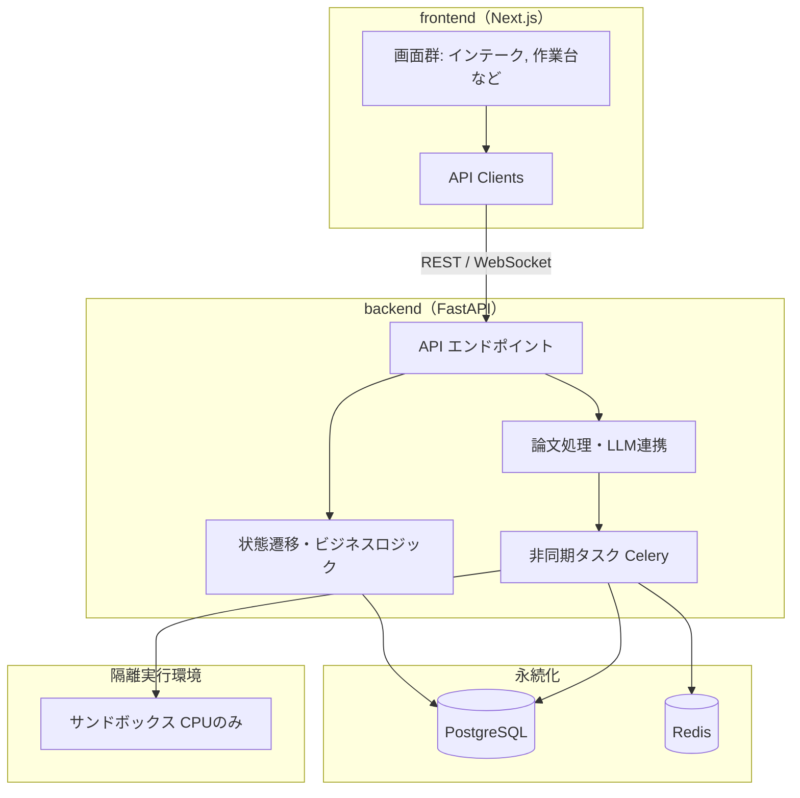

# Paper-Repro アーキテクチャ仕様書

Paper-Repro を**どういう構造で作るか**を定める。

---

## 1. 本書の位置づけ

### 1.1 目的と範囲

英語AI論文の読解〜再現実装支援ツール「Paper-Repro」の初期リリース（タイプB・公式実装ありの論文）を対象とする。
フェーズ6までの縦切り機能を対象とし、将来的な拡張（タイプA、GPU実行、LLM-as-a-Judge等）の土台となる構造を定義する。

### 1.2 上位文書との関係

| 文書 | 関係 |
|---|---|
| `docs/requirements.md` | 要件定義。本書は要求を実現する構造を定める |
| `docs/product-design.md` | プロダクト設計・画面遷移。本書のUI構造の根拠 |
| `docs/roadmap.md` | 開発フェーズ。段階的な実装の指標 |
| `AGENTS.md` | 共通開発指針。コーディング規約やAIエージェントの運用方針 |
| `docs/references.md` | 参考文献の書誌。本書の章立ての由来（REF-15〜REF-17）を含む |
| `docs/references-usdm-ipa.md` | USDM と IPA ガイドラインの URL 一覧・採用範囲・使用条件 |
| `docs/arch-guide/arc-datamodel.md` | データモデル仕様。永続化層の DDL・ENUM・状態遷移表 |
| `docs/arch-guide/arc-screen.md` | 画面アーキテクチャ設計の枠組み（IPA 画面編に準拠） |

### 1.2.1 本書の章立ての由来

本書の章立ては、姉妹プロジェクト Processloop のアーキテクチャ仕様書
（`https://github.com/ChestnutForest/processloop/blob/main/docs/phase1/arc-architecture.md`）
の構成に合わせている。ゼロから独自構成を組むより抜け漏れが少ないと判断したためである
（決定の記録: `docs/devlog/devlog-2026-08-15.md`）。

Processloop 側の構成は、IPA（情報処理推進機構）の要件定義に関するガイドラインを土台としている。
該当する書誌は `docs/references.md` の **REF-15**（発注者ビューガイドライン ver.1.0、2008年）
および **REF-16**（機能要件の合意形成ガイド ver.1.0、2010年）である。

Processloop 側はあわせて USDM（Universal Specification Describing Manner、**REF-17**）を
要求仕様の記述法として採用している。ただし `paper-repro` の要求は `REQ-Cxx` 形式で
管理しており、**USDM の記法は採用していない**。

URL の一覧、著作権上の使用条件、採用範囲の詳細は
`docs/references-usdm-ipa.md` を参照する。

> ⚠️ **IPA の「機能要件の合意形成ガイド」は改変・翻案が禁じられている。**
> 本リポジトリのどの文書にも、同ガイドの本文を転記・翻案してはならない。
> 参照してよいのは著作物にあたらない事実（技術領域の区分、成熟度のレベル名、
> 作業の区分、工程成果物の名称）に限る。

### 1.3 用語

`docs/product-design.md` および `AGENTS.md` の用語集に従う。本書では再定義しない。

---

## 2. 全体構成

### 2.1 層構成



<details>
<summary>Mermaid のソースを見る</summary>

````markdown

````

</details>

### 2.2 バックエンドとフロントエンドを分離する理由

システムを FastAPI（バックエンド）と Next.js（フロントエンド）に分離する。
分離により次を得る。

| 利点 | 内容 |
|---|---|
| テストと検証の独立性 | UIを起動せずともREST APIを通じて状態機械やサンドボックスのテストが可能 |
| 長時間処理の非同期化 | LLM推論やコード実行など重い処理をCeleryワーカーに逃し、WebSocketでUIに進捗をストリームできる |
| 隔離環境との親和性 | 信頼できないコードを実行するサンドボックス環境をバックエンド側で安全に統制できる |

### 2.3 依存の方向

**フロントエンドはバックエンドAPIに依存するが、バックエンドはフロントエンドを意識しない。** 一方向の依存とする。

### 2.4 プロジェクト構成

```text
backend/app/
  api/        FastAPI のルーター
  core/       設定・DB接続・状態機械
  models/     SQLAlchemy モデル
  services/   論文取り込み・LLM等の連携
  workers/    Celery タスク
frontend/src/
  pages/      画面
  components/ UI部品
  lib/        API クライアント
docs/         各種ドキュメント
```

---

## 3. データモデル

### 3.1 論理データモデル

確定要求23件から導いた17エンティティを、次の4領域へ分ける。

| 領域 | エンティティ | 正本 |
| --- | --- | --- |
| 中核 | `Project`, `Paper`, `Spec`, `Assumption`, `Delta` | [`arc-datamodel-list.md`](arc-datamodel-list.md) |
| 批判的検証と由来 | `Claim`, `Evidence`, `ExperimentCond`, `Provenance` | 同上 |
| 実行・照合・成果物 | `SanityRun`, `ScoreCompare`, `Artifact`, `Approval`, `CostRecord` | 同上 |
| 学習と質問 | `SelfExplanation`, `DeepDiveQueue`, `Question` | 同上 |

ER図、定義、CRUD、レビュー基準の構成は
[`arc-datamodel-framework.md`](arc-datamodel-framework.md)を正本とする。

### 3.2 物理データモデル

フェーズ0で物理仕様が確定しているのは`Project`と`Paper`である。
型、NULL、ENUM、制約、索引は[`arc-datamodel.md`](arc-datamodel.md) v1.0を正本とする。
残る15エンティティは、利用する機能の実装直前にUSDM仕様とCRUDを確認して物理設計する。

### 3.3 データ保存の方針

- 工程`Project.phase`と実行状態`Project.status`をPostgreSQLへ別々に永続化する。
- 不明値を推測で補完せず、未報告・推定・確認済みと区別する。
- 承認、実行、由来、コスト、共有は履歴を保持し、現在値だけに上書きしない。
- 本文、ログ、コード、Notebook、zipの実体配置は利用フェーズの物理設計で決める。
- 要求が確定していない将来テーブルを先行作成しない。

---

## 4. 状態遷移エンジン

### 4.1 状態機械 (State Machine) の役割

Paper-Repro は Human-in-the-loop を前提とするため、各フェーズの完了時には必ず「承認ゲート」が存在し、状態機械によって制御される。

### 4.2 状態一覧

工程を表す`phase`は`created`、`intake_review`、`reading`、`implementing`、
`scoring`、`done`、`skipped`の7値である。工程内の`status`は`idle`、`running`、
`waiting_approval`、`failed`の4値である。値と意味は
[`arc-behavior-state.md`](arc-behavior-state.md)を正本とする。

### 4.3 状態遷移の強制 (Enforcement)

`can_transition(src, dst)`は`phase`遷移集合を検査する。ただし承認ゲートの可否は
遷移集合だけで判断せず、ゲート固有APIが対象工程と承認条件を先に確認する。
任意の`phase`を指定できる汎用状態遷移APIは設けない。

---

## 5. 永続化

### 5.1 データベース

初期リリースでは **PostgreSQL** を採用する。
- 既存のインメモリ実装からの移行が容易。
- 小〜中規模のプロジェクトデータ管理に十分。
- SQLAlchemy (ORM) を介してアクセスを抽象化し、特定のRDBMSへの依存を減らす。

将来的にスケーリングやベクトル検索が必要になった場合は、TiDBへの移行を検討する。

### 5.2 ジョブキューと状態ストア

Celeryのバックエンドおよびメッセージブローカーとして **Redis** を使用する。長時間処理の背骨となる。

---

## 6. 画面

- **インテーク画面**: 論文の取り込み、タイプ判定結果の提示、方針選択。
- **作業台 (Reading)**: Specエディタ、仮定台帳。
- **検証台 (Implementing)**: サンドボックスでの実行状況とサニティ階段の確認。
- **レポート画面**: 再現スコアの照合、成果物ZIPのダウンロード。

詳細は `docs/product-design.md` を参照。

---

## 7. API

FastAPI を用いて REST API を提供する。
状態遷移を進める際は、各専用エンドポイント（例: `POST /projects/{id}/policy`）または汎用状態更新エンドポイント（`POST /projects/{id}/state`）を利用する。

---

## 8. テスト方式

- バックエンドのテストは `pytest` を使用する。
- DBアクセスを伴うテストは in-memory の SQLite に差し替えて実行する。
- UIのテスト・ビルド検証は `npm run build` で行う。

---

## 9. 横断的な方針

### 9.1 サンドボックス実行の原則

**信頼できない第三者のコード（論文の公式実装等）は必ず隔離されたサンドボックスで実行する。**
ホスト環境での直接実行は固く禁ずる。初期リリースではCPUのみ、ネットワーク遮断環境を想定。

### 9.2 国際化 (i18n) の準備

フロントエンドの画面文言は最初から `next-intl` 等を用いてキー化（例: `t("key")`）し、日本語・英語のハードコードを避ける。

---

## 10. 決定の一覧

- ライセンス: MITライセンスを採用
- DB: PostgreSQL (将来候補: TiDB)
- 状態遷移: `states.py` の辞書ベースバリデーションによる強制
