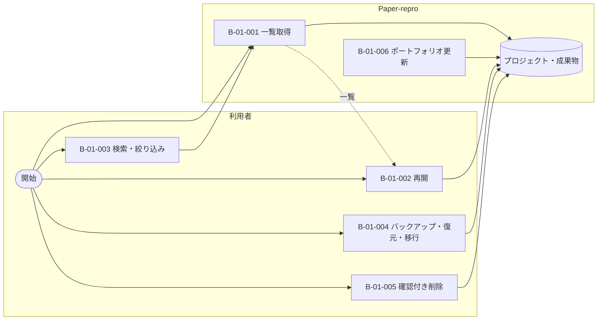
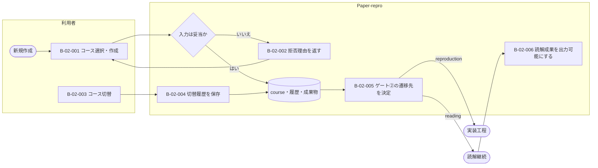
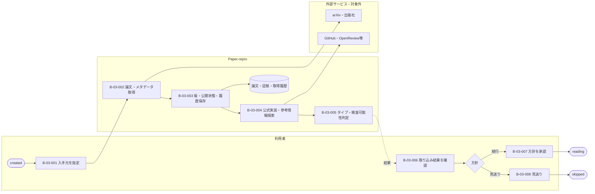
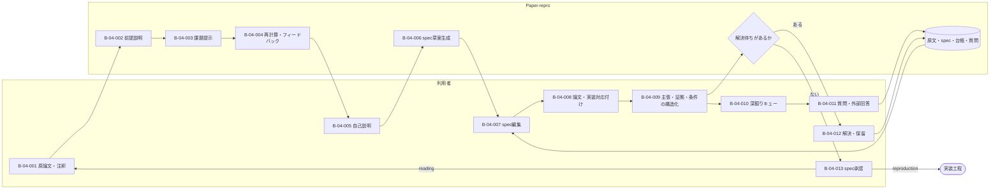
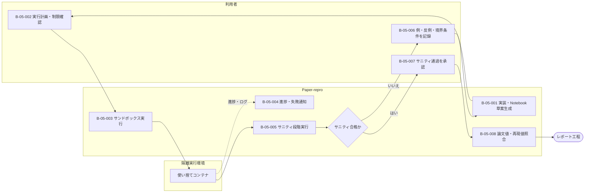
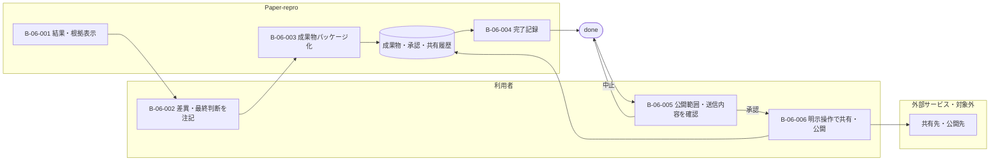
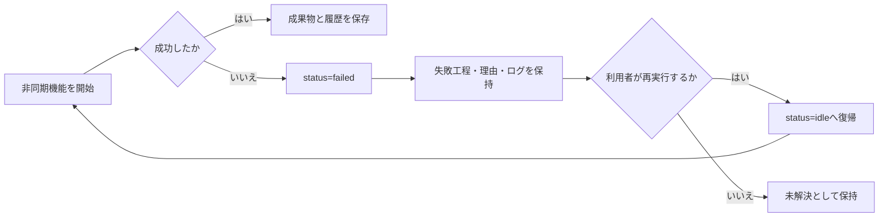

# システム化業務フロー

- 対象プロダクト: `paper-repro`
- 版: **v0.1**
- 作成日: 2026年8月29日
- 準拠: REF-15／REF-16 システム振舞い編
- 一覧: [`arc-behavior-list.md`](arc-behavior-list.md) v0.2
- 共通ルール: [`arc-behavior-rules.md`](arc-behavior-rules.md)

## 0. 図の読み方と範囲

各図は「利用者」「Paper-repro」「外部サービス」のレーンを持つ。`B-xx-xxx`を付けた節点が
開発対象のシステム化業務であり、外部サービス内部の処理は対象外である。承認ゲートは必ず
利用者レーンに置く。実線は処理、点線はデータまたは通知、破線枠相当の注記は将来機能を表す。

| 記号 | 意味 |
| --- | --- |
| 角丸節点 | 開始・終了 |
| 長方形 | 業務または機能 |
| ひし形 | 分岐・人の判断 |
| `[(...)]` | 保存データ |

## BF-01 プロジェクトとポートフォリオ

## BF-02 コース選択と切替

## BF-03 取り込みと方針決定

## BF-04 読解・学習・仕様化

## BF-05 再現実装・検証・照合

## BF-06 レポート・成果物・共有

## 7. 異常系の共通フロー

失敗しても`phase`を失わない。自動的に次工程へ進めず、承認ゲートと
[`arc-behavior-state.md`](arc-behavior-state.md)の遷移条件を再適用する。
