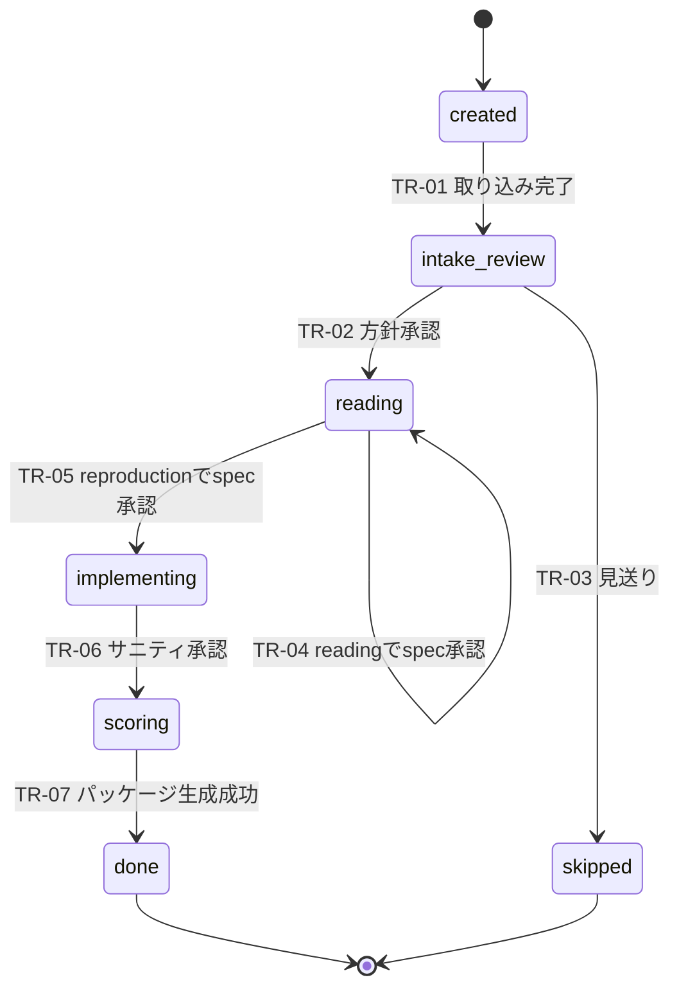
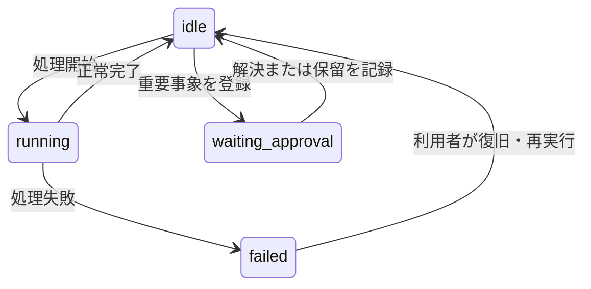

# 状態遷移設計（Paper-repro固有の補助資料）

- 対象プロダクト: `paper-repro`
- 版: **v0.1**
- 作成日: 2026年8月29日
- 位置づけ: REF-15／REF-16の工程成果物ではない、プロジェクト固有の補助資料
- 値の正本: [`arc-datamodel.md`](arc-datamodel.md) v1.0
- 実装: `backend/app/core/states.py`

## 0. 結論

状態は工程を表す`phase`と、工程内の実行状態を表す`status`の直積で表す。
2026年8月29日時点で、列挙値と`phase`遷移は`arc-datamodel.md`と`states.py`で一致する。
ただし、遷移を起こすAPIと画面は一部しか実装されていないため、設計一致は実装完了を意味しない。

## 1. Phase状態

| 状態ID | 値 | 意味 | 主な入口 | 主な出口 |
| --- | --- | --- | --- | --- |
| `ST-01` | `created` | プロジェクト作成直後 | 新規作成 | 取り込み開始 |
| `ST-02` | `intake_review` | 取り込み結果と方針の確認 | 取り込み完了 | 方針承認／見送り |
| `ST-03` | `reading` | 読解、学習、spec作成 | 方針承認 | spec承認 |
| `ST-04` | `implementing` | 実装生成、隔離実行、サニティ | spec承認 | サニティ承認 |
| `ST-05` | `scoring` | 論文値との照合、成果物作成 | サニティ承認 | パッケージ生成成功 |
| `ST-06` | `done` | 完了 | パッケージ生成成功 | 終端 |
| `ST-07` | `skipped` | 見送り | 方針ゲート | 終端 |

`intake`という値は存在しない。`course=reading`は`ST-03`と同名に見えるが、前者は利用経路、
後者は工程であり別概念である。

## 2. Status状態

| 状態ID | 値 | 意味 | 不変条件 |
| --- | --- | --- | --- |
| `SS-01` | `idle` | 入力または次操作を待つ | `approval_kind`は空 |
| `SS-02` | `running` | 同期または非同期処理を実行中 | 同上 |
| `SS-03` | `waiting_approval` | 事象駆動ゲートで人の判断待ち | `approval_kind`必須 |
| `SS-04` | `failed` | 現在の`phase`で処理に失敗 | `phase`を変えない |

## 3. Phase遷移

| 遷移ID | 遷移元 | 遷移先 | 契機 | 条件 | 承認 |
| --- | --- | --- | --- | --- | --- |
| `TR-01` | `created` | `intake_review` | 取り込み完了 | 必須データを保存済み | 不要 |
| `TR-02` | `intake_review` | `reading` | `B-03-007` | 続行方針を選択 | ゲート① |
| `TR-03` | `intake_review` | `skipped` | `B-03-008` | 見送り理由を保存 | ゲート① |
| `TR-04` | `reading` | `reading` | `B-04-013` | `course=reading` | ゲート② |
| `TR-05` | `reading` | `implementing` | `B-04-013` | `course=reproduction` | ゲート② |
| `TR-06` | `implementing` | `scoring` | `B-05-007` | サニティ結果を確認 | ゲート③ |
| `TR-07` | `scoring` | `done` | `B-06-004` | パッケージ生成成功 | 不要 |

## 4. Status遷移

Phase遷移とStatus遷移は別々に検証する。`failed`から復旧しても元の`phase`へ「戻す」処理は
不要であり、工程は保持されたままである。

## 5. 承認ゲートとの対応

| `approval_kind` | 対応業務 | `phase` | 承認後 |
| --- | --- | --- | --- |
| `policy` | `B-03-007`／`B-03-008` | `intake_review` | `TR-02`または`TR-03` |
| `spec` | `B-04-013` | `reading` | `TR-04`または`TR-05` |
| `sanity` | `B-05-007` | `implementing` | `TR-06` |
| `interpretation` | `B-04-011` | 原則`reading` | `phase`維持、`idle`へ |
| `conflict` | `B-04-011` | 任意 | `phase`維持、`idle`へ |
| `comprehension` | `B-04-011` | 原則`reading` | `phase`維持、`idle`へ |

## 6. 既存実装との照合

| 対象 | 設計 | 実装 | 判定 |
| --- | --- | --- | --- |
| `Course` | `reading`, `reproduction` | 一致 | ✅ |
| `Phase` | 7値 | 一致 | ✅ |
| `Status` | 4値 | 一致 | ✅ |
| `ApprovalKind` | 6値 | 一致 | ✅ |
| `ALLOWED_TRANSITIONS` | `TR-01`〜`TR-07` | 遷移集合が一致 | ✅ |
| ゲート①API | 工程確認後に遷移確認 | `/policy`で実装 | ✅ |
| ゲート②・③API | 専用API | 未実装 | ⬜ |
| `TR-01`を起こす取り込み | 取り込み完了イベント | 未実装 | ⬜ |
| `TR-07`を起こす出力 | パッケージ生成成功イベント | 未実装 | ⬜ |
| Status不変条件 | `waiting_approval`時だけkind必須 | DB制約未実装 | ⬜ |

## 7. 禁止する実装

- 任意の`phase`を指定できる汎用状態遷移APIを追加しない。
- 対象工程を確認せず、遷移表だけで承認ゲートの可否を判断しない。
- 失敗時に`phase`を`created`等へ巻き戻さない。
- `course`を`phase`へ混ぜない。
- `done`への遷移を人の承認ゲートとして増やさない。
