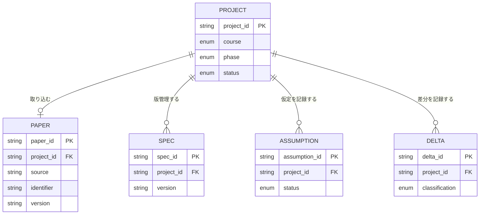
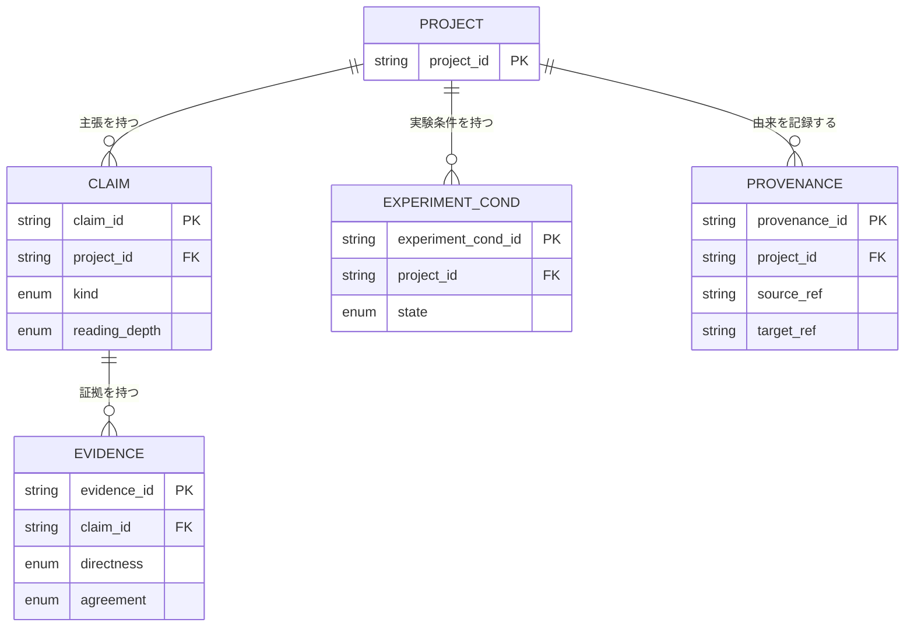
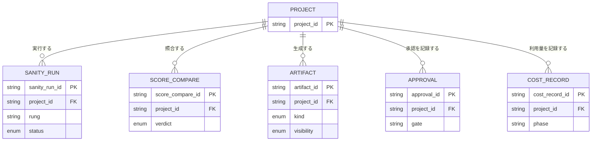
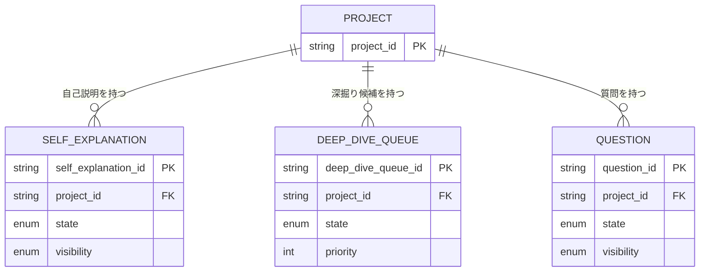

# ER図

- 対象プロダクト: `paper-repro`
- 版: **v0.1**
- 作成日: 2026年8月29日
- 枠組み: [`arc-datamodel-framework.md`](arc-datamodel-framework.md)
- 一覧: [`arc-datamodel-list.md`](arc-datamodel-list.md)

## 0. 表記

- 17エンティティを、利用目的が近い4図へ分割する。
- `Project`は集約の基点として各図に重複表示する。
- 関係が確定要求に明記されていない場合、推測した直接線を引かず`Project`配下として表す。
- 主キー・外部キーの物理名は利用フェーズ直前に確定する。`Project`／`Paper`だけは
  [`arc-datamodel.md`](arc-datamodel.md) v1.0を参照する。

## DM-ER-01 中核

`DM-E01`〜`DM-E05`を扱う。`Project` 1件に対して`Paper`は取り込み前の0件または
取り込み後の1件であり、`Paper`は必ず1件の`Project`に属する。残りは版・判断・差分の
履歴を保持できるよう1対多とする。詳細な削除規則は`DMR-06`に従う。

## DM-ER-02 批判的検証と由来

`DM-E06`〜`DM-E09`を扱う。`Evidence`は要求が明示する`Claim`との関係を持つ。
`Provenance`のsource／targetが参照できる対象種別と整合性制約は、`REQ-C08`のUSDM展開時に確定する。

## DM-ER-03 実行・照合・成果物

`DM-E10`〜`DM-E14`を扱う。実行・承認・コストは履歴を上書きせず追記する。
`Artifact`の実体配置とDBに保持するメタデータの境界はフェーズ4の物理設計で確定する。

## DM-ER-04 学習と質問

`DM-E15`〜`DM-E17`を扱う。回答、訂正、公開・取消の履歴をどこまで別エンティティへ分けるかは、
`REQ-C09`／`REQ-C11`のUSDM展開後に決定する。現段階ではJSON等の物理形を固定しない。

## 5. 関係の未決事項

| 論点 | 現在の扱い | 確定する時期 |
| --- | --- | --- |
| `Spec`の版を別エンティティにするか | `Spec`の複数行で表現できる論理モデル | フェーズ3物理設計 |
| `Provenance`の多態参照 | source／target参照を論理項目として保持 | `REQ-C08` USDM展開時 |
| `Artifact`と実行・照合の直接関係 | `Project`を介して辿る | フェーズ4・5物理設計 |
| 質問の複数回答 | `Question`の履歴要件として保持 | `REQ-C11` USDM展開時 |
| 共有主体・権限 | 新規エンティティを作らない | 認証・共同利用要求の確定時 |

未決事項は多重度やFKを推測で確定せず、ER図に存在しない線として管理する。
