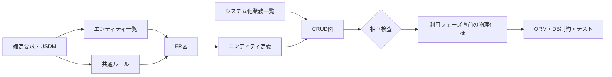

# Paper-repro データモデル・アーキテクチャ設計の枠組み

- 対象プロダクト: `paper-repro`
- 版: **v0.1**
- 作成日: 2026年8月29日
- 要求の正本: [`../requirements.md`](../requirements.md) v0.2
- USDM: [`../requirements-usdm.md`](../requirements-usdm.md) v0.1
- 参照: REF-15／REF-16 データモデル編

## 0. 結論

Paper-reproのデータモデル設計は、確定要求23件から導いた17エンティティを対象に、
次の4つを合意の中心となる工程成果物とする。

1. ER図
2. エンティティ一覧
3. エンティティ定義
4. CRUD図

この4成果物を支えるため、プロジェクト固有の共通ルールとレビュー基準を別文書に置く。
既存の [`arc-datamodel.md`](arc-datamodel.md) v1.0は、フェーズ0で使う
`projects`／`papers`の物理仕様として維持し、本書と役割を分ける。

| 層 | 正本 | 答える問い |
| --- | --- | --- |
| 要求 | `requirements.md`／`requirements-usdm.md` | なぜ、どの振舞いが必要か |
| 論理データモデル | 本書以下のデータモデル成果物 | 何を、どの関係・制約・ライフサイクルで保持するか |
| 物理データモデル | `arc-datamodel.md` | 現在の実装フェーズで、どの型・NULL・制約・索引へ落とすか |
| 実装 | `backend/app/models/`／マイグレーション | 実行環境でどう永続化するか |

## 1. 本書の位置づけ

### 1.1 目的

要件、画面、システム振舞い、既存DDLに散在するデータ記述を、同じエンティティIDで
相互参照できる枠組みにする。目的は、表を増やすことではなく、次の不整合を早期に見つけることである。

- 要求に必要なデータがエンティティへ割り当てられていない
- 画面または業務が扱うデータに作成元・更新元・削除条件がない
- ER図、一覧、定義、CRUDで名称や多重度が異なる
- `unknown`、未報告、推定、確認済みが同じ値へ潰れる
- 論理設計だけのエンティティを実装済みと誤認する

### 1.2 対象範囲

対象は [`../requirements.md`](../requirements.md) 第6章の17エンティティである。
未確定の`REQ-C09-S04`、未具体化の`REQ-C02-S01`／`REQ-C08-S01`から、
新しいエンティティや属性を推測で追加しない。

| 対象 | 粒度 | 状態 |
| --- | --- | --- |
| `Project`／`Paper` | 論理＋物理 | v1.0物理仕様あり。実装は一部のみ |
| 残る15エンティティ | 論理 | 確定要求に書かれた属性と関係まで |
| 性能用の物理分割、パーティション、索引 | 物理 | 利用直前に決定 |
| 認証・マルチユーザー固有エンティティ | 未決 | 要求確定後に追加 |

### 1.3 対象外

- Redis／Celery内部の管理スキーマ
- 外部サービス内部のデータモデル
- ORM固有の実装詳細を論理要件として固定すること
- 未確定要求を前提にした将来テーブルの先行実装
- ガイドに掲載された例示モデルのPaper-reproへの転用

## 2. 参照資料の統合方針

### 2.1 2冊の関係

REF-15は2008年の前身、REF-16は2010年の改訂版である。Paper-reproではREF-16を
成果物構成の基準とし、REF-15は表現・記述確認・レビュー観点の系譜を確認するために使う。

| 確認した事項 | REF-15 | REF-16 | Paper-reproでの反映 |
| --- | --- | --- | --- |
| 4工程成果物 | 序・第1部第1章 | 第1部2.1・第2部 | 本書第3章 |
| 一覧・定義の構成要素 | 第1部1.2・1.3 | 第2部2・3 | `arc-datamodel-list.md`／`arc-datamodel-definitions.md` |
| ER図の構成要素 | 第1部1.1 | 第2部1 | `arc-datamodel-er.md` |
| 業務とデータの対応 | 第1部1.4・第3部2.6 | 第2部4・第3部 | `arc-datamodel-crud.md` |
| 設計・レビューの確認 | 第2部・第4部 | 第3部 | `arc-datamodel-rules.md` |

出典表記: 発注者ビューガイドライン（データモデル編）、Copyright©2008 IPA。
機能要件の合意形成ガイド ver.1.0（データモデル編）、Copyright©2010 IPA。

ガイドのコツ本文や例を転載・翻案しない。成果物の名称と役割を採用し、
Paper-reproの要求から導いた独自の制約を、要求ID・業務ID・画面IDとともに記述する。

### 2.2 個人開発への読み替え

本プロジェクトでは発注者と開発者が同一人物である。合意形成を省略せず、次のように読み替える。

| 一般的な役割 | Paper-reproでの担当 | 証跡 |
| --- | --- | --- |
| 発注者 | 利用者として目的、意味、許容範囲を確認する | 要求ID、承認理由、レビュー記録 |
| 開発者 | 型、制約、実現可能性、実装差分を示す | 設計文書、コード、テスト |
| レビュー | 要求と設計、設計成果物同士、設計と実装を照合する | 本書第7章の完了条件 |

## 3. 工程成果物と補助成果物

| 順序 | 成果物 | 正本 | 役割 |
| ---: | --- | --- | --- |
| 1 | エンティティ一覧 | [`arc-datamodel-list.md`](arc-datamodel-list.md) | 対象範囲、意味、分類、主管、成熟度の目次 |
| 1 | 共通ルール・レビュー基準 | [`arc-datamodel-rules.md`](arc-datamodel-rules.md) | 全成果物で共通に守る意味・制約・確認方法 |
| 2 | ER図 | [`arc-datamodel-er.md`](arc-datamodel-er.md) | エンティティ間の関係、多重度、境界 |
| 3 | エンティティ定義 | [`arc-datamodel-definitions.md`](arc-datamodel-definitions.md) | 属性、識別子、値の状態、根拠、未決事項 |
| 4 | CRUD図 | [`arc-datamodel-crud.md`](arc-datamodel-crud.md) | 47業務が各エンティティをどう扱うか |
| 補助 | フェーズ0物理仕様 | [`arc-datamodel.md`](arc-datamodel.md) | DDLへ落とす型、NULL、ENUM、制約、索引 |
| 補助 | 状態遷移 | [`arc-behavior-state.md`](arc-behavior-state.md) | `Project.phase/status`の遷移と承認ゲート |

### 3.1 作成順序

一覧とルールを先に固定し、詳細から新しいエンティティIDを生やさない。
物理仕様は対象機能を実装する直前に確定し、使わないテーブルを先行作成しない。

## 4. ID体系と区切り方

### 4.1 ID

| 対象 | 形式 | 例 |
| --- | --- | --- |
| エンティティ | `DM-E##` | `DM-E01`（Project） |
| ER図 | `DM-ER-##` | `DM-ER-01`（中核） |
| データルール | `DMR-##` | `DMR-02`（不明値） |
| レビュー項目 | `DMV-##` | `DMV-05`（CRUDライフサイクル） |

既存の要求ID、業務ID、画面ID、状態IDは振り直さない。データモデルIDはそれらを
置換する番号ではなく、成果物間で同じデータ概念を参照するための補助識別子である。

### 4.2 1エンティティの区切り

次のいずれかが独立する場合にエンティティを分ける。

- 独立した識別子とライフサイクルを持つ
- 主管または更新主体が異なる
- 版、承認、実行、公開範囲を別に追跡する必要がある
- 1件対複数件の関係を保持する必要がある

単に画面上で別欄に見えること、実装上JSONへ分けたいことだけを理由に分割しない。

## 5. 成熟度と実装状態

### 5.1 合意成熟度

| 状態 | Paper-reproでの意味 |
| --- | --- |
| 仕掛 | エンティティ候補と要求根拠があり、未決事項を明記している |
| 充実 | 4成果物で名称・関係・属性・CRUDが整合し、レビュー項目を通している |
| 完成 | 対象リリースのUSDM仕様、画面、振舞い、物理仕様、テストと一致している |

### 5.2 状態を混同しない

| 表示 | 意味 |
| --- | --- |
| 論理設計 | 要求上必要なデータ概念を定義済み |
| 物理設計 | 型、NULL、制約、索引まで決定済み |
| 実装 | ORM／DDLへ反映済み |
| 検証 | DB制約、API、テスト、画面で確認済み |

2026年8月29日時点で、17エンティティは論理設計の対象であるが、物理仕様が確定しているのは
`Project`／`Paper`だけである。さらに実装済みなのは`Project`の一部だけである。

## 6. 他の設計領域との接続

| 接続先 | 照合すること |
| --- | --- |
| USDM | 要求の動詞に必要な入力、出力、履歴、根拠が保持できるか |
| システム振舞い | 47業務のC/R/U/D、トリガー、事前・事後条件と一致するか |
| 画面 | 表示・入力・確認・削除・公開する項目の意味が一致するか |
| 外部インタフェース | 取得元・対象版・変換・欠落項目・送信先を追跡できるか |
| バッチ | 一括処理の対象集合、再実行、冪等性、失敗履歴を表せるか |
| 帳票・成果物 | 出力項目の由来、版、公開範囲、ライセンスを辿れるか |

## 7. 完了条件

データモデル編を「充実」とするには、少なくとも次をすべて満たす。

- 17エンティティが一覧、ER図、定義、CRUDへ同じIDで現れる
- 確定要求23件と47業務のうち、データを扱うものに対応先がある
- ER図の多重度と定義のFK候補が矛盾しない
- 各エンティティに作成元があり、削除しないものはその理由がある
- `unknown`、未報告、推定、外部確認済み、人間承認済みを区別する
- 版、取得元、生成条件、承認・訂正履歴を必要なエンティティで保持する
- 保存期間、最大件数、増加率が未決なら、未決と確認時期を明記する
- 論理設計、物理設計、実装、検証の状態を分けて表示する
- ローカルMarkdownリンクとMermaidの実描画検証が成功する

「完成」は、各要求のUSDM仕様が展開され、対象フェーズの物理仕様・実装・テスト・画面確認まで
一致した時点で判定する。本書群の作成だけでソフトウェア実装フェーズを進めない。

## 8. 更新規約

1. 要求追加時は、先に一覧へエンティティ追加の要否を記録する。
2. 一覧へ追加したIDだけをER図と定義へ展開する。
3. システム化業務の追加・変更時はCRUDを同じ変更で更新する。
4. ENUM、状態、承認ゲートを変える場合は状態遷移と物理仕様を同時に確認する。
5. 物理仕様を実装へ反映したら、一覧の成熟度と実装状態を更新する。
6. フェーズ状態が変わらない設計更新では`roadmap.md`を変更しない。
