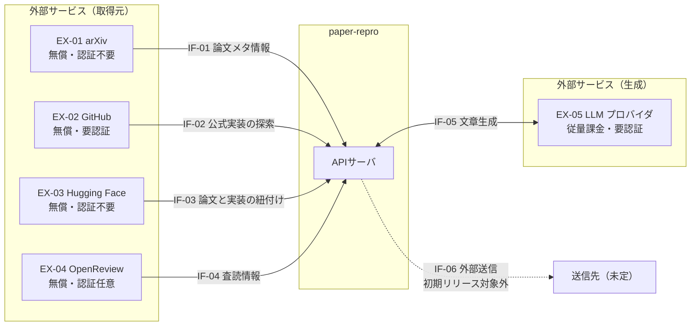

# 外部システム関連図

- 対象プロダクト: `paper-repro`
- 版: **v0.1.2**
- 作成日: 2026年8月31日
- 準拠: REF-16 外部インタフェース編
- 枠組み: [`arc-interface.md`](arc-interface.md)
- 一覧: [`arc-interface-list.md`](arc-interface-list.md)

## 更新履歴

| 版 | 日付 | 変更内容 |
| --- | --- | --- |
| v0.1.2 | 2026-08-31 | `IF-03` を Hugging Face へ差し替え。線を点線から実線へ |
| v0.1.1 | 2026-08-31 | Mermaid のソースをトグルで表示（他文書と記法を統一） |
| v0.1 | 2026-08-31 | 初版 |

## 0. 共通情報

出典表記: 機能要件の合意形成ガイド ver.1.0、Copyright©2010 IPA

本書は [`arc-interface-list.md`](arc-interface-list.md) に載ったインタフェースを図で示す。
**一覧に無いものを図へ描かない。**

---

## 1. 関連図


<details>
<summary>Mermaid のソースを見る</summary>

````markdown

````

</details>

### 1.1 線種の約束

| 線種 | 意味 |
| --- | --- |
| 実線・単方向 | 採用済み。取得のみ |
| 実線・双方向 | 採用済み。送信と取得の両方 |
| **点線** | **採用していない**（要判断、または初期リリース対象外） |

⚠️ **`IF-06` だけが点線である。** 初期リリースで実装しない。
`IF-03` は Hugging Face への差し替えにより実線とした（[`arc-interface-list.md`](arc-interface-list.md) 1.1節）。

### 1.2 図から読み取れること

- **取得が4件、送受信が1件、送信のみが1件**である。
- **`IF-05` だけが双方向**である。論文本文を送り、生成結果を受け取る。
- **`IF-05` だけが従量課金**である。コスト上限の主対象となる。
- **`IF-06` の接続先が未定**である。初期リリースで実装しないため。

---

## 2. 依存の強さ

インタフェースが使えないとき、何が止まるかを示す。

| IF | 止まるもの | 代替 | 影響度 |
| --- | --- | --- | --- |
| `IF-01` | **取り込みそのもの** | 利用者による手入力 | **高** |
| `IF-02` | 公式実装の探索結果が欠ける | 利用者による指定 | 中 |
| `IF-03` | 実装の紐付けが得られない | `IF-02` の検索 | 中 |
| `IF-04` | 査読情報が欠ける | 無し | 低 |
| `IF-05` | **spec生成・数式下訳** | 利用者による手作業 | **高** |

**`IF-01` と `IF-05` が止まると、主要な工程が進まない。**
ただし、いずれも利用者の手作業で代替できる。**完全に停止はしない。**

⚠️ **`IF-04` に代替が無い。** 査読情報は OpenReview 以外から得にくい。
ただし影響度は低く、無くても工程は進む。

---

## 3. 境界の外にあるもの

`BR-02`（拠点・実行境界）に従い、**外部サービスの内部処理は設計範囲外**とする。

| 範囲外 | 理由 |
| --- | --- |
| arXiv の論文登録・審査の仕組み | `EX-01` の内部 |
| GitHub のリポジトリ管理 | `EX-02` の内部 |
| OpenReview の査読プロセス | `EX-04` の内部 |
| LLM の推論処理 | `EX-05` の内部 |

**本書が扱うのは、境界を越えるデータのやりとりだけである。**

---

## 4. 未確定の事項

- ~~**`IF-03` の扱い**~~ → **決定済。** Hugging Face Papers API へ差し替えた
  （[`../worknotes/decision-pwc-replacement.md`](../worknotes/decision-pwc-replacement.md)）。
- **`IF-06` の接続先。** 初期リリース対象外のため未定。
- **サンドボックスからの外部アクセス。** `BR-12` は「ネットワークは原則遮断」と定める。
  検証コードが外部へアクセスする場合の扱いは、本書の範囲外か要確認。
