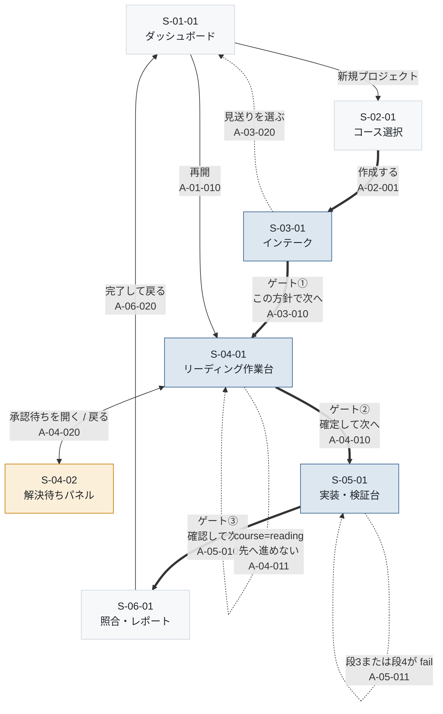
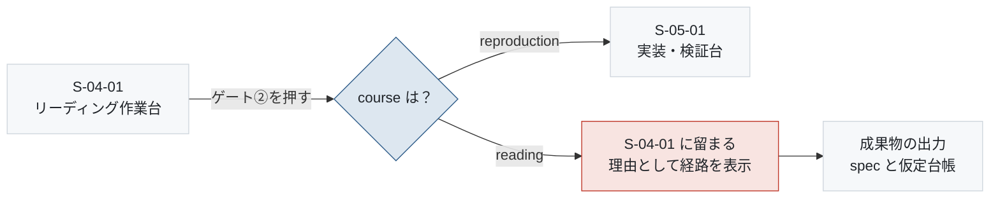

# 画面遷移

- 対象プロダクト: `paper-repro`
- 版: v0.1
- 作成日: 2026年8月27日
- 枠組み: [`arc-screen.md`](arc-screen.md) 7.2節
- 共通ルール: [`arc-screen-rules.md`](arc-screen-rules.md)
- 画面一覧: [`arc-screen-list.md`](arc-screen-list.md)
- 準拠する標準: IPA「機能要件の合意形成ガイド」画面編（[`../references.md`](../references.md) REF-16）

**画面と画面のつながりを定める。** 画面の中身は各画面の設計書が、
配置と配色は共通ルールが扱う。本書は**線と、線を引く条件**だけを扱う。

---

## 1. 図の読み方

| 表記 | 意味 |
|---|---|
| 実線の矢印 | 正常系の遷移 |
| **点線の矢印** | **異常系・例外の遷移** |
| 太線の矢印 | **承認ゲートを通る遷移**。他に先へ進む道は無い |
| 双方向の矢印 | 行き来できる |
| ラベル | 遷移を起こすイベント |

**遷移図の矢印は遷移を表す。** 各画面の設計書に載せた図では、
矢印が「画面上の配置の上下関係」を表していた（[`arc-screen-rules.md`](arc-screen-rules.md) CR-01）。
**同じ記号が別の意味を持つので注意する。**

---

## 2. T-01 全体の遷移

論文1本を投入してから成果物を出力するまでの、ひとまとまりの流れ。



<details>
<summary>Mermaid のソースを見る</summary>

````markdown

````

</details>

### 図から読み取れること

**先へ進む線は、すべて太線である。** つまり承認ゲートを通らずに
次の工程へ行く道が画面に無い。これが `REQ-C06` の「迂回不可能な承認ゲート」を
画面の構造で守っている形である。

**戻る線が少ない。** ダッシュボードへ戻る経路はあるが、
工程を逆行する線は引いていない。理由は第4章に書く。

---

## 3. イベント一覧

遷移を起こすイベントと、対応するアクションID。

| イベント | 発生元 | 遷移先 | アクションID | 種別 | 対応要求 |
|---|---|---|---|---|---|
| 新規プロジェクトを押す | `S-01-01` | `S-02-01` | — | 正常 | `REQ-C09` |
| 再開を押す | `S-01-01` | `phase` に応じた画面 | `A-01-010` | 正常 | `REQ-C09-S01` |
| 作成するを押す | `S-02-01` | `S-03-01` | `A-02-001` | **ゲート外** | `REQ-C01-R1.110` |
| 経路が未選択のまま押す | `S-02-01` | `S-02-01`（留まる） | `A-02-002` | 異常 | `REQ-C01-R1.70` |
| この方針で次へを押す | `S-03-01` | `S-04-01` | `A-03-010` | **ゲート①** | `REQ-C06` |
| 見送りを選ぶ | `S-03-01` | `S-01-01` | `A-03-020` | 正常（終端） | — |
| 確定して次へを押す | `S-04-01` | `S-05-01` | `A-04-010` | **ゲート②** | `REQ-C06` |
| 同上（`course=reading`） | `S-04-01` | `S-04-01`（留まる） | `A-04-011` | 異常 | **`REQ-C01-R2.40`** |
| 承認待ちを押す | `S-04-01` ほか全画面 | `S-04-02` | `A-04-020` | 正常 | `REQ-C07` |
| 解決するを押す | `S-04-02` | `S-04-02`（留まる） | `A-04-030` | 正常 | `REQ-C07` |
| 未解決のまま進むを押す | `S-04-02` | `S-04-02`（留まる） | `A-04-031` | 正常 | `REQ-C07` |
| 確認して次へを押す | `S-05-01` | `S-06-01` | `A-05-010` | **ゲート③** | `REQ-C05` |
| 段3または段4が fail | `S-05-01` | `S-05-01`（留まる） | `A-05-011` | 異常 | `REQ-C05` |
| zip をダウンロードを押す | `S-06-01` | `S-06-01`（留まる） | `A-06-010` | 正常 | `REQ-C09-S03` |
| 完了して戻るを押す | `S-06-01` | `S-01-01` | `A-06-020` | 正常 | — |
| 製品名を押す | 全画面 | `S-01-01` | — | 正常 | — |
| 言語を切り替える | 全画面 | **遷移しない** | — | 正常 | `AGENTS.md` 5章 |

**アクションIDは各画面の設計書 3節（画面アクション明細）と一致させる。**
現時点で3節は未作成のため、**本表が先にIDを確定する。**
明細を書くときは本表の番号に合わせる。

---

## 4. 経路による分岐

`REQ-C01` により、`course` の値で遷移が変わる。**変わるのは1か所だけである。**



<details>
<summary>Mermaid のソースを見る</summary>

````markdown

````

</details>

### 分岐が1か所で済む理由

`course` は7画面のうち **`S-04-01` から `S-05-01` へ進む線にしか影響しない。**
他の画面は経路によらず同じものを見せる。

**これが画面グループを工程でなく機能で切った根拠でもある**
（[`arc-screen-list.md`](arc-screen-list.md) 第1章）。
画面そのものは経路で変わらないため、1つのIDで足りる。

### 経路の切り替えは遷移を起こさない

`REQ-C01-R3` の切り替えは、**画面を移動させない**（`R3.80` により `phase` を変えないため）。
表示中の経路名と、実装工程への導線の有無だけが変わる（`R3.90`・`R3.100`）。

---

## 5. 引かなかった線

**引ける線をすべて引かない。** 引かなかったものと、その理由を残す。

| 引かなかった線 | 理由 |
|---|---|
| `S-04-01` → `S-03-01`（工程を戻る） | 方針を確定した後に戻れると、承認ゲート①をやり直せることになる。方針を変えたい場合は**プロジェクトを作り直す** |
| `S-05-01` → `S-04-01`（工程を戻る） | 同上。spec を確定した後に戻すと、実行済みのサニティ結果との対応が崩れる |
| `S-01-01` → `S-05-01`（工程を飛ばす） | 承認ゲートの迂回になる（`REQ-C06`）。再開は `phase` が示す画面へのみ |
| `S-06-01` → 各工程（やり直し） | 照合結果を出した後の巻き戻しは、成果物の由来が追えなくなる（`REQ-C08`） |
| ログイン画面からの遷移 | 初期リリースでは認証を持たない（[`arc-screen-rules.md`](arc-screen-rules.md) CR-07） |

> **戻る線を引かない判断は、利便性を下げる。** 方針を変えたいだけでも
> 作り直しになる。それでも引かないのは、**戻った後に前の工程の成果物を
> どう扱うかが決まっていない**ためである。決めずに線だけ引くと、
> 実装時に「戻ったら台帳はどうなるのか」で必ず詰まる。
>
> 必要になった時点で、`REQ-C08`（由来の追跡）と突き合わせて設計する。
> それまでは**引かないことを明示的な判断として記録する。**

---

## 6. 全画面に共通する遷移

[`arc-screen-rules.md`](arc-screen-rules.md) CR-05 が定める。本書では再掲しない。

| 操作 | 遷移 |
|---|---|
| ヘッダの製品名 | `S-01-01` へ |
| ヘッダの言語切替 | 遷移しない |
| ユーティリティの工程表示 | その工程の画面へ。**先の工程へは進めない** |
| ユーティリティの承認待ち件数 | `S-04-02` へ |

---

## 7. 未解決の確認事項

- **`A-xx-xxx` の採番。** 本書が先に確定したが、各画面の設計書3節を書くときに
  番号が不足する可能性がある。10刻みにしてあるので間に挿入できる。
- **再開時の遷移先**（`A-01-010`）。`phase` ごとの対応表が未作成。
  `skipped` と `done` のプロジェクトを再開したときの挙動が未定。
- **戻る線の要否**（第5章）。利便性と、成果物の扱いの複雑さを比べて判断する。
- **`S-06-01` の「完了して戻る」の意味。** `phase` を `done` にするのか、
  単に画面を移動するだけかが未定。
