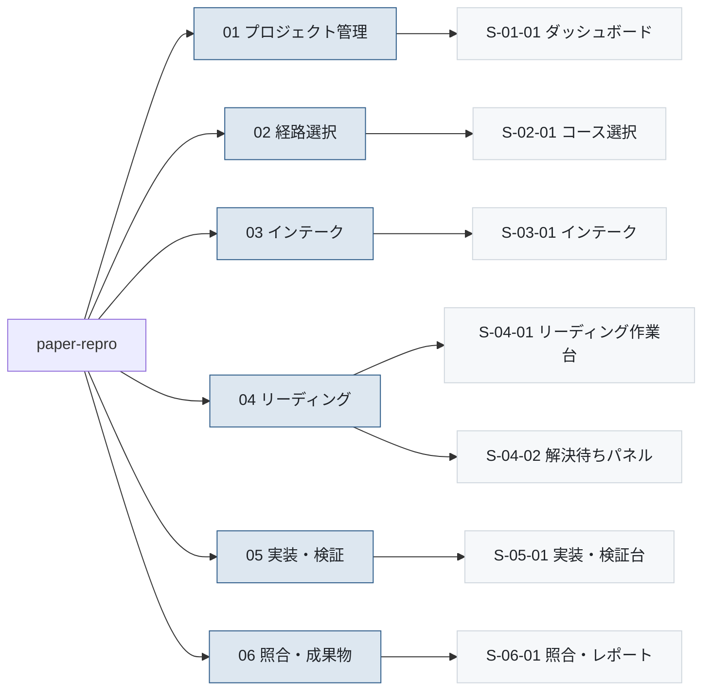

# 画面一覧

- 対象プロダクト: `paper-repro`
- 版: v0.2（2026年9月8日、要求→画面の逆方向検査を追加）
- 作成日: 2026年8月26日
- 枠組み: [`arc-screen.md`](arc-screen.md) 7.1節
- 共通ルール: [`arc-screen-rules.md`](arc-screen-rules.md)
- 準拠する標準: IPA「機能要件の合意形成ガイド」画面編（[`../references.md`](../references.md) REF-16）

**1行＝1画面。** 画面数は行数で数えられる。

---

## 1. 画面グループの定義

枠組み第10章の未解決事項だった「グループを機能で切るか工程で切るか」を、
**機能（利用者から見たまとまり）で切る**と決めた。

**工程で切らない理由。** `course` が `reading` か `reproduction` かで、
04 から 05 へ進めるかが変わる。工程で切ると、同じ画面が経路によって
別のグループに属することになり、画面IDが2つ必要になる。
**画面そのものは変わらない**ので、機能で切れば1つで済む。

| `nn` | グループ名 | 含む画面 |
|---|---|---|
| 01 | プロジェクト管理 | 一覧・再開 |
| 02 | 経路選択 | コースの選択と切替 |
| 03 | インテーク | 取り込み・タイプ判定・方針決定 |
| 04 | リーディング | spec・台帳・解決待ち |
| 05 | 実装・検証 | サニティ・実行 |
| 06 | 照合・成果物 | スコア照合・出力 |

---

## 2. 一覧表

| No. | 画面ID | 画面名 | 分類 | 階層 | 説明 | 対応要求 | 実装単位 | 初期リリース |
|---|---|---|---|---|---|---|---|---|
| 1 | `S-01-01` | ダッシュボード | 一覧表示 | 01 | プロジェクトを一覧し、状態と経路を見て再開する | `REQ-C09`、`REQ-C09-S01` | `F-13` | 含む |
| 2 | `S-02-01` | コース選択 | 入力フォーム | 02 | 読解か再現実装かを選び、論文の URL とともに作成する | **`REQ-C01`**、`REQ-C01-R1` | `F-15` | 含む |
| 3 | `S-03-01` | インテーク | 情報表示＋選択 | 03 | 第1パス要約・公式実装・タイプ判定を見て、方針を5択で決める | `REQ-C03`、`REQ-C03-S01` | `F-01` `F-03` `F-04` `F-14` | 含む |
| 4 | `S-04-01` | リーディング作業台 | 3ペイン編集 | 04 | 論文・spec・仮定台帳を並べて読み解く | `REQ-C07`、`REQ-C08`、`REQ-C10-S01`〜`S04` | `F-05` `F-06` | 含む |
| 5 | `S-04-02` | 解決待ちパネル | 一覧＋入力 | 04 | 解釈・証拠矛盾・理解確認の未解決を解決する | `REQ-C07`、`REQ-C10-S04` | `F-12` `F-17` | 最小形 |
| 6 | `S-05-01` | 実装・検証台 | 実行監視 | 05 | サニティ階段を実行し、ログと中間生成物を目視する | `REQ-C05`、`REQ-C06` | `F-08` `F-09` | 含む |
| 7 | `S-06-01` | 照合・レポート | 表示＋出力 | 06 | 再現値と論文値を照合し、成果物を出力する | `REQ-C05`、`REQ-C10-S02` | `F-10` `F-11` | 含む |

**7画面。** 初期リリース（要件 第8章）で必要な範囲に絞っている。

---

## 3. 階層構造



<details>
<summary>Mermaid のソースを見る</summary>

````markdown

````

</details>

---

## 4. 各画面の設計書

| 画面ID | 設計書 |
|---|---|
| `S-01-01` | [`screens/S-01-01.md`](screens/S-01-01.md) |
| `S-02-01` | [`screens/S-02-01.md`](screens/S-02-01.md) |
| `S-03-01` | [`screens/S-03-01.md`](screens/S-03-01.md) |
| `S-04-01` | [`screens/S-04-01.md`](screens/S-04-01.md) |
| `S-04-02` | [`screens/S-04-02.md`](screens/S-04-02.md) |
| `S-05-01` | [`screens/S-05-01.md`](screens/S-05-01.md) |
| `S-06-01` | [`screens/S-06-01.md`](screens/S-06-01.md) |

---

## 5. 未確定の画面

**仕様は存在するが、実現手段としての画面が決まっていないもの**（枠組み 8.1節）。

⚠️ **2026年9月8日に逆方向の検査を行った。**
第6章は「画面 → 要求」を確かめていたが、**「要求 → 画面」を確かめていなかった。**
要求33件を実装単位（`F-xx`）経由で突き合わせた結果、**画面を持たない実装単位が5つ**見つかった。
うち2つ（`F-07`・`F-21`）は本節にも記録がなかった。

⚠️ **いま画面を起こさない。** いずれも「画面に何をどう並べるか」が判断材料であり、
[`../../.agents/skills/paper-repro-requirement-deferral/SKILL.md`](../../.agents/skills/paper-repro-requirement-deferral/SKILL.md)
に従って担当工程・解除条件・再判断の期限を与える。

### 5.1 `F-07` Δリスト

- **対応する要求**：`REQ-C05-S03`（論文設定からの差分Δを残す）
- **内容**：差分を1〜3個で管理し、5行を超えたら警告する
- **担当工程**：画面編の設計（実装フェーズ）
- **解除条件**：`S-04-01`（リーディング作業台）の3ペインに収まるか、
  独立したパネルが要るかを、仮定台帳の表示量を実測して判断できること
- **再判断の期限**：`S-04-01` の入出力項目一覧を書く時点
- **状況**：⚠️ **本節に記録が無かった。** 画面一覧の作成時（2026年8月26日）からの漏れである

### 5.2 `F-18` 学習ポートフォリオ

- **対応する要求**：`REQ-C09`、`REQ-C09-S02`（深掘りキュー）、`REQ-C09-S03`（公開範囲）
- **内容**：論文更新、学習履歴、深掘りキュー、探索状態、要約・索引、公開範囲、再学習対象を表示・管理する
- **担当工程**：画面編の設計（実装フェーズ）
- **解除条件**：`S-01-01`（ダッシュボード）の拡張で足りるか、別画面が要るかを、
  表示項目数を数えて判断できること
- **再判断の期限**：`S-01-01` の入出力項目一覧を書く時点
- **状況**：`REQ-C09-S02`・`S03` は段階2で仕様が第2フェーズ送りである（USDM 第11章）

### 5.3 `F-19` 批判的検証ワークスペース

- **対応する要求**：`REQ-C10`、`REQ-C10-S05`（生成内容の検証）
- **内容**：主張区分、前提、帰結、支持例・反例、検討状態、再現結果を関連付け、人間が最終判断する
- **担当工程**：画面編の設計（実装フェーズ）
- **解除条件**：`S-04-01`・`S-04-02` との役割分担が定まること。
  `S-04-02`（解決待ちパネル）は「最小形」として作られており、**その拡張で足りるかを先に判断する**
- **再判断の期限**：`S-04-02` の入出力項目一覧を書く時点
- **状況**：⚠️ **本節は当初 `REQ-C04`（理解の確認）として記録していた。** 訂正する。
  `F-19` の対応要求は `REQ-C10`（批判的検証ワークスペース）であり、要求名と実装単位がずれていた

### 5.4 `F-20` 質問・対話・共同読解

- **対応する要求**：`REQ-C11`、`REQ-C04-S03`（生成AIとの対話）、`REQ-C09-S05`（外部照会と返礼）
- **内容**：個人質問台帳から生成AI対話、限定共有、専門家・著者問い合わせへ段階拡張する
- **担当工程**：画面編の設計（実装フェーズ）
- **解除条件**：`REQ-C04-S03` の対話が読解の画面（`S-04-01`）の中で完結するか、
  独立した画面が要るかを判断できること。**外部送信を伴う `REQ-C09-S05` は分けるかも同時に決める**
- **再判断の期限**：`S-04-01` の入出力項目一覧を書く時点
- **状況**：`REQ-C11` は段階2で仕様が第2フェーズ送りである（USDM 第12章）。
  一方 `REQ-C04-S03`・`REQ-C09-S05` は初期リリースの範囲であり、**フェーズが揃っていない**

### 5.5 `F-21` 再現スコープ定義書

- **対応する要求**：`REQ-C12`（再現スコープの定義）
- **内容**：再現する要素を4〜6個に絞り、4区分で表示する。スコープ外を除外理由つきで並べる
- **担当工程**：画面編の設計（実装フェーズ）
- **解除条件**：`S-03-01`（インテーク）で方針を決めた直後に置くか、
  `S-05-01`（実装・検証台）の入口に置くかを、`REQ-C12-R2.40`（後段の実装依頼の入力）の
  受け渡し先が定まってから判断できること
- **再判断の期限**：`S-03-01` または `S-05-01` の入出力項目一覧を書く時点
- **状況**：⚠️ **本節に記録が無かった。** `REQ-C12` を2026年9月8日に新設した際に生じた穴である

### 5.6 既存の未確定2件

| 対応する要求 | 状況 |
|---|---|
| `REQ-C02` 前提知識の段階的説明 | 独立した画面にするか、リーディング作業台の中に置くかが未定。実装単位は `F-16` で、`S-04-01` に含まれる |
| `REQ-C04` 理解の確認とフィードバック | 同上。`REQ-C04-S02` の自己説明をどこで書かせるか。実装単位は `F-16` |

⚠️ **この2件は5.1〜5.5と性質が違う。** 実装単位 `F-16` は既に `S-04-01` に含まれており、
**画面が無いのではなく、置き場所が未定である。**

---

### 5.7 検査のやり方

要求から画面への対応は、実装単位を経由して確かめる。

1. [`../requirements.md`](../requirements.md) 第9章の対応表から、各要求の `F-xx` を取る
2. 本書の一覧表（第2章）が挙げる `F-xx` の集合と突き合わせる
3. **本書に現れない `F-xx` を持つ要求が、画面を持たない要求である**

⚠️ **第6章の検査（画面 → 要求）だけでは足りない。**
7画面すべてが要求に紐づいていても、**要求の側に画面が無いものが残る。**

## 6. 対応する仕様を持たない画面

**現時点で該当なし。** 7画面すべてが要求に紐づいている。

この節を空のまま残すのは、**将来ここに項目が増えたときに気づくため**である。
根拠のない画面は、作った本人しか理由を説明できなくなる。
