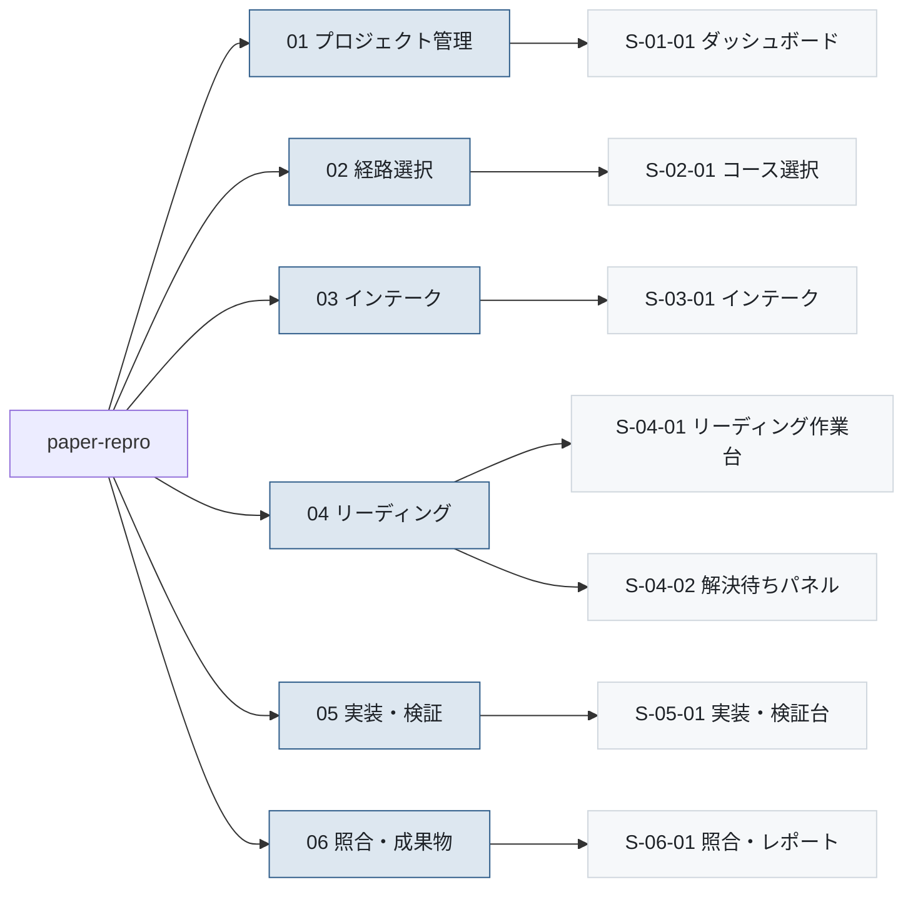

# 画面一覧

- 対象プロダクト: `paper-repro`
- 版: v0.1
- 作成日: 2026年8月26日
- 枠組み: [`arc-screen.md`](arc-screen.md) 7.1節
- 共通ルール: [`arc-screen-rules.md`](arc-screen-rules.md)
- 準拠する標準: IPA「機能要件の合意形成ガイド」画面編（[`../references.md`](../references.md) REF-16）

**1行＝1画面。** 画面数は行数で数えられる。

---

## 1. 画面グループの定義

枠組み第10章の未解決事項だった「グループを機能で切るか工程で切るか」を、
**機能（利用者から見たまとまり）で切る**と決めた。

**工程で切らない理由。** `course` が `reading` か `reproduction` かで、
04 から 05 へ進めるかが変わる。工程で切ると、同じ画面が経路によって
別のグループに属することになり、画面IDが2つ必要になる。
**画面そのものは変わらない**ので、機能で切れば1つで済む。

| `nn` | グループ名 | 含む画面 |
|---|---|---|
| 01 | プロジェクト管理 | 一覧・再開 |
| 02 | 経路選択 | コースの選択と切替 |
| 03 | インテーク | 取り込み・タイプ判定・方針決定 |
| 04 | リーディング | spec・台帳・解決待ち |
| 05 | 実装・検証 | サニティ・実行 |
| 06 | 照合・成果物 | スコア照合・出力 |

---

## 2. 一覧表

| No. | 画面ID | 画面名 | 分類 | 階層 | 説明 | 対応要求 | 実装単位 | 初期リリース |
|---|---|---|---|---|---|---|---|---|
| 1 | `S-01-01` | ダッシュボード | 一覧表示 | 01 | プロジェクトを一覧し、状態と経路を見て再開する | `REQ-C09`、`REQ-C09-S01` | `F-13` | 含む |
| 2 | `S-02-01` | コース選択 | 入力フォーム | 02 | 読解か再現実装かを選び、論文の URL とともに作成する | **`REQ-C01`**、`REQ-C01-R1` | `F-15` | 含む |
| 3 | `S-03-01` | インテーク | 情報表示＋選択 | 03 | 第1パス要約・公式実装・タイプ判定を見て、方針を5択で決める | `REQ-C03`、`REQ-C03-S01` | `F-01` `F-03` `F-04` `F-14` | 含む |
| 4 | `S-04-01` | リーディング作業台 | 3ペイン編集 | 04 | 論文・spec・仮定台帳を並べて読み解く | `REQ-C07`、`REQ-C08`、`REQ-C10-S01`〜`S04` | `F-05` `F-06` | 含む |
| 5 | `S-04-02` | 解決待ちパネル | 一覧＋入力 | 04 | 解釈・証拠矛盾・理解確認の未解決を解決する | `REQ-C07`、`REQ-C10-S04` | `F-12` `F-17` | 最小形 |
| 6 | `S-05-01` | 実装・検証台 | 実行監視 | 05 | サニティ階段を実行し、ログと中間生成物を目視する | `REQ-C05`、`REQ-C06` | `F-08` `F-09` | 含む |
| 7 | `S-06-01` | 照合・レポート | 表示＋出力 | 06 | 再現値と論文値を照合し、成果物を出力する | `REQ-C05`、`REQ-C10-S02` | `F-10` `F-11` | 含む |

**7画面。** 初期リリース（要件 第8章）で必要な範囲に絞っている。

---

## 3. 階層構造



<details>
<summary>Mermaid のソースを見る</summary>

````markdown

````

</details>

---

## 4. 各画面の設計書

| 画面ID | 設計書 |
|---|---|
| `S-01-01` | [`screens/S-01-01.md`](screens/S-01-01.md) |
| `S-02-01` | [`screens/S-02-01.md`](screens/S-02-01.md) |
| `S-03-01` | [`screens/S-03-01.md`](screens/S-03-01.md) |
| `S-04-01` | [`screens/S-04-01.md`](screens/S-04-01.md) |
| `S-04-02` | [`screens/S-04-02.md`](screens/S-04-02.md) |
| `S-05-01` | [`screens/S-05-01.md`](screens/S-05-01.md) |
| `S-06-01` | [`screens/S-06-01.md`](screens/S-06-01.md) |

---

## 5. 未確定の画面

**仕様は存在するが、実現手段としての画面が決まっていないもの**（枠組み 8.1節）。

| 対応する仕様・要求 | 状況 |
|---|---|
| `REQ-C02` 前提知識の段階的説明 | 独立した画面にするか、リーディング作業台の中に置くかが未定 |
| `REQ-C04` 理解の確認とフィードバック | 同上。`REQ-C04-S02` の自己説明をどこで書かせるか |
| `REQ-C09` 論文ポートフォリオ | ダッシュボードの拡張で足りるか、別画面が要るかが未定 |
| `REQ-C11` 質問台帳と外部対話 | フェーズ未定。外部送信を伴うため慎重に決める |

**放置しない。** 実装するフェーズが決まった時点で、画面を起こすか
仕様側を見直すかを判断する。

## 6. 対応する仕様を持たない画面

**現時点で該当なし。** 7画面すべてが要求に紐づいている。

この節を空のまま残すのは、**将来ここに項目が増えたときに気づくため**である。
根拠のない画面は、作った本人しか理由を説明できなくなる。
