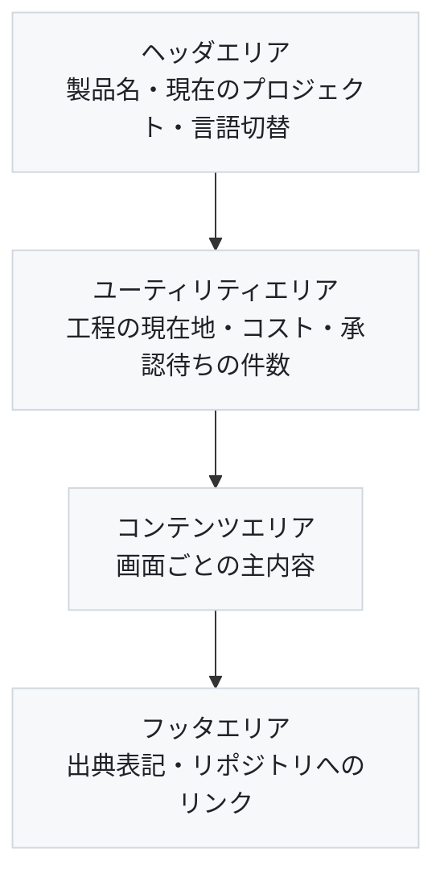
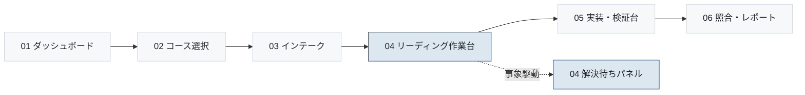

# 画面遷移・レイアウト共通ルール

- 対象プロダクト: `paper-repro`
- 版: v0.1
- 作成日: 2026年8月26日
- 枠組み: [`arc-screen.md`](arc-screen.md) 7.3節
- 準拠する標準: IPA「機能要件の合意形成ガイド」画面編（[`../references.md`](../references.md) REF-16）

**個別の画面に依らず共通して決めることを、ここにまとめる。**
各画面の設計書（`screens/S-xx-xx.md`）は本書に従い、同じ内容を書き写さない。

---

## CR-01 ページの構成要素

画面を5つのエリアに分ける。**フレームは使わない。**



<details>
<summary>Mermaid のソースを見る</summary>

````markdown

````

</details>

> **本書および各画面の図で、矢印は「画面上の配置の上下関係」を表す。**
> 画面遷移ではない。遷移は [`arc-screen-flow.md`](arc-screen-flow.md) が扱う。
> **同じエリアの中で横に並ぶ要素は、画面上でも左から右に並ぶ。**

| エリア | 用途 | 表示 |
|---|---|---|
| ヘッダ | 製品名、現在のプロジェクト名、言語切替 | 全画面で固定 |
| ユーティリティ | **工程の現在地、`status`、承認待ちの件数、累計コスト** | 全画面で固定 |
| コンテンツ | 画面ごとの主内容 | 画面による |
| フッタ | 出典表記、リポジトリへのリンク | 全画面で固定 |

**ユーティリティエリアを全画面で固定した理由。** 工程の現在地と承認待ちの件数は、
どの画面にいても知る必要がある。事象駆動ゲート④⑤⑥は作業中に不定期に発生するため、
専用画面へ行かないと気づけない作りにすると見落とす（[`../product-design.md`](../product-design.md) 1.3）。

---

## CR-02 配色

### 方針

**画面は彩度を抑える。** この製品の主内容は論文の本文と図表であり、
**論文の図の色が画面の色に負けてはならない。**
色は「状態を伝える」ことだけに使い、装飾には使わない。

### 色の定義

| 用途 | 色 | 値 | 使いどころ |
|---|---|---|---|
| 背景 | 白 | `#FFFFFF` | 画面全体の地 |
| 面 | 薄灰 | `#F6F8FA` | エリアの区切り、カード |
| 罫線 | 灰 | `#D0D7DE` | 枠線、区切り線 |
| 本文 | 黒 | `#1F2328` | 通常の文字 |
| 副次の文字 | 中灰 | `#57606A` | 補足、単位、日付 |
| **キーカラー** | 藍 | `#2F5D8A` | 主要な操作、現在地、リンク |
| **アクセント** | 赤 | `#C0392B` | エラー、失敗、破壊的操作 |
| 承認待ち | 橙 | `#C77700` | 承認ゲート、`waiting_approval` |
| 成功 | 緑 | `#1E7E34` | サニティ合格、照合が範囲内 |
| 実行中 | 藍（淡） | `#DDE7F0` | `running` の背景 |

### 状態と色の対応

**`status` と承認ゲートは、色だけで区別しない。** 必ず文言を添える。
色覚特性により区別できない利用者がいるためである。

| 状態 | 色 | 併記する文言 |
|---|---|---|
| `idle` | 中灰 `#57606A` | 待機中 |
| `running` | 藍 `#2F5D8A` | 実行中 |
| `waiting_approval` | 橙 `#C77700` | 承認待ち（ゲートの種別を併記） |
| `failed` | 赤 `#C0392B` | 失敗（**`phase` も併記する**） |

**`failed` に `phase` を併記するのは、2列に分けた効果を画面で見せるためである**
（[`arc-datamodel.md`](arc-datamodel.md) 2.1節）。

---

## CR-03 文字フォント・サイズ

| 対象 | 指定 |
|---|---|
| 書体 | 指定しない。OS の既定に従う（`system-ui`） |
| 本文 | 16px |
| 補足・単位 | 14px |
| 見出し | 20px / 24px の2段階のみ |
| **論文本文の表示** | **等幅にしない。** 可変幅で行長を 45〜75 文字に収める |
| コード・ログ | 等幅（`ui-monospace`）14px |

**見出しを2段階に絞ったのは、階層を深くしないためである。**
3段階目が必要になったら、画面を分けることを先に検討する。

---

## CR-04 全体構造とナビゲーション



<details>
<summary>Mermaid のソースを見る</summary>

````markdown

````

</details>

**ナビゲーションはユーティリティエリアの工程表示が兼ねる。** 別立てのメニューを置かない。
工程を飛ばす操作は承認ゲートを迂回することになるため、**画面に導線を作らない**（`REQ-C06`）。

---

## CR-05 画面遷移パターン

| エリア | 操作 | 遷移 |
|---|---|---|
| ヘッダ | 製品名を押す | ダッシュボードへ |
| ヘッダ | 言語を切り替える | **遷移しない。**同じ画面のまま文言だけ変わる |
| ユーティリティ | 工程の現在地を押す | その工程の画面へ。**先の工程へは進めない** |
| ユーティリティ | 承認待ちの件数を押す | 解決待ちパネルへ |
| コンテンツ | 画面ごと | [`arc-screen-flow.md`](arc-screen-flow.md) による |

**ポップアップを使わない。** 別ウィンドウも開かない。
承認は画面内で行い、履歴に残す。

---

## CR-06 エラー表示方法・エラーメッセージ

| 種別 | 表示位置 | 例 |
|---|---|---|
| 入力エラー | **その入力欄の直下** | コース未選択のまま作成しようとした |
| 処理の失敗 | コンテンツエリアの先頭 | 取り込みジョブが失敗した |
| 未解決の記録 | **消さずに残す** | 証拠矛盾を `:defer` した |

**3つ目が要点である。** 未解決のまま先へ進むことは許すが、
**未解決であることを画面から消さない**（`REQ-C07`）。
成果物にも表示する。

エラーの文言は、**何が起きたかと、次に何をすればよいかを両方**書く。
「エラーが発生しました」だけの表示をしない。

---

## CR-07 ユーザの定義

| 分類 | 説明 |
|---|---|
| 利用者 | 論文を読み、再現実装する人。**現在は1名（開発者本人）** |
| 認証 | 初期リリースでは単一利用者を想定し、ログイン画面を持たない |

**ログイン画面が無いことを明記した。** 一般公開（フェーズ6）で必要になるが、
それまでは作らない。無いことを書いておかないと、抜けと誤解される。

---

## CR-08 制約事項

| 項目 | 値 |
|---|---|
| 対象ブラウザ | 最新版の Chrome / Edge / Firefox |
| 画面幅 | **1280px 以上を前提**とする |
| 縦スクロール | 許容する |
| 横スクロール | **画面全体では排除する。** 表とログの内部は許容する |
| 3ペイン | 画面幅 1280px 未満では縦積みへ切り替える |

**PC 優先である。** 論文ビューアと spec エディタと台帳を同時に見る作業のため、
狭い画面では成立しない（[`../product-design.md`](../product-design.md) 4.3）。

---

## CR-09 多言語の扱い（`paper-repro` 固有）

| 規則 | 内容 |
|---|---|
| 文言 | **ハードコードしない。** `next-intl` の `t("キー")` で参照する |
| 対象言語 | `ja` / `en` / `zh-TW` の3つ |
| 追加時 | **3ファイルすべてに同時に追加する。** 1つ欠けるとその言語で実行時エラーになる |
| 論文本文 | **翻訳しない。** 原文のまま表示する |

**最後の行が重要である。** 画面の文言は翻訳するが、
**論文の本文と図表は原文のまま**扱う。訳した本文を根拠にすると、
訳の誤りが再現実装まで伝播する。

---

## CR-10 承認ゲートの表示（`paper-repro` 固有）

**遷移型と事象駆動型で見せ方を変える。**

| 種別 | ゲート | 表示 |
|---|---|---|
| 遷移型 | ①方針 ②spec ③サニティ | **コンテンツエリアの末尾に固定**。次へ進む唯一の導線 |
| 事象駆動型 | ④解釈 ⑤矛盾 ⑥理解確認 | **ユーティリティエリアに件数**、詳細は解決待ちパネル |

**事象駆動型は作業を止めない。** 件数を出すだけにし、
利用者が任意の時点で解決待ちパネルへ行く。作業中に割り込むと、
読解の流れが切れる。

`:resolve` には**理由の入力欄を必須**とする（`REQ-C07`）。
理由が空のまま解決できる作りにしない。

---

## CR-11 長時間処理の表示（`paper-repro` 固有）

| 規則 | 内容 |
|---|---|
| 実行中 | 進捗をストリーム表示する。**画面を固めない** |
| 離脱 | **ブラウザを閉じても処理は続く。** その旨を画面に書く |
| 中間生成物 | **画像やファイルを目視できるようにする** |

**3つ目は要件 第7章の教訓による。** 真っ白な画像でもパイプラインは点数を返しうる。
数値だけを見ていると誤った成功を通してしまうため、**目で見られる必要がある。**

---

## 未解決の確認事項

- **画面幅 1280px 未満での縦積み**（CR-08）の具体的な並び順。
- **論文ビューアの表示方式。** HTML 版と PDF 版で見せ方が変わる。
- **色の実装方法。** Tailwind の既定パレットを使うか、上の値を独自に定義するか。
- ダークモードの要否。現時点では対応しない。
