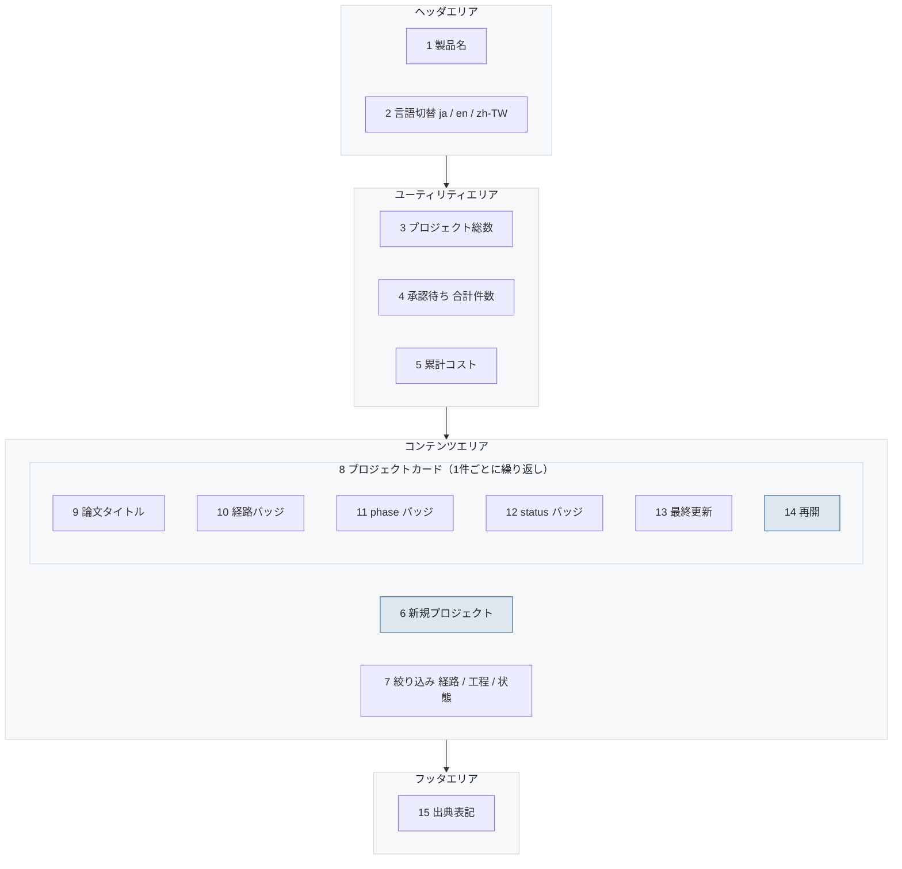

# S-01-01 ダッシュボード

- 対象プロダクト: `paper-repro`
- 版: v0.1（**レイアウトのみ。入出力項目一覧とアクション明細は未作成**）
- 作成日: 2026年8月26日
- 共通ルール: [`../arc-screen-rules.md`](../arc-screen-rules.md)
- 画面一覧: [`../arc-screen-list.md`](../arc-screen-list.md)

## 書誌情報

| 項目 | 内容 |
|---|---|
| 画面ID | `S-01-01` |
| 画面の名称 | ダッシュボード |
| 分類 | 一覧表示 |
| 概要 | プロジェクトを一覧し、状態と経路を見て再開する。 |
| 対応要求 | `REQ-C09`、`REQ-C09-S01` |
| 実装単位 | `F-13` |

---

## 1. 画面レイアウト

> 矢印は**画面上の配置の上下関係**を表す。遷移ではない。
> 同じ枠の中で横に並ぶ要素は、画面上でも左から右に並ぶ（[`../arc-screen-rules.md`](../arc-screen-rules.md) CR-01）。



<details>
<summary>Mermaid のソースを見る</summary>

````markdown

````

</details>

### 画面部品

| 識別ID | ラベル（表示例） | 部品の種類 | 入出力 | 説明 |
|---|---|---|---|---|
| 1 | paper-repro | ラベル | OUT | 押すとダッシュボードへ戻る（CR-05） |
| 2 | 日本語 / English / 繁體中文 | リストボックス | IN | 遷移しない。文言だけ変わる |
| 3 | 12 件 | ラベル | OUT | プロジェクトの総数 |
| 4 | 承認待ち 3 件 | ボタン | OUT | 押すと解決待ちパネルへ（CR-10） |
| 5 | $12.40 | ラベル | OUT | 全プロジェクトの累計 |
| 6 | 新規プロジェクト | ボタン | — | 押すとコース選択へ |
| 7 | すべて / 読解 / 再現実装 | ラジオボタン | IN | 一覧の絞り込み |
| 9 | StructEval: Benchmarking... | ラベル | OUT | 論文タイトル。長い場合は2行で折り返す |
| 10 | 読解 / 再現実装 | ラベル | OUT | `course`。藍の枠で表示 |
| 11 | reading | ラベル | OUT | `phase`。**status とは別のバッジ** |
| 12 | 待機中 / 実行中 / 承認待ち / 失敗 | ラベル | OUT | `status`。色と文言の両方（CR-02） |
| 13 | 2026-08-26 18:42 | ラベル | OUT | 副次の文字色 |
| 14 | 再開 | ボタン | — | `phase` に応じた画面へ |

### 設計上の要点

**11 と 12 を別のバッジにした。** `phase` と `status` を1つにまとめると、
失敗したときにどの工程で失敗したかが画面から消える。
2列に分けた効果は、**バッジが2つ並ぶことで初めて目に見える**
（[`../arc-datamodel.md`](../arc-datamodel.md) 2.1節）。

**この画面がフェーズ0-1の確認画面である。** 基準論文で作成し、
uvicorn を再起動してから、この一覧に残っていることを目で確かめる
（[`../../roadmap.md`](../../roadmap.md) フェーズ0の確認画面）。

---

## 2. 画面入出力項目一覧

**未作成。** 一覧の絞り込み条件と、カードに出す項目の桁数・省略規則を決める必要がある。

## 3. 画面アクション明細

**未作成。** 「再開」を押したときの遷移先が `phase` により分岐する。その対応表を書く。

> 2節と3節は、この画面を実装するフェーズで書く（[`../arc-screen.md`](../arc-screen.md) 第3章）。
> **先に書いても、実装で必ず変わる。** 枠だけを残し、中身は実装と同じ変更で埋める。
