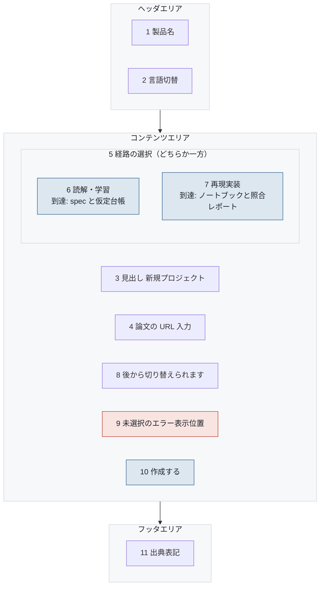

# S-02-01 コース選択

- 対象プロダクト: `paper-repro`
- 版: v0.1（**レイアウトのみ。入出力項目一覧とアクション明細は未作成**）
- 作成日: 2026年8月26日
- 共通ルール: [`../arc-screen-rules.md`](../arc-screen-rules.md)
- 画面一覧: [`../arc-screen-list.md`](../arc-screen-list.md)

## 書誌情報

| 項目 | 内容 |
|---|---|
| 画面ID | `S-02-01` |
| 画面の名称 | コース選択 |
| 分類 | 入力フォーム |
| 概要 | 読解か再現実装かを選び、論文の URL とともにプロジェクトを作成する。 |
| 対応要求 | **`REQ-C01`**、`REQ-C01-R1` |
| 実装単位 | `F-15` |

---

## 1. 画面レイアウト

> 矢印は**画面上の配置の上下関係**を表す。遷移ではない。
> 同じ枠の中で横に並ぶ要素は、画面上でも左から右に並ぶ（[`../arc-screen-rules.md`](../arc-screen-rules.md) CR-01）。



<details>
<summary>Mermaid のソースを見る</summary>

````markdown

````

</details>

### 画面部品

| 識別ID | ラベル（表示例） | 部品の種類 | 入出力 | 説明 |
|---|---|---|---|---|
| 3 | 新規プロジェクト | ラベル | OUT | 見出し 24px |
| 4 | https://arxiv.org/abs/... | テキストボックス | IN | 必須 |
| 6 | 読解・学習 | ラジオボタン | IN | **初期状態は未選択**（`REQ-C01-R1.50`） |
| 7 | 再現実装 | ラジオボタン | IN | 6 と排他（`R1.60`） |
| 8 | 後から切り替えられます | ラベル | OUT | `R1.30` |
| 9 | 経路を選んでください | ラベル | OUT | 未選択のとき、選択肢の直下に出す（CR-06） |
| 10 | 作成する | ボタン | — | **未選択の間は押せない**（`R1.70`） |

### 設計上の要点

**6 と 7 の下に到達できる成果物を書いた**（`R1.20`）。
経路の名前だけでは、何が得られるかが分からない。

**初期状態を未選択にした**（`R1.50`）。どちらかを既定で選んでおくと、
利用者が選ばないまま作成でき、「開始時に選択する」という `REQ-C01` が骨抜きになる。
DB 側で `course` に既定値を置かない判断と対になっている
（[`../arc-datamodel.md`](../arc-datamodel.md) 5.1節）。

**9 のエラーは選択肢の直下に置く。** 画面上部にまとめて出すと、
どの入力が問題かが分からない（CR-06）。

---

## 2. 画面入出力項目一覧

**未作成。** `course` の値（`reading` / `reproduction`）と、URL の入力制約を定める。

## 3. 画面アクション明細

**未作成。** 作成に成功したときの 201 と、経路の欠落・不正値の 422 を分けて書く（`R1.90`・`R1.100`）。

> 2節と3節は、この画面を実装するフェーズで書く（[`../arc-screen.md`](../arc-screen.md) 第3章）。
> **先に書いても、実装で必ず変わる。** 枠だけを残し、中身は実装と同じ変更で埋める。
