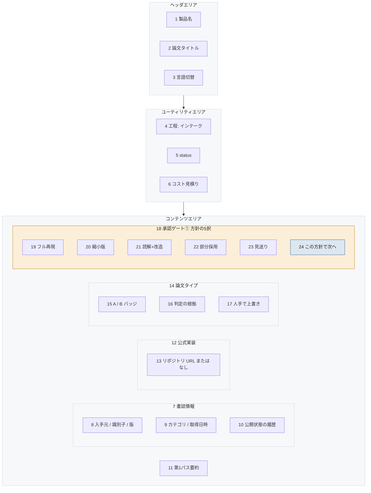

# S-03-01 インテーク

- 対象プロダクト: `paper-repro`
- 版: v0.1（**レイアウトのみ。入出力項目一覧とアクション明細は未作成**）
- 作成日: 2026年8月26日
- 共通ルール: [`../arc-screen-rules.md`](../arc-screen-rules.md)
- 画面一覧: [`../arc-screen-list.md`](../arc-screen-list.md)

## 書誌情報

| 項目 | 内容 |
|---|---|
| 画面ID | `S-03-01` |
| 画面の名称 | インテーク |
| 分類 | 情報表示＋選択 |
| 概要 | 第1パス要約・公式実装・タイプ判定を見て、方針を5択で決める。 |
| 対応要求 | `REQ-C03`、`REQ-C03-S01` |
| 実装単位 | `F-01` `F-03` `F-04` `F-14` |

---

## 1. 画面レイアウト

> 矢印は**画面上の配置の上下関係**を表す。遷移ではない。
> 同じ枠の中で横に並ぶ要素は、画面上でも左から右に並ぶ（[`../arc-screen-rules.md`](../arc-screen-rules.md) CR-01）。



<details>
<summary>Mermaid のソースを見る</summary>

````markdown

````

</details>

### 画面部品

| 識別ID | ラベル（表示例） | 部品の種類 | 入出力 | 説明 |
|---|---|---|---|---|
| 8 | arXiv / 2505.20139 / v3 | ラベル | OUT | `REQ-C03-S01`。**取得できない項目は空にする** |
| 10 | プレプリント → 採択 | ラベル | OUT | 履歴。単一の値にしない |
| 11 | （Abstract の要約） | ラベル | OUT | 第1パス |
| 13 | github.com/... / なし | ラベル | OUT | **見つからない場合は「なし」と出す。**空欄にしない |
| 15 | B | ラベル | OUT | タイプ判定 |
| 16 | 学習を伴わないため | ラベル | OUT | 根拠を必ず添える |
| 17 | 上書きする | ボタン | — | 人間が判定を覆せる |
| 19〜23 | 5つの方針 | ラジオボタン | IN | 初期状態は未選択 |
| 24 | この方針で次へ | ボタン | — | **`phase` を進める唯一の導線**（`REQ-C06`） |

### 設計上の要点

**13 で「なし」と明示する。** 空欄にすると、探していないのか
探して無かったのかが区別できない。`REQ-C03-S01` の
「不明な情報を推測で補わない」を画面で守る形である。

**18 のゲートをコンテンツの末尾に固定した**（CR-10）。
ここを通らずに次の工程へ行く導線を画面に置かない。

**16 の根拠は必ず出す。** 判定だけを見せると、
利用者が確認せずに受け入れてしまう。

---

## 2. 画面入出力項目一覧

**未作成。** 書誌情報の各項目の桁数と、取得できなかった場合の表示を定める。

## 3. 画面アクション明細

**未作成。** 取り込みジョブの起動、タイプ判定の上書き、方針の確定（`policy`）の3つを書く。

> 2節と3節は、この画面を実装するフェーズで書く（[`../arc-screen.md`](../arc-screen.md) 第3章）。
> **先に書いても、実装で必ず変わる。** 枠だけを残し、中身は実装と同じ変更で埋める。
