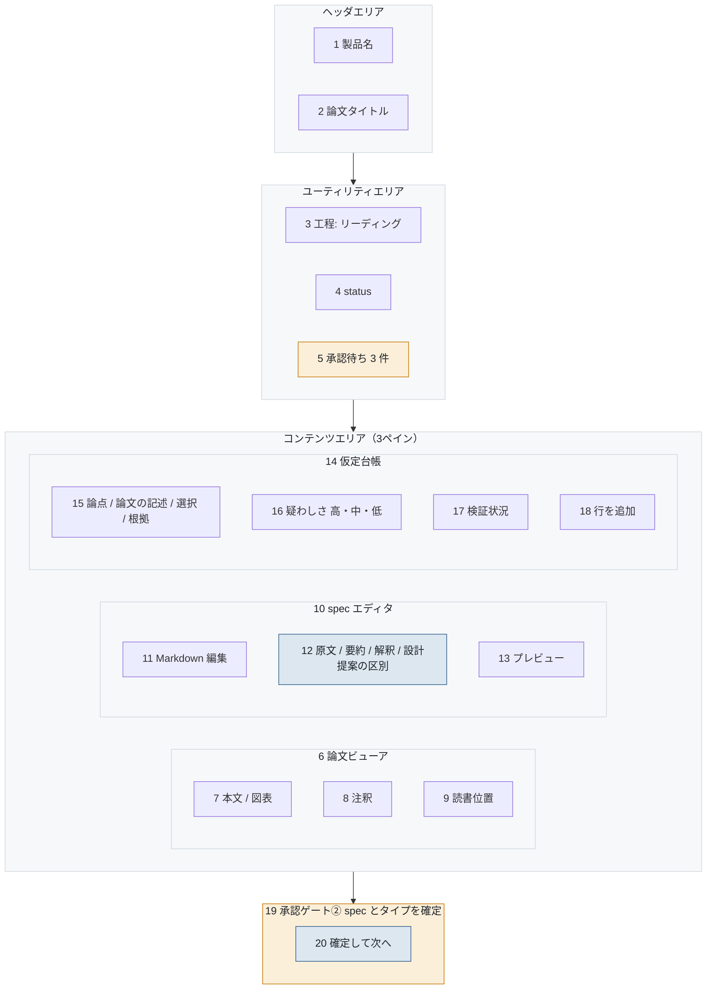

# S-04-01 リーディング作業台

- 対象プロダクト: `paper-repro`
- 版: v0.1（**レイアウトのみ。入出力項目一覧とアクション明細は未作成**）
- 作成日: 2026年8月26日
- 共通ルール: [`../arc-screen-rules.md`](../arc-screen-rules.md)
- 画面一覧: [`../arc-screen-list.md`](../arc-screen-list.md)

## 書誌情報

| 項目 | 内容 |
|---|---|
| 画面ID | `S-04-01` |
| 画面の名称 | リーディング作業台 |
| 分類 | 3ペイン編集 |
| 概要 | 論文・spec・仮定台帳を並べて読み解く。 |
| 対応要求 | `REQ-C07`、`REQ-C08`、`REQ-C10-S01`〜`S04` |
| 実装単位 | `F-05` `F-06` |

---

## 1. 画面レイアウト

> 矢印は**画面上の配置の上下関係**を表す。遷移ではない。
> 同じ枠の中で横に並ぶ要素は、画面上でも左から右に並ぶ（[`../arc-screen-rules.md`](../arc-screen-rules.md) CR-01）。



<details>
<summary>Mermaid のソースを見る</summary>

````markdown

````

</details>

### 画面部品

| 識別ID | ラベル（表示例） | 部品の種類 | 入出力 | 説明 |
|---|---|---|---|---|
| 7 | （論文の本文） | 表 | OUT | **原文のまま表示。翻訳しない**（CR-09） |
| 8 | 注釈を付ける | ボタン | IN | 本文の箇所に紐づく |
| 12 | 原文 / 要約 / 解釈 / 設計提案 | ラベル | OUT | **4区分を視覚的に分ける**（`REQ-C10-S04`） |
| 16 | 高 / 中 / 低 | リストボックス | IN | 疑わしさ。色と文言の両方 |
| 17 | 未検証 / 検証中 / 確定 | リストボックス | IN | 検証状況 |
| 20 | 確定して次へ | ボタン | — | **`course=reading` のときは押せない**（`REQ-C01-R2.40`） |

### 設計上の要点

**12 の4区分が、この画面の核である。** 原文と解釈を同じ見た目で並べると、
どこまでが論文に書いてあり、どこからが読み取りかが分からなくなる。
`REQ-C10-S04` が求める「直接支持する範囲と追加の推論を要する範囲を分ける」を、
画面で守る形である。

**20 は `course` により押せなくなる**（`REQ-C01-R2`）。
押せない理由として**経路を明示する**。故障や権限不足と区別できる文言にする（`R2.60`）。

**5 の承認待ちはユーティリティエリアに置く。** 作業を止めずに件数だけ伝え、
利用者が任意の時点で解決待ちパネルへ行く（CR-10）。

---

## 2. 画面入出力項目一覧

**未作成。** spec エディタの保存単位と、注釈の位置指定の方式を定める。

## 3. 画面アクション明細

**未作成。** 注釈の追加、台帳の行追加、spec の保存、ゲート②の確定を書く。

> 2節と3節は、この画面を実装するフェーズで書く（[`../arc-screen.md`](../arc-screen.md) 第3章）。
> **先に書いても、実装で必ず変わる。** 枠だけを残し、中身は実装と同じ変更で埋める。
