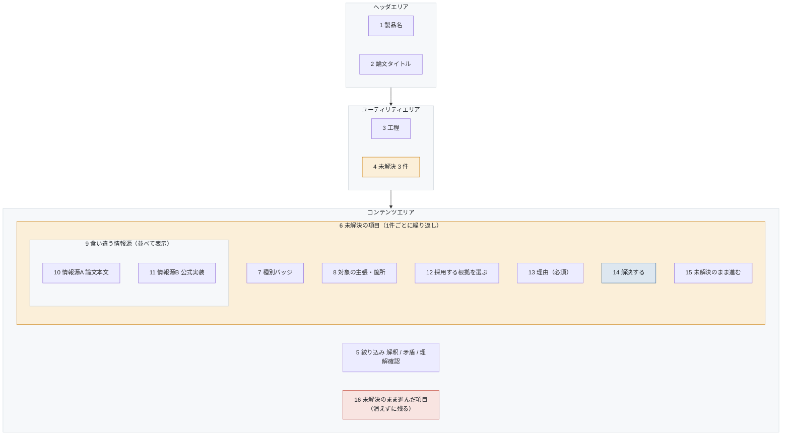

# S-04-02 解決待ちパネル

- 対象プロダクト: `paper-repro`
- 版: v0.1（**レイアウトのみ。入出力項目一覧とアクション明細は未作成**）
- 作成日: 2026年8月26日
- 共通ルール: [`../arc-screen-rules.md`](../arc-screen-rules.md)
- 画面一覧: [`../arc-screen-list.md`](../arc-screen-list.md)

## 書誌情報

| 項目 | 内容 |
|---|---|
| 画面ID | `S-04-02` |
| 画面の名称 | 解決待ちパネル |
| 分類 | 一覧＋入力 |
| 概要 | 解釈・証拠矛盾・理解確認の未解決を、人間が判断して解決する。 |
| 対応要求 | `REQ-C07`、`REQ-C07-S01`、`REQ-C10-S04` |
| 実装単位 | `F-12` `F-17` |

---

## 1. 画面レイアウト

> 矢印は**画面上の配置の上下関係**を表す。遷移ではない。
> 同じ枠の中で横に並ぶ要素は、画面上でも左から右に並ぶ（[`../arc-screen-rules.md`](../arc-screen-rules.md) CR-01）。



<details>
<summary>Mermaid のソースを見る</summary>

````markdown

````

</details>

### 画面部品

| 識別ID | ラベル（表示例） | 部品の種類 | 入出力 | 説明 |
|---|---|---|---|---|
| 7 | 解釈 / 証拠矛盾 / 理解確認 | ラベル | OUT | ゲート④⑤⑥の種別 |
| 10 | （論文の該当箇所） | ラベル | OUT | **一方を自動採用しない。両方を並べる**（`REQ-C07`） |
| 11 | （実装の該当箇所） | ラベル | OUT | 同上 |
| 12 | A を採用 / B を採用 | ラジオボタン | IN | 人間が選ぶ |
| 13 | （採用の理由） | 複数行テキスト | IN | **必須。空では 14 を押せない** |
| 14 | 解決する | ボタン | — | `:resolve` |
| 15 | 未解決のまま進む | ボタン | — | `:defer`。記録は残る |
| 16 | 未解決 2 件 | 表 | OUT | **消さない。**成果物にも表示する |

### 設計上の要点

**10 と 11 を並べて表示する。** 確信度が高い方を自動で採用して
片方を隠すと、なぜその判断になったかを後から検証できない（`REQ-C07`）。

**13 の理由を必須にした。** 理由なしで解決できると、
「人間が採用根拠を承認できる」という受入基準を満たさない。

**16 を消さない。** `:defer` で先へ進むことは許すが、
未解決であることを画面から消さない。これが「矛盾を隠さない」の実装である。

**14 と 15 は人間の操作に限る。** LLM から呼び出せない
（[`../../product-design.md`](../../product-design.md) 3.4節）。

---

## 2. 画面入出力項目一覧

**未作成。** 情報源の属性（種別・版・直接性・一致状況）の表示項目を定める。

## 3. 画面アクション明細

**未作成。** `:resolve` と `:defer` の2つ。理由の必須検証を含める。

> 2節と3節は、この画面を実装するフェーズで書く（[`../arc-screen.md`](../arc-screen.md) 第3章）。
> **先に書いても、実装で必ず変わる。** 枠だけを残し、中身は実装と同じ変更で埋める。
