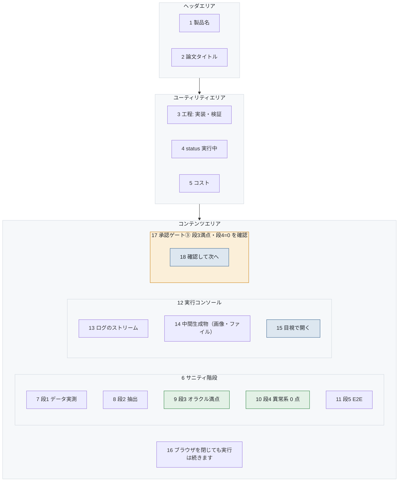

# S-05-01 実装・検証台

- 対象プロダクト: `paper-repro`
- 版: v0.1（**レイアウトのみ。入出力項目一覧とアクション明細は未作成**）
- 作成日: 2026年8月26日
- 共通ルール: [`../arc-screen-rules.md`](../arc-screen-rules.md)
- 画面一覧: [`../arc-screen-list.md`](../arc-screen-list.md)

## 書誌情報

| 項目 | 内容 |
|---|---|
| 画面ID | `S-05-01` |
| 画面の名称 | 実装・検証台 |
| 分類 | 実行監視 |
| 概要 | サニティ階段を実行し、ログと中間生成物を目視する。 |
| 対応要求 | `REQ-C05`、`REQ-C06` |
| 実装単位 | `F-08` `F-09` |

---

## 1. 画面レイアウト

> 矢印は**画面上の配置の上下関係**を表す。遷移ではない。
> 同じ枠の中で横に並ぶ要素は、画面上でも左から右に並ぶ（[`../arc-screen-rules.md`](../arc-screen-rules.md) CR-01）。



<details>
<summary>Mermaid のソースを見る</summary>

````markdown

````

</details>

### 画面部品

| 識別ID | ラベル（表示例） | 部品の種類 | 入出力 | 説明 |
|---|---|---|---|---|
| 7〜11 | pass / fail / 未実行 | ラベル | OUT | 段ごとの結果。色と文言の両方（CR-02） |
| 9 | 段3 オラクル満点 | ラベル | OUT | **強調する。**評価器が正しいことの確認 |
| 10 | 段4 異常系 0 点 | ラベル | OUT | 同上 |
| 13 | （stdout） | 表 | OUT | ストリーム表示。画面を固めない |
| 14 | （生成された画像） | 画像 | OUT | **必ず目視できるようにする** |
| 15 | 開く | ボタン | — | 中間生成物を拡大表示 |
| 16 | ブラウザを閉じても… | ラベル | OUT | CR-11 |
| 18 | 確認して次へ | ボタン | — | 段3と段4が pass でなければ押せない |

### 設計上の要点

**14 の目視が、この画面で最も重要である。** 真っ白な画像でも
パイプラインは点数を返しうる。数値だけを見ていると誤った成功を通してしまう
（要件 第7章の教訓）。**画像を画面に出すこと自体が要件である。**

**9 と 10 を強調した。** この2段は評価器が正しく動いていることの確認であり、
ここを飛ばして照合へ進むと、誤った評価器で出した数字を信じることになる。

**16 を明記した。** 長時間処理のため、閉じてよいことが分からないと
利用者が画面の前で待つことになる（CR-11）。

---

## 2. 画面入出力項目一覧

**未作成。** 各段の判定基準と、ログの保持件数を定める。

## 3. 画面アクション明細

**未作成。** 段ごとの実行、中間生成物の取得、ゲート③の確認を書く。

> 2節と3節は、この画面を実装するフェーズで書く（[`../arc-screen.md`](../arc-screen.md) 第3章）。
> **先に書いても、実装で必ず変わる。** 枠だけを残し、中身は実装と同じ変更で埋める。
