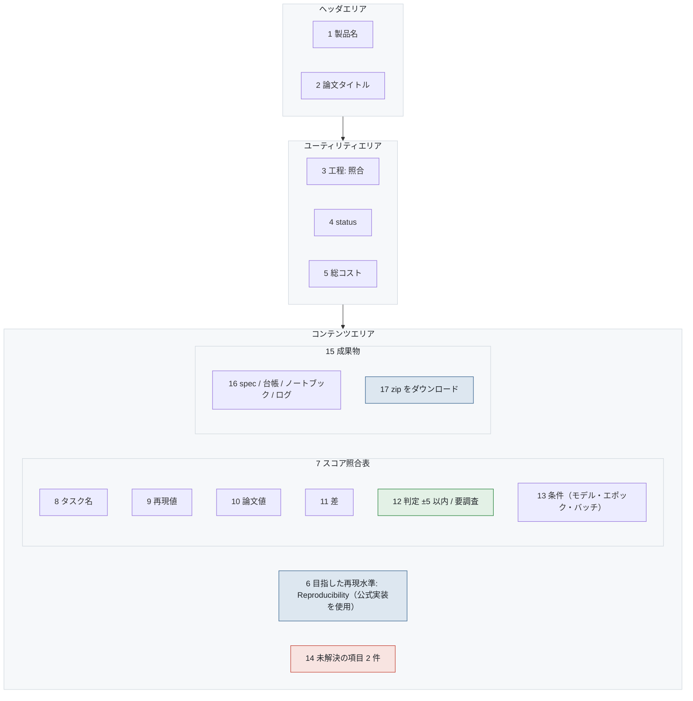

# S-06-01 照合・レポート

- 対象プロダクト: `paper-repro`
- 版: v0.1（**レイアウトのみ。入出力項目一覧とアクション明細は未作成**）
- 作成日: 2026年8月26日
- 共通ルール: [`../arc-screen-rules.md`](../arc-screen-rules.md)
- 画面一覧: [`../arc-screen-list.md`](../arc-screen-list.md)

## 書誌情報

| 項目 | 内容 |
|---|---|
| 画面ID | `S-06-01` |
| 画面の名称 | 照合・レポート |
| 分類 | 表示＋出力 |
| 概要 | 再現値と論文値を照合し、成果物を出力する。 |
| 対応要求 | `REQ-C05`、`REQ-C10-S02` |
| 実装単位 | `F-10` `F-11` |

---

## 1. 画面レイアウト

> 矢印は**画面上の配置の上下関係**を表す。遷移ではない。
> 同じ枠の中で横に並ぶ要素は、画面上でも左から右に並ぶ（[`../arc-screen-rules.md`](../arc-screen-rules.md) CR-01）。



<details>
<summary>Mermaid のソースを見る</summary>

````markdown

````

</details>

### 画面部品

| 識別ID | ラベル（表示例） | 部品の種類 | 入出力 | 説明 |
|---|---|---|---|---|
| 6 | Reproducibility（公式実装を使用） | ラベル | OUT | **水準を書かずに「再現できた」と表示しない**（要件 第0章） |
| 9 | 75.3 | ラベル | OUT | 再現値 |
| 10 | 75.58 | ラベル | OUT | 論文値。**出典（表番号）を添える** |
| 11 | -0.28 | ラベル | OUT | 差 |
| 12 | ±5 以内 | ラベル | OUT | 判定。色と文言の両方 |
| 13 | o1-mini / 100 epoch | ラベル | OUT | `REQ-C10-S02`。条件なしの数値を出さない |
| 14 | 未解決 2 件 | 表 | OUT | **解決待ちで `:defer` した項目を、ここにも出す** |
| 17 | zip をダウンロード | ボタン | — | 規約名 `files_reify_YYYYMMDD_hhmm.zip`（JST） |

### 設計上の要点

**6 を画面の先頭に置いた。** ACM v1.1 の3水準は互いに独立した達成であり、
どれを目指したかを書かずに「再現できた」と表示すると、
読む人が別の水準と取り違える（要件 第0章）。

**13 の条件を必ず添える。** 数値だけを並べると、
どの設定での値かが分からず、比較にならない（`REQ-C10-S02`）。

**14 で未解決を再掲する。** 解決待ちパネルで `:defer` した項目は、
最終成果物にも表示する。ここで消えると「矛盾を隠さない」が破れる。

---

## 2. 画面入出力項目一覧

**未作成。** 照合表の列と、論文値の出典（図表番号）の記録方法を定める。

## 3. 画面アクション明細

**未作成。** 照合の実行、zip の生成、成果物の個別ダウンロードを書く。

> 2節と3節は、この画面を実装するフェーズで書く（[`../arc-screen.md`](../arc-screen.md) 第3章）。
> **先に書いても、実装で必ず変わる。** 枠だけを残し、中身は実装と同じ変更で埋める。
