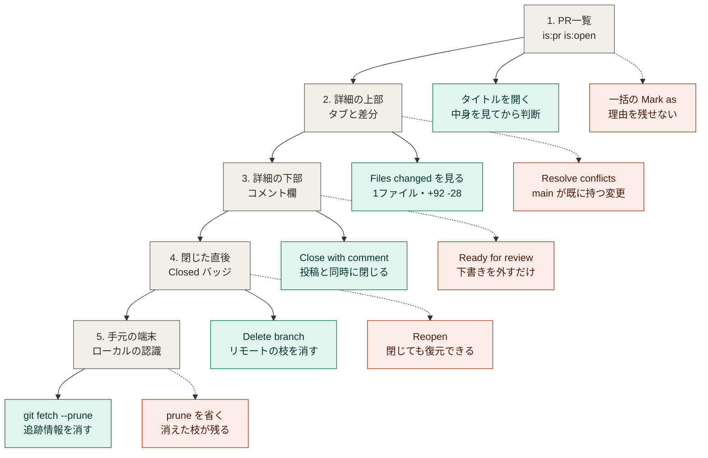

# GitHub の Pull Request 操作

- 対象: `paper-repro` リポジトリの Pull Request
- 作成日: 2026年9月7日
- 作成の契機: PR #1（`docs/update-directory-structure`）をマージせず閉じた作業
- 関連: [`daily-routine.md`](daily-routine.md)（日々の作業）、[`../AGENTS.md`](../AGENTS.md) 8.2節（コミットの単位）

> **この文書が扱うこと。** PRを開く・閉じる・ブランチを消すまでの画面操作と、
> 各画面で**押さなかったボタンとその理由**。
> 画面には正解のすぐ隣に別の道が置かれており、
> **押さない判断のほうが押す判断より多い。**

---

## 1. 全体の流れ

実線は実際に行った操作、点線は同じ画面にあって見送った操作を示す。



<details>
<summary>この図の Mermaid コードを表示する</summary>

```text
flowchart TD
    S1["1. PR一覧<br>is:pr is:open"]
    S2["2. 詳細の上部<br>タブと差分"]
    S3["3. 詳細の下部<br>コメント欄"]
    S4["4. 閉じた直後<br>Closed バッジ"]
    S5["5. 手元の端末<br>ローカルの認識"]

    D1["タイトルを開く<br>中身を見てから判断"]
    D2["Files changed を見る<br>1ファイル・+92 -28"]
    D3["Close with comment<br>投稿と同時に閉じる"]
    D4["Delete branch<br>リモートの枝を消す"]
    D5["git fetch --prune<br>追跡情報を消す"]

    N1["一括の Mark as<br>理由を残せない"]
    N2["Resolve conflicts<br>main が既に持つ変更"]
    N3["Ready for review<br>下書きを外すだけ"]
    N4["Reopen<br>閉じても復元できる"]
    N5["prune を省く<br>消えた枝が残る"]

    S1 --> S2 --> S3 --> S4 --> S5
    S1 --> D1
    S2 --> D2
    S3 --> D3
    S4 --> D4
    S5 --> D5
    S1 -.-> N1
    S2 -.-> N2
    S3 -.-> N3
    S4 -.-> N4
    S5 -.-> N5

    classDef st fill:#F1EFE8,stroke:#5F5E5A,color:#2C2C2A
    classDef ok fill:#E1F5EE,stroke:#0F6E56,color:#04342C
    classDef ng fill:#FAECE7,stroke:#993C1D,color:#4A1B0C
    class S1,S2,S3,S4,S5 st
    class D1,D2,D3,D4,D5 ok
    class N1,N2,N3,N4,N5 ng
```

</details>

---

## 2. 画面ごとの解説

### 2.1 Pull requests 一覧（`/pulls`）

リポジトリのPRを一覧する画面。検索欄の `is:pr is:open` が既定のフィルタで、
**開いているものしか表示していない。** 左上の「1 Open / 0 Closed」がその内訳。
閉じたPRを見るときは `is:open` を `is:closed` に書き換える。

PR名の下の `#1 opened 2 weeks ago by ChestnutForest` `Owner` `Draft` が素性を示す。
`Draft` は「まだレビューに出していない下書き」。

⚠️ **この画面に Close ボタンは無い。**
一覧はPRの中身を見せない場所であり、
GitHub は「開いて中身を確認してから状態を変える」流れを既定にしている。

### 2.2 チェックボックスを選んだ状態

行の左端のチェックを入れると、ヘッダ行の `Author` `Label` などが `Mark as` に変わる。
複数のPRをまとめて処理するための一括操作で、`Mark as` の中に `Closed` がある。

⚠️ **使わない。一括操作はコメントを残せない。**
閉じる判断には根拠があり、それを書き残さないと後日また同じ調査を繰り返す。
`AGENTS.md` を正本にツールを往復するリレー開発では、判断の記録がそのまま引き継ぎになる。

### 2.3 PR詳細のヘッダ

`ChestnutForest wants to merge 1 commit into main from docs/update-directory-structure`
の一行がPRの定義そのもの。**`main` が取り込む側（base）、ブランチが取り込まれる側（compare）。**

| タブ | 見えるもの |
|---|---|
| Conversation | 説明文とコメント、状態変化のタイムライン |
| Commits | 取り込まれるコミットの一覧 |
| Checks | CIの結果 |
| Files changed | 実際に変わるファイルと差分 |

⚠️ **右上の `Files changed` と `+92 -28` が、マージしたときに実際に起きること。**
ここを見ずに判断してはいけない（第3章）。

右サイドバーの `Development` にある「Successfully merging this pull request may close these issues」は、
`Fixes #12` のような記法でIssueと紐付いていればマージ時にそのIssueも閉じる、という説明。

### 2.4 PR詳細の下部（閉じる前）

3つの帯が縦に並ぶ。それぞれ別の理由でマージを止めている。

| 帯 | 意味 | 押すか |
|---|---|---|
| This branch has conflicts | 同じ箇所が両側で変わり、自動で決められない | ❌ `Resolve conflicts` は押さない |
| This pull request is still a work in progress | 下書き状態。ドラフトのままではマージできない | ❌ `Ready for review` は押さない |
| Merge pull request（グレー） | 上2つの理由で無効化されている | — |

`Ready for review` を押すと**ドラフトが外れてレビュー待ちに進むだけで、閉じられない。**
`Resolve conflicts` を押すと**解消作業に入るが、`main` が既に持つ変更を再適用するだけ。**

そして `Add a comment` の欄。**ここが要点。**

⚠️ **入力欄が空のときボタンは `Close pull request`、文字を入れると `Close with comment` に変わる。**
ラベルが変わっただけで、押せばコメントの投稿とクローズが1回で行われる。
「Close pull request が見当たらない」と感じたときは、既に文字を入力している。

右の緑の `Comment` はコメントだけを投稿するボタンで、PRは開いたまま残る。

### 2.5 閉じた直後

バッジが `Draft` から赤い `Closed` に変わり、タイムラインに `closed this` が追加される。

⚠️ **PRを閉じてもコミットもブランチも消えない。**
変わるのは「このPRは処理済み」という状態だけ。だから `Reopen pull request` で開き直せる。

`Closed with unmerged commits` の帯は、**マージされないまま閉じたPRに対してGitHubが機械的に出す注意書き。**
「このブランチにはまだ取り込まれていないコミットがある」という意味で、
中身が重複しているかどうかまでは見ていない。

### 2.6 ブランチを削除した後

タイムラインに `deleted the ... branch` が入り、**リモート側のブランチが消える。**

`Closed with unmerged commits` の枠が残って見えるのは、ページが再描画されていないだけ。
再読込すると `Restore branch` に変わる。GitHub は削除したブランチの参照をしばらく保持している。

---

## 3. 比較方法の違い（この作業で犯した誤り）

**当初「マージすると168ファイル・28,300行が消える」と判断したが、これは誤りだった。**
画面の `Files changed 1` が正しい値である。

原因は比較の方法にある。

| 方法 | コマンド | 何を出すか |
|---|---|---|
| 二点間比較 | `git diff main branch` | 2つの先端を直接比べる。**`main` にあってブランチに無いものも差分に出る** |
| 三点間比較 | `git diff main...branch` | 共通の祖先を起点にする。**ブランチが分岐後に加えた変更だけ**を出す |

**GitHub の PR が使うのは三点間比較。**
今回のブランチは145コミット遅れていたため、二点間比較では9月に `main` へ追加した文書が
すべて「削除」として並んだ。実際に変わるのは README.md 1ファイルだけだった。

⚠️ **画面に出ている数字を確認してから判断する。**
手元のコマンドの出力を、画面と突き合わせずに結論へ使わない。

なお、閉じる判断そのものは変わらなかった。根拠が
「消えるから危険」ではなく「得られるものが無いから不要」に変わった。

---

## 4. 閉じてよいかの判定

**マージせず閉じる前に、ブランチ独自のコミットが本当に不要かを確認する。**

```powershell
git fetch origin <ブランチ名>
git log --oneline main..FETCH_HEAD
```

出たコミットについて、同じ内容が `main` に別のコミットとして入っていないかを調べる。

```powershell
git log --oneline --all --grep="<コミットメッセージの一部>"
git diff <ブランチのSHA> <mainのSHA> -- <対象ファイル>
```

**`git diff` の出力が空なら、両者のファイル内容は同一。** 閉じても失われない。

今回は `78a972e`（ブランチ）と `bb2174e`（main）が同じ README を持っていた。
別経路で同じ変更が `main` へ入り、ブランチだけが取り残されていた。

---

## 5. 実行するコマンド

閉じる操作は画面で行い、手元の整理だけコマンドで行う。

```powershell
git fetch --prune; git branch -a | Select-String "<ブランチ名>"
```

`--prune` は**リモートで消えたブランチの追跡情報を手元からも消す**指定。
実行しないと `remotes/origin/<ブランチ名>` が残り続け、
後から見たときに「まだ作業中のブランチがある」と誤解する。

出力が空にならない場合は、ローカルに実体のブランチがある。

```powershell
git branch -D <ブランチ名>
```

---

## 6. 運用の原則

この作業から残す原則は4つ。

1. **一覧では判断しない。** 開いて中身を見てから状態を変える
2. **画面の数字を、手元のコマンドの出力より優先する。** 突き合わせずに結論へ使わない
3. **変更の理由を記録に残す。** 一括操作はコメントを残せないため使わない
4. **手元とリモートの認識を揃える。** 削除の直後に `--prune` を実行する

2は判断材料の作成でも同じ失敗が起きている
（[`worknotes/decision-material-requirements-source.md`](worknotes/decision-material-requirements-source.md) 1.8節
「判断材料を作るときこそ、実物を確認する」）。**確認の省略は、対象が何であっても同じ形で現れる。**
