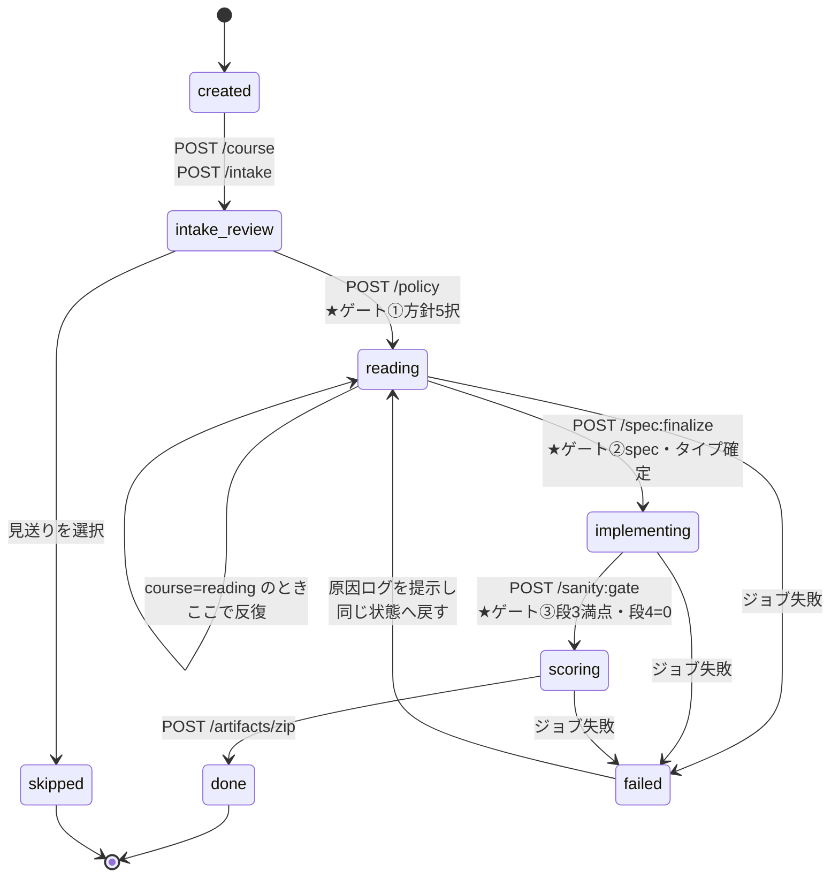
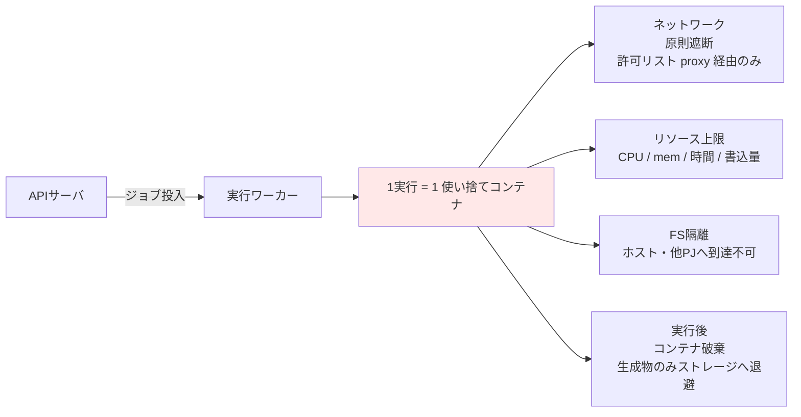
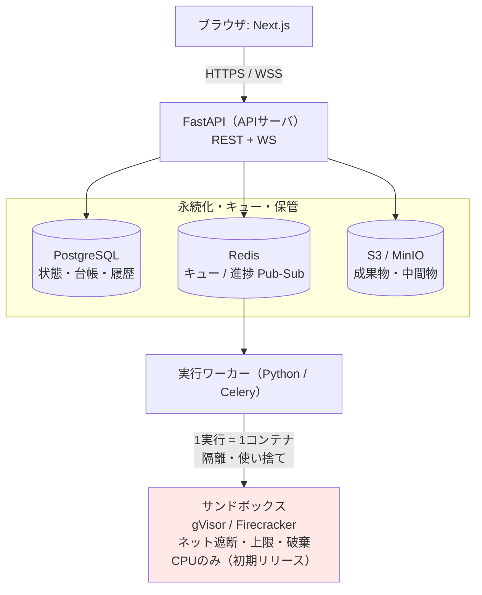

# paper-repro 製品設計：画面遷移・APIエンドポイント・技術スタック

- 対象: 正式版 paper-repro の第1段階（タイプB・公式実装あり）
- 位置づけ: 本書は製品全体の上限ではなく、初期リリースを縦切りで完成させるための設計を定める
- 版: **v0.3**（画面設計を `arch-guide/` へ移管）
- 前版: v0.2（要件定義 v0.2 準拠）
- 前版: v0.1（要件定義 v0.1 に基づく初版）
- 準拠する要件: [`requirements.md`](requirements.md) v0.2

前提（要件定義書より）: **human-in-the-loop の伴走型パイプライン。**
GPU 不要・レンダリング不要・LLM-as-a-Judge 不要に絞った範囲。

### v0.2 での主な変更

要件定義 v0.2 で確定した内容のうち、設計に影響する3点を反映した。

1. **二経路の追加**（`REQ-C01` / `F-15`）。読解・学習と再現実装を同等の主要経路とし、
   進捗を失わずに切り替えられるようにした。プロジェクトの状態機械とスキーマに `course` を加えた。
2. **承認ゲートの拡張**（`REQ-C01`・`REQ-C07`）。human-in-the-loop を実行承認だけでなく、
   重要な解釈・重大な証拠矛盾・学習到達点にも適用した。ゲートを**遷移型と事象駆動型に分けた**。
3. **要求IDの明記。** 画面・API・データモデルの各項目に、対応する要求ID（`REQ-Cxx`）と
   実装単位（`F-xx` / `B-xx` / `N-xx`）を併記した。要件 v0.2 第9章の対応表と双方向に引ける。

---

## 0. 設計の背骨（4つの原則）

1. **非同期ジョブ + WebSocket 進捗。** 取り込み・読解・推論・実行はすべて長時間。
   REST で「投げてジョブID受領」、進捗は WS でストリーム。同期で待たせない。
2. **サンドボックスは別プロセスに隔離。** 信頼できないコードを実行するワーカーを、
   API サーバと同じ空間に置かない。ネットワーク遮断・使い捨て。
3. **プロジェクトはステートマシン。** Phase 0〜6 は承認ゲートで進む状態遷移。
   `phase`（現在地）× `status`（idle / running / waiting_approval / failed）で管理。
   **Phase 0〜6 は確定した工程モデルである**（要件 v0.2.1 第1.1節、2026年9月2日確定）。工程名を UI の文言や
   API パスへ直に埋め込まず、状態機械の定義を1か所に集約して差し替え可能にする。
4. **二経路を1つのプロジェクトで保持する。**（`REQ-C01`）読解コースと再現実装コースは
   別プロジェクトではなく、同じプロジェクトの属性 `course` で表す。
   切り替えても spec・台帳・注釈・承認履歴は保持し、破棄しない。

---

## 1. 状態遷移（プロジェクトのライフサイクル）

### 1.1 主経路



<details>
<summary>Mermaid のソースを見る</summary>

````markdown

````

</details>

**失敗系**: どの状態でも実行ジョブが失敗すれば `failed` に落ち、原因ログを提示して同じ状態へ戻す。
`skip`（見送り）は intake_review からいつでも選べる終端。

### 1.2 コースによる経路の違い（`REQ-C01` / `F-15`）

| コース | 経路 | 終端 |
|---|---|---|
| `reproduction`（再現実装） | 上記の主経路をすべて通る | `done`（照合とzip出力まで） |
| `reading`（読解・学習） | `intake_review` → `reading` を反復し、`implementing` 以降へ進まない | `reading` に留まる。任意の時点で成果物を出力できる |

**切り替えの規約。** `POST /course` はいつでも呼べる。切り替え時に次を守る。

- spec・仮定台帳・注釈・自己説明・承認履歴・コスト記録を**削除しない**
- `reading` → `reproduction` へ切り替えたとき、既存の spec と台帳をそのまま引き継ぐ
- `reproduction` → `reading` へ切り替えたとき、サニティ実行結果と照合結果は保持し、参照可能なまま残す
- 切り替えを `Approval[]` に記録し、いつどちらへ切り替えたかを追跡できるようにする

### 1.3 承認ゲートの2分類（`REQ-C01`・`REQ-C07`）

v0.1 のゲートはすべて「Phase を進めてよいか」を問う遷移型だった。
v0.2 では、**進行中でも人間に判断を戻す事象駆動型**を追加する。

| 種別 | ゲート | 契機 | 対応要求 |
|---|---|---|---|
| 遷移型 | ①方針の5択 | Phase 0 末 | `REQ-C06` |
| 遷移型 | ②spec とタイプの確定 | Phase 1〜3 末 | `REQ-C06` |
| 遷移型 | ③サニティの合格確認 | Phase 4 末 | `REQ-C05`・`REQ-C06` |
| **事象駆動型** | **④重要な解釈の確認** | LLM が論文の主張を解釈したとき | `REQ-C10`・`REQ-C10-S04` |
| **事象駆動型** | **⑤重大な証拠矛盾の解決** | 情報源どうしが食い違ったとき | `REQ-C07`・`REQ-C07-S01` |
| **事象駆動型** | **⑥学習到達点の確認** | 理解できたと判定してよいか | `REQ-C04`・`REQ-C04-S02` |

**事象駆動型の扱い。** `status` を `waiting_approval` にし、`approval_kind` で
どのゲートかを区別する。Phase は進めず、その場に留める。

- **矛盾を自動的に解消しない。** 一方の情報源を採用して先へ進めることはしない（`REQ-C07`）
- 未解決のまま先へ進むことは許すが、**未解決であることを記録し、成果物に表示する**
- LLM の判断だけでゲートを通過させない（`REQ-C10-S04`）

### 1.4 スキーマへの追加（v0.1 からの差分）

> 列の型・NULL可否・ENUM の値・状態遷移表は
> [`arch-guide/arc-datamodel.md`](arch-guide/arc-datamodel.md) v1.0 が正本である。本節は差分の要点のみを示す。

```
Project
 ├─ course             ENUM(reading, reproduction)     ← REQ-C01（新規・NOT NULL）
 ├─ course_changed_at  TIMESTAMP                        ← REQ-C01（新規）
 ├─ phase, status
 └─ approval_kind      ENUM(policy, spec, sanity,
                            interpretation, conflict,
                            comprehension) NULL         ← REQ-C07 ほか（新規）
```

`course` は **`NOT NULL` かつ既定値を置かない。** 既定値を置くと、利用者が選ばないまま
片方の経路に入ってしまい、「開始時に選択する」という要求（`REQ-C01`）が骨抜きになる。

---

## 2. 画面遷移

**本章の内容は画面設計の各文書へ移した。** 同じ図を2か所に持つと必ず食い違うため、
ここには残さず、参照だけを置く。

| 知りたいこと | 参照先 |
|---|---|
| 画面の一覧と階層 | [`arch-guide/arc-screen-list.md`](arch-guide/arc-screen-list.md) |
| **画面の遷移** | [`arch-guide/arc-screen-flow.md`](arch-guide/arc-screen-flow.md) |
| 画面ごとのレイアウトと部品 | [`arch-guide/screens/`](arch-guide/screens/) の7ファイル |
| 配色・エリア構成・エラー表示 | [`arch-guide/arc-screen-rules.md`](arch-guide/arc-screen-rules.md) |
| 設計の枠組みと準拠する標準 | [`arch-guide/arc-screen.md`](arch-guide/arc-screen.md) |

**画面まわりの正本は上記の各文書である。** 本書（`product-design.md`）は
API・技術スタック・デプロイ構成を扱う。

### 移した内容

| 旧・本章の内容 | 移し先 |
|---|---|
| 画面遷移図 | `arc-screen-flow.md` 第2章（T-01）。承認ゲートを太線にし、異常系を点線に分けた |
| 画面別の主要UI要素の表 | `screens/S-xx-xx.md` の各「画面部品」表。画面ごとに分割し、識別IDを付けた |
| 再現水準の表示についての注記 | `screens/S-06-01.md` の設計上の要点 |

---

## 3. APIエンドポイント（初期リリース）

規約: REST は `/api/v1`。長時間処理は **202 Accepted + `{job_id}`** を返し、進捗は WS。
認証は初期リリースでは単一ユーザー想定（Bearer トークン）。

### 3.1 プロジェクト / 状態

| メソッド | パス | 役割 | 返却 | 対応要求 |
|---|---|---|---|---|
| GET | `/projects` | 一覧（状態・**コース**・進捗・コスト） | `Project[]` | `REQ-C09` |
| POST | `/projects` | 作成。**arXiv URL と `course` を必須で受け**、取り込みジョブ起動 | `{project_id, job_id}` | `REQ-C01`、`REQ-C03` |
| GET | `/projects/{id}` | 詳細（現在の phase/status/course を含む） | `Project` | `REQ-C09` |
| **POST** | **`/projects/{id}/course`** | **作成後の切替専用。`{course: reading/reproduction}`。既存の成果物を保持したまま切り替える** | `Project` | **`REQ-C01`** |

> **`course` は作成時に必須である**（[`arch-guide/arc-datamodel.md`](arch-guide/arc-datamodel.md) 5.1 で確定）。
> 列に既定値を置かないため、未選択のプロジェクトは存在しない。上の `/course` は**切替のみ**を担う。
>
> **`phase` を直接指定して遷移させる汎用エンドポイントは設けない**（同 5.2 で確定）。
> 遷移は `policy`・`spec:finalize`・`sanity:gate` などゲートのエンドポイント経由に限る。
> 経路を1つに絞ることで、承認ゲートの迂回が構造上できなくなる（`REQ-C06`）。
| DELETE | `/projects/{id}` | 削除（コンテナ・成果物も破棄） | `204` | `REQ-C09-S01` |

### 3.2 Phase 0：インテーク

| メソッド | パス | 役割 | 対応要求 |
|---|---|---|---|
| POST | `/projects/{id}/intake` | 第1パス要約 + タイプ判定 + 実装探索（GitHub/Hugging Face/OpenReview）をジョブ実行 | `REQ-C03`、`REQ-C05-S01` |
| GET | `/projects/{id}/intake` | 結果取得（要約・official_repo_url・type・**入手元・版・カテゴリー・公開状態**・cost見積もり） | `REQ-C03-S01` |
| POST | `/projects/{id}/policy` | **承認ゲート①**。`{policy: full/reduced/adapt/partial/skip}` を確定 → `reading` へ | `REQ-C06` |

### 3.3 Phase 1〜3：リーディング（spec・台帳・Δ）

| メソッド | パス | 役割 | 対応要求 |
|---|---|---|---|
| POST | `/projects/{id}/spec:draft` | LLM で spec 草案生成（ジョブ）。**公式リポジトリ読解の結果を反映** | `REQ-C05-S01` |
| GET / PUT | `/projects/{id}/spec` | spec.md 取得 / 人手編集の保存 | `REQ-C08` |
| GET | `/projects/{id}/assumptions` | 仮定台帳の一覧 | `REQ-C07` |
| POST | `/projects/{id}/assumptions` | 行追加 | `REQ-C07` |
| PUT / DELETE | `/projects/{id}/assumptions/{aid}` | 行更新（疑わしさ・状態）/ 削除 | `REQ-C07` |
| GET / PUT | `/projects/{id}/deltas` | Δリスト取得/更新（5超で警告フラグ） | `REQ-C08` |
| POST | `/projects/{id}/repo:read` | 公式リポジトリを clone し、抽出関数・スコア計算・パーサ・プロンプトを静的抽出（ジョブ） | `REQ-C05-S01`、`REQ-C06` |
| POST | `/projects/{id}/spec:finalize` | **承認ゲート②**。type と spec を確定 → `implementing` へ | `REQ-C06` |

### 3.4 事象駆動ゲート：解釈・矛盾・理解確認（v0.2 で新設）

| メソッド | パス | 役割 | 対応要求 |
|---|---|---|---|
| **GET** | **`/projects/{id}/pending`** | **未解決の解釈・証拠矛盾・理解確認を一覧。`{kind, subject, sources[], state}`** | **`REQ-C07`、`REQ-C10-S04`** |
| **POST** | **`/projects/{id}/pending/{pid}:resolve`** | **人間が判断して解決。採用した根拠と理由を必須で受け取る** | **`REQ-C07`** |
| **POST** | **`/projects/{id}/pending/{pid}:defer`** | **未解決のまま先へ進む。未解決の記録は残り、成果物に表示される** | **`REQ-C07`** |

**設計上の制約。** `:resolve` は理由（`rationale`）を必須とする。理由なしで解決できると、
「人間が採用根拠を承認できる」という受入基準（`REQ-C07`）を満たさない。
また、この2つのエンドポイントは**LLM から呼び出せない**。人間の操作に限る（`REQ-C10-S04`）。

### 3.5 Phase 4：サニティ階段（サンドボックス）

| メソッド | パス | 役割 | 対応要求 |
|---|---|---|---|
| POST | `/projects/{id}/notebook:generate` | Colab `.ipynb` を生成（環境ピン留め・サニティ段・照合を含む） | `REQ-C05` |
| POST | `/projects/{id}/sanity/{rung}` | 指定段を**サンドボックスで実行**（ジョブ）。rung=data/parse/oracle/adversarial/e2e/subset | `REQ-C05`、`REQ-C06` |
| GET | `/projects/{id}/sanity` | 各段の pass/fail/ログ参照 | `REQ-C05` |
| POST | `/projects/{id}/sanity:gate` | **承認ゲート③**。段3(oracle)満点・段4(adversarial)=0 を確認 → `scoring` へ | `REQ-C05`、`REQ-C06` |

### 3.6 Phase 5〜6：照合・成果物

| メソッド | パス | 役割 | 対応要求 |
|---|---|---|---|
| POST | `/projects/{id}/scores` | 再現値と論文値を照合（±5判定）。`{tasks:[{name,mine,paper}]}` | `REQ-C05` |
| GET | `/projects/{id}/scores` | 照合結果（**目指した再現水準を含む**） | `REQ-C05`、`REQ-C10-S02` |
| POST | `/projects/{id}/artifacts/zip` | **規約名 zip（files_reify_YYYYMMDD_hhmm.zip, JST）**生成 | `REQ-C09-S03` |
| GET | `/projects/{id}/artifacts` | 成果物一覧（notebook/code/spec/zip） | `REQ-C09` |
| GET | `/projects/{id}/cost` | Phase 別コストと合計 | — |

### 3.7 ジョブ / ストリーム

| メソッド | パス | 役割 |
|---|---|---|
| GET | `/jobs/{job_id}` | ジョブ状態（queued/running/done/failed）とサマリ |
| WS | `/ws/jobs/{job_id}` | 進捗率・ログ行・stdout・生成物イベントをストリーム |

### 3.8 エンドポイント共通仕様

- 長時間ジョブ: `202 { job_id }` → クライアントは `/ws/jobs/{job_id}` 購読
- 実行前に**ドライラン見積もり**（例数×モデル数×単価）を返し、上限超過は起動拒否（`N-03`）
- 冪等: 同一段の再実行は前結果を上書きし履歴に残す（`N-05`）
- **外部送信は人間の明示操作を必須とする**（`N-10`・`REQ-C11`）。
  初期リリースでは外部送信を伴うエンドポイントを実装しないが、
  将来追加する場合もこの制約を先に満たす

---

## 4. 技術スタック選定

### 4.1 推奨構成

| 層 | 推奨 | 主な代替 | 選定理由 |
|---|---|---|---|
| フロントエンド | **Next.js (React) + TypeScript** | SvelteKit, Vue/Nuxt | WS/SSE容易、Monaco・KaTeX 等の資産が揃う、型安全 |
| エディタ | **Monaco Editor** | CodeMirror | spec/コード編集。VSCode同等の体験 |
| 数式表示 | **KaTeX** | MathJax | 高速・軽量 |
| APIサーバ | **FastAPI (Python)** | Node/NestJS, Go | **ML/評価資産がPython。** async・型・WS・OpenAPI自動生成。`t_scorer.py` 等を直接流用 |
| ジョブキュー | **Redis + Celery** | RQ, Arq, Dramatiq | 非同期ジョブの定番。進捗は Redis Pub/Sub → WS 中継 |
| DB | **PostgreSQL** | MySQL | 台帳の可変列は JSONB。承認履歴・状態遷移に強い |
| オブジェクトストレージ | **S3互換（MinIO/AWS S3）** | ローカルFS(初期) | 生成物・中間ファイル・zip |
| **サンドボックス** | **gVisor もしくは Firecracker 上の使い捨てコンテナ** | Docker+seccomp/ネットns, nsjail | **信頼できないコードの実行分離。ここは最優先で妥協しない** |
| LLM | **Claude API（抽象化層で包む）** | 他プロバイダ差替可 | spec抽出・数式→コード下訳・翻訳。プロバイダ非依存に |
| 認証(初期リリース) | 単一ユーザー + Bearer | OAuth(将来) | 初期リリースは最小限 |
| デプロイ | Docker Compose（初期リリース）→ k8s（拡張時） | — | まず1ホストで、実行ワーカーだけ隔離 |

### 4.2 なぜ FastAPI（バックエンドを Python に寄せる）か

- サニティチェック・スコア照合・ノートブック生成は**すべて Python 資産**。
  今回作成した `t_scorer.py`・オラクル生成・照合ロジックが**そのまま流用できる**。
- 公式リポジトリの読解（AST 解析・関数抽出）も Python で完結。
- フロントを TS、バックを Python に分けても、**「重い処理は Python 一貫」**が最も無駄がない。

### 4.3 サンドボックスの構成（最重要・再掲）



<details>
<summary>Mermaid のソースを見る</summary>

````markdown

````

</details>

- 初期リリースは **CPU のみ・ネットワーク遮断**で十分（タイプBに絞ったため）。
- gVisor/Firecracker で**カーネル分離**まで行うと、任意コード実行前提でも安全度が上がる。
- **中間生成物（画像・ファイル）は必ず退避し、UI で目視できるように**（タイプBの教訓）。

### 4.4 却下した選択肢と理由

| 却下案 | 理由 |
|---|---|
| バックエンドも Node/TS で統一 | 評価・ML 資産が Python にあり、二重実装になる |
| 同期 REST で処理を待たせる | 数十分ジョブで破綻。タイムアウト・UX崩壊 |
| サンドボックス無しでホスト実行 | **信頼できない第三者コードの実行。論外**（セキュリティ致命傷） |
| 素の Docker のみ（分離なし） | コンテナ脱出リスク。任意コード前提なら gVisor/Firecracker 相当が要る |
| DB を持たずファイルだけで管理 | 状態遷移・台帳・承認履歴・冪等再開が破綻 |
| **コースを別プロジェクトとして分ける** | **`REQ-C01` が「進捗を失わず切り替えられる」を要求している。別プロジェクトにすると成果物の引き継ぎが必要になり、切替のたびに重複が生じる** |
| **`course` に既定値を置く** | **利用者が選ばないまま片方の経路に入り、「開始時に選択する」という要求が骨抜きになる** |
| **証拠矛盾を確信度で自動解決する** | **`REQ-C07` が「重大な矛盾を隠さず、人間が採用根拠を承認できる」を要求している** |

---

## 5. 初期リリース構成図（デプロイ）



<details>
<summary>Mermaid のソースを見る</summary>

````markdown

````

</details>

---

## 6. 要求と設計の対応表

要件 v0.2 第9章（要求 → 実装単位）に対し、本書は**実装単位 → 設計箇所**を与える。
初期リリースに含まれない実装単位は「第2フェーズ以降」と記す。

| 実装単位 | 本書の設計箇所 | 初期リリース |
|---|---|---|
| F-01 論文入力 | 2章 インテーク画面、3.2 | 含む |
| F-02 パイプライン | 0章 原則3、1.1 状態遷移 | 含む |
| F-03 論文タイプ表示 | 2章 インテーク画面 | 含む |
| F-04 方針選択ゲート | 1.3 ゲート①、3.2 | 含む |
| F-05／F-06 仕様・台帳 | 2章 リーディング作業台、3.3 | 含む |
| F-07 Δリスト | 3.3 | 含む |
| F-08 サニティ階段 | 2章 実装・検証台、3.5 | 含む |
| F-09 実行コンソール | 2章 実装・検証台 | 含む |
| F-10 スコア照合 | 2章 照合・レポート、3.6 | 含む |
| F-11 成果物ビュー | 2章 照合・レポート、3.6 | 含む |
| F-12 承認ゲート | 1.3 ゲート①〜⑥、3.4 | 含む（①〜③と④⑤⑥の最小形） |
| F-13 プロジェクト管理 | 2章 ダッシュボード、3.1 | 含む |
| F-14 コスト表示 | 2章 インテーク・実装検証台、3.6 | 含む |
| **F-15 利用経路選択** | **1.2、2章 コース選択画面、3.1** | **含む（v0.2 で追加）** |
| F-16 段階的学習支援 | — | 第2フェーズ以降 |
| F-17 証拠・プロヴェナンス表示 | 2章 解決待ちパネル（最小形） | 最小形のみ |
| F-18 学習ポートフォリオ | — | 第2フェーズ以降 |
| F-19 批判的検証ワークスペース | — | 第2フェーズ以降 |
| F-20 質問・対話・共同読解 | — | 第2フェーズ以降 |
| B-01〜B-04 | 3.2、3.3 | 含む |
| B-05／B-06 サンドボックス・サニティ | 4.3、3.5 | 含む（CPU・ネット遮断） |
| B-07／B-08 ノートブック・照合 | 3.5、3.6 | 含む |
| B-09 永続化 | 1.4、4.1 | 含む |
| B-10／B-11 パッケージ・コスト | 3.6 | 含む |
| B-12〜B-15 | 3.4（`pending` の最小形のみ） | 最小形のみ／以降は第2フェーズ |
| N-01〜N-05、N-07 | 4.1、4.3、3.8 | 含む |
| N-06 監査ログ | 1.3、3.4 | 含む（承認履歴のみ） |
| N-08〜N-10 | 3.8 に制約のみ明記 | 第2フェーズ以降 |

---

## 7. 実装の着手順（サニティの精神で、縦に薄く貫く）

1. **骨組み1本を貫通させる**: arXiv URL 投入 → **コース選択** → 取り込み → spec 草案 →
   手編集 → zip 出力（サンドボックス無し）
2. **サンドボックスを足す**: CPU・ネット遮断の使い捨てコンテナで、
   段3(オラクル満点)・段4(異常系0点)だけ動かす
3. **照合を足す**: 2タスクの再現値 vs 論文値、±5 判定
4. **承認ゲートと状態機械を締める**: 遷移型ゲート①〜③を必須化、失敗系の復帰を整える
5. **事象駆動ゲートの最小形を足す**: `pending` 一覧と `:resolve` / `:defer`。
   矛盾を自動解決しないこと、理由を必須にすることだけを先に満たす

**いきなり全機能を横に広げない。** まず1本の縦線（1論文が done まで通る）を最短で通し、そこに機能を足す。
これは Phase 4 のサニティチェックと同じ思想（縦切り実装）である。

**`course` は手順1で入れる。** 後から足すと `Project` のスキーマ変更とマイグレーション、
状態機械の書き直しが必要になる。ロードマップのフェーズ0（データ永続化・状態遷移）が
まさにこの箇所にあたるため、そこで一緒に入れる。
