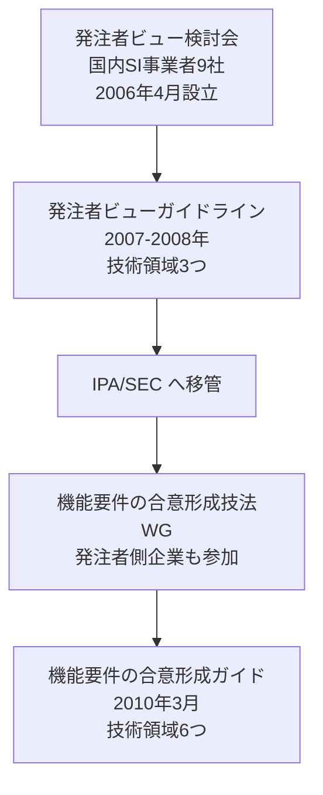

# USDM・XDDP と IPA ガイドライン：参照した一次情報

`paper-repro` の要求仕様と設計に関する**記法・方針**の根拠となる一次情報をまとめる。

各文書の記述はここに挙げた資料にもとづく。**孫引きや二次情報ではなく、
一次資料そのものを参照すること。** 解釈に迷った場合も原典に当たる。

## 本書の位置づけと出所

- 対象プロダクト: `paper-repro`
- 作成日: 2026年8月24日
- **本書は姉妹プロジェクト Processloop の `docs/references.md`（「参照した一次情報」）を
  `paper-repro` へ移設したものである。** 2026年8月24日時点の内容を引き継いだ。
  移設元: `https://github.com/ChestnutForest/processloop/blob/main/docs/references.md`
- 書誌の短縮形は [`references.md`](references.md) の REF-15〜REF-17 に登録した。
  **本書は URL の一覧・採用範囲・使用条件を扱い、`references.md` は書誌の正本を扱う。**

> **`paper-repro` での採用の実態に注意。** `paper-repro` がこれらの資料から採っているのは、
> 現時点では **`docs/arch-guide/arc-architecture.md` の章立て**だけである。それも
> Processloop の構成に合わせた結果としての間接的な採用であり、直接適用したものではない
> （決定の記録: [`devlog/devlog-2026-08-15.md`](devlog/devlog-2026-08-15.md)）。
> 本書に記した「Processloop での採用範囲」は移設元の記録であり、
> **`paper-repro` が同じ範囲を採用していることを意味しない。**
> `paper-repro` へ適用する場合は、5択を経て要求として確定させること。

---

## 1. USDM（要求仕様の記述法）

USDM（Universal Specification Describing Manner）は清水吉男氏が提唱した記述法である。
派生開発推進協議会（AFFORDD）の T2 研究会が小冊子を公開している。

| 資料 | URL |
|---|---|
| AFFORDD 研究会 成果物一覧 | https://affordd.jp/previous/results.shtml |
| **USDM 小冊子 基礎編 ver 1.3**（2016） | https://affordd.jp/previous/tech_documents/affordd-t2-usdmtext-basic_1.3.pdf |
| **USDM 小冊子 付録編 ver 1.3**（2016） | https://affordd.jp/previous/tech_documents/affordd-t2-usdmtext-appendix_1.3.pdf |

### Processloop での採用範囲（移設元の記録）

基礎編から次を採用している。

- 要求・理由・説明・仕様グループ・仕様の5要素からなる階層構造
- 要求を動詞形の振る舞いとして書くこと
- 要求が持つ3つの役割（動きを感じさせる／範囲を示す／全ての動詞と目的語を見せる）
- 動詞が8個以上になったら要求を分割すること。分割の4型（時系列・構成・状態・共通）
- 避けるべき3表現（「等」「etc」／否定表現／ペースト作文）
- 仕様が満たすべき3条件（要求から導出される／設計をイメージできる／検証をイメージできる）

適用の詳細は Processloop 側の
`https://github.com/ChestnutForest/processloop/blob/main/docs/phase1/req/README.md` を参照。

⚠️ **小冊子の本文は転記していない。** 記法という方法論を採用しているにとどまる。

### `paper-repro` での状況

**採用済み（2026-08-26 から）。** [`requirements-usdm.md`](requirements-usdm.md) が、
要求・理由・説明・仕様グループ・仕様の5要素階層で要求仕様書を構成する。

| 採用したもの | 反映先 |
|---|---|
| 5要素の階層構造 | `requirements-usdm.md` の各要求 |
| 要求を動詞形の振る舞いとして書くこと | 同上。動詞の数を数えて分割を判断する |
| 要求の3つの役割 | 同 1.1 の対照表 |
| 分割の4型（時系列・構成・状態・共通） | `REQ-C01` は時系列分割を適用 |
| 避けるべき3表現（「等」／否定表現／ペースト作文） | 同 1.3 の約束 |
| 仕様が満たすべき3条件 | 同上 |

**要求 ID は既存の `REQ-Cxx` を維持する。** 新しい体系を作ると、決定台帳3冊と
分析文書19本の追跡が切れるため。下位要求と仕様の ID だけを USDM の流儀で追加した。

⚠️ **小冊子の本文は転記していない。** 記法という方法論を採用しているにとどまる。

---

## 1.5 XDDP（派生開発プロセス）

USDM は単独の技法ではなく、**XDDP（eXtreme Derivative Development Process）という
派生開発プロセスの中で使われる**。XDDP は清水吉男氏が提唱したもので、
既存のソフトウェアへ変更を加える開発を対象とする。

### USDM と XDDP の関係

XDDP は「3点セット」と呼ばれる成果物を持ち、**USDM はそのうちの1つ**にあたる。

| 確認すること | XDDP の成果物 | 役割 |
|---|---|---|
| **What / Why** — 何を、なぜ変えるか | **USDM 形式の変更要求仕様書** | 要求・理由・仕様を階層化し、Before / After で変更内容を明確にする |
| **Where** — どこが影響を受けるか | **スペックアウト＋トレーサビリティ・マトリクス（TM）** | 変更仕様とモジュール・ファイル・関数を対応づける |
| **How** — どのように変えるか | **変更設計書** | コード変更の具体的な方法を、実装の前に記述する |

3点セットを**レビューしてからコードを変更する**。これを「コーディング留保」と呼び、
「見つけ次第コーディング」による誤りと手戻りを防ぐことが狙いである。

XDDP はさらに、**既存機能の変更**（変更プロセス）と**新しい機能の追加**（機能追加プロセス）を
分けて進め、最後に統合・テスト・正式文書の更新を行う。

### 一次資料（AFFORDD 公式）

**優先して読むもの**

| 資料 | 内容 | URL |
|---|---|---|
| **えくす・でぃ・でぃ・ぴぃ概論＆入門ワークショップ**（54ページ、2016） | 派生開発の問題、XDDP 全体像、変更／機能追加プロセス、PFD、USDM、TM、変更設計書、コーディング留保。**最初に読む資料** | https://affordd.jp/previous/conference2016/affordd_conference2016_ws_XDDP.pdf |
| AFFORDD の活動と XDDP の成り立ち（23ページ） | XDDP が必要になった背景。「変更依頼では要求が省略される」「短納期で全体を理解できない」「早すぎるコード変更が問題を生む」 | https://affordd.jp/wp-content/uploads/et2018/ET2018_01.pdf |

**演習用（上の資料1と組で使う）**

| 資料 | 内容 | URL |
|---|---|---|
| 入門ワークショップ用 TM（1ページ） | 変更仕様と変更対象を交差表で扱う演習 | https://affordd.jp/previous/conference2016/affordd_conference2016_ws_TM.pdf |
| 入門ワークショップ用 母体仕様書（6ページ） | 既存仕様から変更箇所を探し TM へ対応づける演習 | https://affordd.jp/previous/conference2016/affordd_conference2016_ws_Specification.pdf |

**適用事例**

| 資料 | 内容 | URL |
|---|---|---|
| 制御モデルの仕様化と派生開発への展開（トヨタ自動車、26ページ） | 制御モデルと設計書を USDM＋TM へ再構成。**従来の設計書を変更設計書として活用したテーラリング例** | https://affordd.jp/previous/conference2021/affordd_conference2021_toyota.pdf |
| 公共系システムでの XDDP 実践（42ページ） | 自治体向け Web システムへの適用。**XDDP は組込み専用ではない**ことを示す | https://affordd.jp/previous/conference2017/affordd_conference2017_p3.pdf |
| XDDP 導入してから3年経ちました（53ページ） | 導入後の定着、変更設計書レビュー、Before / After、差分成果物から正式仕様書を更新する方法 | https://affordd.jp/previous/conference2019/affordd_conference2019_session2.pdf |
| XDDP による派生開発ソフトウェア品質向上の取り組み（Panasonic、19ページ） | PFD によるプロセス設計と組織導入の観点 | https://affordd.jp/previous/conference2010/xddp2010_P7.pdf |
| ソースコード主体からモデル主体の派生開発へ（35ページ） | 変更スコープ特定図、Before / After モデル、クラスレベルの TM。**Mermaid・PlantUML との連携を検討する際の参考** | https://affordd.jp/previous/conference2013/xddp2013_p4.pdf |

### 原典書籍

| 書籍 | 内容 | URL |
|---|---|---|
| 清水吉男『「派生開発」を成功させるプロセス改善の技術と極意』技術評論社, 2007 | **XDDP の原典。** 変更要求仕様書、PFD、TM、変更設計書、スペックアウト、レビュー、見積り、構成管理 | https://gihyo.jp/book/2007/978-4-7741-3249-5 |
| 清水吉男『【改訂第2版】要求を仕様化する技術・表現する技術』技術評論社, 2010 | **USDM の原典。** REF-17 の小冊子はこの本をもとにしている | https://gihyo.jp/book/2010/978-4-7741-4257-9 |

### ⚠️ 二次資料（根拠にしない）

次の資料は解説として有用だが、**AFFORDD 公式でも原典でもない**。
第5節「一次資料に当たる」の原則により、**記法や方針の根拠には使わない。**
理解の助けとして読むにとどめ、記述の裏づけは必ず上の一次資料へ当たる。

| 資料 | 発行 | URL |
|---|---|---|
| 派生開発プロセス XDDP 導入支援 | エクスモーション（企業） | https://www.exmotion.co.jp/solution/xddp.html |
| USDM による要件定義と要求仕様化 | エクスモーション（企業） | https://www.exmotion.co.jp/solution/yokyu-1.html |
| XDDP とは？ 第1回 | Eureka Box（企業） | https://www.eureka-box.com/media/column/a34 |
| XDDP の背景を知る 第2回 | Eureka Box（企業） | https://www.eureka-box.com/media/column/a47 |
| 品質確保に効果のあった派生開発プロセスの工夫（100ページ） | 個人サイト。**発行主体と権利関係を確認できない** | https://creative-1st.com/doc/110_DevelopmentProcess/developProcess_v1.0_SoSato.pdf |

### `paper-repro` での採用範囲

| XDDP の要素 | 採否 | 理由 |
|---|---|---|
| USDM 形式の要求仕様書 | **採用** | [`requirements-usdm.md`](requirements-usdm.md) |
| トレーサビリティ・マトリクス（TM） | **採用（テーラリング）** | [`traceability-matrix.md`](traceability-matrix.md)。後述の違いに注意 |
| 変更設計書 | **未採用** | 現在は新規開発であり、変更対象の母体が無い |
| コーディング留保 | **部分的に採用** | 承認ゲートが同じ役割を担う（`REQ-C06`） |
| 変更プロセスと機能追加プロセスの分離 | **未採用** | 同上 |
| PFD（Process Flow Diagram） | **未採用** | 工程は [`roadmap.md`](roadmap.md) が担う |

⚠️ **`paper-repro` は現時点で新規開発であり、XDDP が前提とする「母体」が無い。**
XDDP をそのまま適用することはできない。採用したのは USDM と TM の2つで、
**TM は本来の用途（変更箇所の特定）から、工程の進捗管理へ用途を広げている。**
その差は [`traceability-matrix.md`](traceability-matrix.md) 第2章に記録した。

**確認日**: 上記 URL は 2026年8月26日に確認した。うち「概論＆入門ワークショップ」は
**本文を取得して内容を確認済み**。他は URL の所在のみ確認している。

---

## 2. 機能要件の合意形成ガイド（IPA、2010年3月）

IPA/SEC の「機能要件の合意形成技法ワーキンググループ」が策定した。
発注者と開発者の不充分な合意形成が原因で下流工程に生じる手戻りを防ぐための
「コツ」を集めたもので、**対象工程は外部設計工程**である。

事業は2008年度から2009年度に実施された。

### 総合ページ

| 資料 | URL |
|---|---|
| **エンタプライズ系事業/機能要件の合意形成技法** | https://www.ipa.go.jp/archive/digital/iot-en-ci/jyouryuu/ent03-a.html |

背景、合意成熟度の3レベル、4つの作業、コツの定義と留意点、利用シーンが
まとめられている。**全体像を知るにはここから読むのが早い。**

### 各分冊（全7編）

「概要編」と6つの技術領域の分冊からなる。**概要編は技術領域ではない**点に注意する。

| # | 分冊 | URL |
|---|---|---|
| 1 | **概要編** | https://www.ipa.go.jp/archive/files/000004517.pdf |
| 2 | システム振舞い編 | https://www.ipa.go.jp/archive/files/000004525.pdf |
| 3 | 画面編 | https://www.ipa.go.jp/archive/files/000004521.pdf |
| 4 | データモデル編 | https://www.ipa.go.jp/archive/files/000004509.pdf |
| 5 | 外部インタフェース編 | https://www.ipa.go.jp/archive/files/000004513.pdf |
| 6 | バッチ編 | https://www.ipa.go.jp/archive/files/000004501.pdf |
| 7 | 帳票編 | https://www.ipa.go.jp/archive/files/000004505.pdf |

### 説明資料

| 資料 | URL |
|---|---|
| 「機能要件の合意形成ガイド」説明資料（PowerPoint、2011年6月） | https://www.ipa.go.jp/archive/files/000028868.ppt |

### Processloop での採用範囲（移設元の記録）

| 採用したもの | 反映先 |
|---|---|
| 6技術領域の区分 | Front Matter の `domains` |
| 合意成熟度の3レベル（仕掛・充実・完成） | Front Matter の `status` の意味づけ |
| 4つの作業の区分 | レビューの進め方 |
| 各技術領域が想定する工程成果物の名称 | Processloop の `docs/phase1/req/diagram-guide.md` の記法割り当て |

### ⚠️ 使用条件

ガイドの著作権は IPA が保有する。著作権表示を明記すれば、
情報システム開発に携わる者が本目的のために無償で複製・再配布できるが、
**改変・翻案は禁じられている**。

したがって Processloop では**コツの本文を転記も言い換えもしていない**。
参照するのは著作物にあたらない事実（技術領域の区分、成熟度のレベル名、
作業の区分、工程成果物の名称）に限る。

Processloop の `docs/phase1/req/review-checklist.md` の30項目は、
コツの翻案ではなく独自に構成したものである。

**コツそのものを活用したい場合は、上記の PDF を直接参照すること。**

出典表記: 機能要件の合意形成ガイド ver.1.0、Copyright©2010 IPA

**`paper-repro` でも同じ条件が適用される。** 本リポジトリのどの文書にも、
コツの本文を転記・翻案してはならない。

### ⚠️ 想定するプロジェクト規模

ガイドは 300ファンクションポイント以上、5000万円以上、10名以上、50人月以上を目安としている。
Processloop は個人プロジェクトであり、この想定から大きく外れる。**`paper-repro` も同様である。**

ただしガイド自身が、開発規模が小さくメンバも少ないプロジェクトでも
発注者と開発者の合意は必要であり、書き方とレビューのコツを参考にしてほしいと述べている。

### `paper-repro` での状況

**間接的に採用している。** [`arch-guide/arc-architecture.md`](arch-guide/arc-architecture.md)
の章立てが、Processloop のアーキテクチャ仕様書の構成に合わせられており、
その構成が本ガイドを土台としている。区分やレベル名を直接引用してはいない。

---

## 3. 発注者ビューガイドライン（2007〜2008年）

機能要件の合意形成ガイドの前身にあたる。
国内 SI 事業者9社による「実践的アプローチに基づく要求仕様の発注者ビュー検討会」が策定し、
その後 IPA/SEC に移管された。

Web アプリケーション開発における外部設計工程で、発注者と受注者の
システム仕様に関する認識のずれを防ぐコツをまとめたものである。

### 構成

| 編 | 公開 |
|---|---|
| 画面編 | 2007年9月 |
| システム振舞い編 | 2008年3月 |
| データモデル編 | 2008年3月 |
| 概説編・用語集 | 2008年 |

### 現在の入手先

⚠️ **IPA の現行サイトに独立したページは存在しない。**
成果は機能要件の合意形成ガイド（2010）に引き継がれ、技術領域も3つから6つに拡張された。

したがって**参照すべきは後継である機能要件の合意形成ガイド**である。
前身の内容を確認する必要が生じた場合は、国立国会図書館のインターネット資料収集保存事業
（WARP）に保存された IPA 旧サイトのページから辿れる。

| 資料 | URL |
|---|---|
| 発注者ビューガイドライン（IPA 旧サイト、WARP 保存版） | https://warp.ndl.go.jp/web/20130117225954/http://sec.ipa.go.jp/reports/20080710.html |

⚠️ WARP は自動取得を許可していないため、ブラウザで直接開く必要がある。

### 系譜



<details>
<summary>ソースを見る</summary>

````markdown

````

</details>

---

## 4. その他の一次情報

### 移植元（Processloop 固有）

⚠️ **この節は Processloop の移植元に関する記録であり、`paper-repro` とは関係しない。**
移設元の内容を欠落させないために残す。

| 資料 | URL |
|---|---|
| Process Dashboard（GitHub） | https://github.com/dtuma/processdash |
| Process Dashboard 公式サイト | https://www.processdash.com/ |

上流ピンは `bf5a4d63aff08410f79840001c816b37392e5001`（バージョン 2.7.6、2026-05-28）。

### 作図記法

| 資料 | URL |
|---|---|
| Mermaid 公式ドキュメント | https://mermaid.js.org/intro/ |
| Mermaid Requirement Diagram（SysML 1.6 準拠） | https://mermaid.js.org/syntax/requirementDiagram.html |
| draw.io の Mermaid 編集機能 | https://www.drawio.com/blog/mermaid-updates/ |

作図記法の選定理由は Processloop 側の
`https://github.com/ChestnutForest/processloop/blob/main/docs/adr/adr-0003-diagram-notation.md`
を参照。

**`paper-repro` も Mermaid を採用している。** 図は次の対で書く。

1. 描画される `mermaid` ブロック
2. その直後に `<details><summary>Mermaid のソースを見る</summary>` で包んだソース表示

ソース側は4連バッククォートで囲み、内側の3連バッククォートがそのまま見えるようにする。
ASCII アートの図は、この対に置き換える。

---

## 5. 参照の原則

**この節の原則は `paper-repro` にもそのまま適用する。**
[`references.md`](references.md) の「引用の方針」と重なるが、
あちらは書誌の扱い、こちらは調査と検証の作法を述べる。

### 一次資料に当たる

本書に挙げた資料は、いずれも原典または公式の配布元である。
解説記事やブログ記事は参考にとどめ、**記法や方針の根拠にはしない**。

実際、調査の過程で二次情報に誤りが見つかった。
機能要件の合意形成ガイドの技術領域を7つとする記述や、
対象工程を要件定義とする記述が該当する。**いずれも一次資料で訂正した**。

### 著作権に配慮する

方法論や構造は採用してよいが、**本文の転記と翻案は避ける**。
特に機能要件の合意形成ガイドは改変・翻案を明示的に禁じている。

Processloop の文書に書かれた観点やチェックリストは、
一次資料を読んだうえで**独自に構成したもの**である。

### リンクの確認方法

⚠️ **コマンドラインのツールでは 403 が返る場合がある。** IPA、AFFORDD、Mermaid の各サイトは
自動取得を制限しているため、`curl` や `wget` での到達確認は当てにならない。
**ブラウザで開いて確認する。**

移設元に記載された URL は、2026-08-10 時点でブラウザ相当の取得により内容を確認している。
このうち IPA の総合ページ（`ent03-a.html`）は、**2026-08-24 に `paper-repro` 側でも
本文を取得して再確認した。** AFFORDD と WARP の URL は未再確認である。

### URL の陳腐化に備える

IPA のサイトは改組により URL が変わることがある。
実際、旧 `sec.ipa.go.jp` のページは現在 `www.ipa.go.jp/archive/` 配下に移っている。

リンク切れが生じた場合は、資料名で検索するか、
IPA のアーカイブトップから辿る。

| 資料 | URL |
|---|---|
| IPA アーカイブ トップ | https://www.ipa.go.jp/archive/index.html |
| システム構築の上流工程強化 | https://www.ipa.go.jp/archive/digital/iot-en-ci/jyouryuu/index.html |
