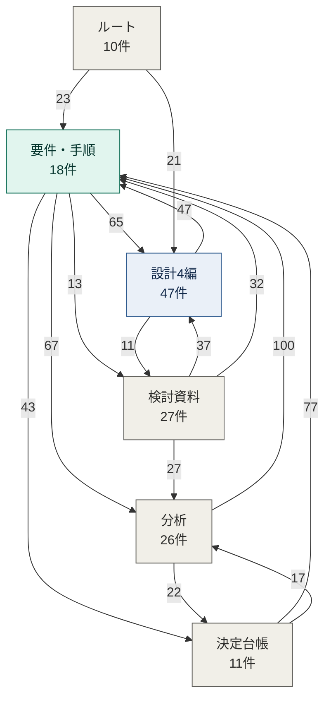
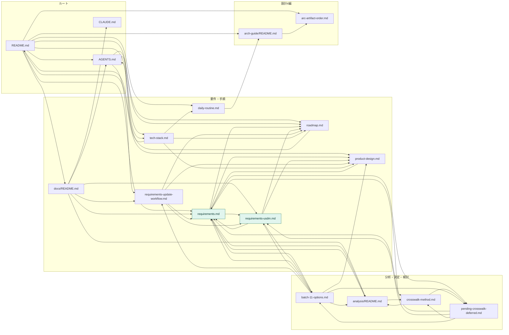

# リポジトリ構造と依存関係の鳥観図

- 対象プロダクト: `paper-repro`
- 作成日: 2026年9月8日
- 対象コミット: `c8ad4edf91a200f59064c0caed660b9457f6be62`
- 対象ファイル数: **223件**（`git ls-files` による追跡ファイル全件）

> **依存の定義。** 本書でいう依存とは、Markdown の**相対リンク**である。
> `[表示文字](相対パス)` の形で他のファイルを参照していれば、
> **リンク元 → リンク先**の向きで依存とみなす。
> 外部URL（`http`・`mailto`）とアンカーのみの参照は数えない。
>
> ⚠️ **リンクは機械的に抽出した。** 推測や意味づけによる依存は含まない。
> 抽出は上記コミットの時点であり、以後の変更は反映されない。

---

## 1. カテゴリ分け

223ファイルを14カテゴリへ分けた。**重複なし、漏れなし。**

| カテゴリ | 件数 | 置き場所 | 内容 |
|---|---:|---|---|
| 設計4編 | 47 | `docs/arch-guide/` | 画面編・システム振る舞い編・データモデル編・外部インタフェース編 |
| 検討資料 | 27 | `docs/worknotes/` | 判断材料、保留の記録、振り返り |
| 分析 | 26 | `docs/requirements-analysis/` | 一次資料の分析と要求突合表 |
| スキル本体 | 22 | `.agents/skills/`、`.claude/skills/` | AI Agent 用スキルの正本と入口 |
| フロントエンド | 22 | `frontend/` | Next.js、TypeScript、i18n |
| 要件・手順 | 18 | `docs/` 直下 | 要求仕様、ロードマップ、製品設計、運用手順 |
| バックエンド | 16 | `backend/` | FastAPI、SQLAlchemy、テスト |
| 開発ログ | 16 | `docs/devlog/` | 日次の知識資産 |
| 決定台帳 | 11 | `docs/requirements-decisions/` | 5択の記録（第1〜11バッチ） |
| ルート | 10 | リポジトリ直下 | `README.md`、`AGENTS.md`、`CLAUDE.md`、`LICENSE` ほか |
| スクリプト | 4 | `scripts/` | 起動、検証 |
| 開発環境設定 | 2 | `.vscode/` | エディタ設定 |
| 履歴 | 1 | `docs/history/` | 変更履歴 |
| スキル運用 | 1 | `docs/skills/` | スキルの運用ガイド |

⚠️ **文書が全体の77%を占める**（172件が `.md`）。
コードは `.py` 14件、`.tsx` 7件、`.ts` 4件である。

---

## 2. カテゴリ間の依存（鳥観図）

矢印はリンクの向き、数字はリンクの本数である。**本数10件以上の辺のみを描く。**
10件未満の辺は第4章の表に載せる。



<details>
<summary>Mermaid のソースを見る</summary>

```text
flowchart TB
    ROOT["ルート<br>10件"]
    REQ["要件・手順<br>18件"]
    ANA["分析<br>26件"]
    DEC["決定台帳<br>11件"]
    WN["検討資料<br>27件"]
    ARC["設計4編<br>47件"]

    ANA -->|100| REQ
    DEC -->|77| REQ
    REQ -->|67| ANA
    REQ -->|65| ARC
    ARC -->|47| REQ
    REQ -->|43| DEC
    WN -->|37| ARC
    WN -->|32| REQ
    WN -->|27| ANA
    ROOT -->|23| REQ
    ANA -->|22| DEC
    ROOT -->|21| ARC
    DEC -->|17| ANA
    REQ -->|13| WN
    ARC -->|11| WN

    classDef hub fill:#E1F5EE,stroke:#0F6E56,color:#04342C
    classDef up fill:#F1EFE8,stroke:#5F5E5A,color:#2C2C2A
    classDef down fill:#EAF0F8,stroke:#2F5B8F,color:#12294A
    class REQ hub
    class ANA,DEC,WN up
    class ARC down
    class ROOT up
```

</details>

### 2.1 この図が示すこと

⚠️ **「要件・手順」が中心である。** 入ってくる辺が4本（分析100、決定台帳77、設計4編47、
検討資料32、ルート23）、出ていく辺が4本（分析67、設計4編65、決定台帳43、検討資料13）で、
**他のどのカテゴリよりも出入りが多い。**

⚠️ **分析・決定台帳・要件のあいだは双方向である。**
分析→要件が100、要件→分析が67。決定台帳→要件が77、要件→決定台帳が43。
一方向ではなく、**互いを参照し合う。** 分析が要求を提案し、要求が根拠として分析を指す構造である。

⚠️ **設計4編は要件の下流だが、要件も設計を参照する。**
要件→設計4編が65、設計4編→要件が47。工程としては要件が上流だが、
**リンクの上では相互参照になっている。**

⚠️ **バックエンド・フロントエンドは図に現れない。**
コードから文書への相対リンクがなく、文書からコードへのリンクもリンク数が10未満である。
**実装と文書がリンクで結ばれていない。**

---

## 3. カテゴリ内の依存

同じカテゴリ内でのリンク本数である。

| カテゴリ | カテゴリ内リンク | 1ファイルあたり |
|---|---:|---:|
| 設計4編 | 238 | 5.1 |
| 分析 | 144 | 5.5 |
| 要件・手順 | 128 | 7.1 |
| 検討資料 | 38 | 1.4 |
| スキル本体 | 9 | 0.4 |
| 決定台帳 | 7 | 0.6 |
| ルート | 2 | 0.2 |
| 開発ログ | 1 | 0.1 |

⚠️ **決定台帳はカテゴリ内でほとんど繋がっていない**（11ファイルで7本）。
各バッチは独立した選択であり、互いを参照しないためである。**設計としてそうなっている。**

⚠️ **開発ログは1本しかない。** 日次のログは互いを参照せず、
索引（`docs/devlog/README.md`）からのみ辿る構造である。

---

## 4. カテゴリ間の依存（全辺）

第2章に描かなかった10件未満の辺を含む全30辺である。

| 元 | 先 | 本数 |
|---|---|---:|
| 分析 | 要件・手順 | 100 |
| 決定台帳 | 要件・手順 | 77 |
| 要件・手順 | 分析 | 67 |
| 要件・手順 | 設計4編 | 65 |
| 設計4編 | 要件・手順 | 47 |
| 要件・手順 | 決定台帳 | 43 |
| 検討資料 | 設計4編 | 37 |
| 検討資料 | 要件・手順 | 32 |
| 検討資料 | 分析 | 27 |
| ルート | 要件・手順 | 23 |
| 分析 | 決定台帳 | 22 |
| ルート | 設計4編 | 21 |
| 決定台帳 | 分析 | 17 |
| 要件・手順 | 検討資料 | 13 |
| 設計4編 | 検討資料 | 11 |
| 要件・手順 | スキル本体 | 9 |
| ルート | スキル本体 | 8 |
| 決定台帳 | 検討資料 | 8 |
| 要件・手順 | ルート | 7 |
| スキル本体 | 要件・手順 | 6 |
| 分析 | 検討資料 | 5 |
| 要件・手順 | 開発ログ | 4 |
| スキル本体 | 設計4編 | 3 |
| スキル本体 | 検討資料 | 3 |
| 設計4編 | 開発ログ | 2 |
| 決定台帳 | 設計4編 | 2 |
| スキル運用 | スキル本体 | 2 |
| 検討資料 | 決定台帳 | 2 |
| スキル本体 | ルート | 1 |
| ルート | 検討資料 | 1 |

⚠️ **バックエンド・フロントエンド・スクリプト・開発環境設定・履歴は0本である。**
これらは Markdown を持たないか、相対リンクを含まない。

---

## 5. 中核18ファイルの依存

カテゴリ単位では見えないファイル同士の関係を、**中核18ファイルに限って**示す。
全172の Markdown を描くと読めなくなるためである。

⚠️ **本図だけ左から右への流れ（`LR`）にしている。**
第2章と向きが違うのは、縦長に収めるためである。
`README.md` が9本の辺を出すため、上から下（`TB`）にすると子が横に9個並んで横長になる。
`LR` では4つのサブグラフが列として並び、各列の中でノードが縦に積まれる。
**ノードと辺の対応は変えていない。**



<details>
<summary>Mermaid のソースを見る</summary>

```text
flowchart LR
    subgraph L1["ルート"]
        RM["README.md"]
        AG["AGENTS.md"]
        CL["CLAUDE.md"]
    end
    subgraph L2["要件・手順"]
        REQ["requirements.md"]
        USDM["requirements-usdm.md"]
        WF["requirements-update-workflow.md"]
        PD["product-design.md"]
        RD["roadmap.md"]
        TS["tech-stack.md"]
        DR["daily-routine.md"]
        DRM["docs/README.md"]
    end
    subgraph L3["分析・決定・検討"]
        ARM["analysis/README.md"]
        CWM["crosswalk-method.md"]
        B11["batch-11-options.md"]
        PCD["pending-crosswalk-deferred.md"]
    end
    subgraph L4["設計4編"]
        ARC["arch-guide/README.md"]
        AAO["arc-artifact-order.md"]
    end

    RM --> AG
    RM --> DRM
    RM --> RD
    RM --> TS
    RM --> PD
    RM --> REQ
    RM --> ARC
    RM --> AAO
    RM --> DR
    AG --> WF
    AG --> RD
    AG --> TS
    DRM --> AG
    DRM --> CL
    DRM --> REQ
    DRM --> USDM
    DRM --> WF
    DRM --> ARM
    REQ --> USDM
    REQ --> PD
    REQ --> RD
    REQ --> ARM
    REQ --> CWM
    REQ --> B11
    REQ --> PCD
    USDM --> REQ
    USDM --> PD
    USDM --> B11
    USDM --> RD
    WF --> REQ
    WF --> USDM
    WF --> PD
    WF --> RD
    PD --> REQ
    TS --> AG
    TS --> RD
    TS --> PD
    TS --> DR
    RD --> RM
    DR --> ARC
    ARM --> CWM
    ARM --> REQ
    CWM --> ARM
    CWM --> PCD
    B11 --> REQ
    B11 --> USDM
    B11 --> PD
    B11 --> ARM
    B11 --> WF
    B11 --> PCD
    PCD --> REQ
    PCD --> USDM
    PCD --> CWM
    PCD --> B11
    ARC --> AAO

    classDef hub fill:#E1F5EE,stroke:#0F6E56,color:#04342C
    class REQ,USDM hub
```

</details>

### 5.1 この図が示すこと

⚠️ **`requirements.md` と `requirements-usdm.md` が相互に参照する。**
`USDM → requirements.md` が33本と、中核18ファイルの中で最多である。
**USDM の各節が「[`requirements.md`](requirements.md) 第3.2節より」と出所を明記している**ためで、
2026年9月7日に確定した役割分担（重複するのは要求文と受入基準）の現れである。

⚠️ **`README.md` から出る辺が9本、入る辺が1本（`roadmap.md` から）である。**
ほぼ一方向の入口として機能している。

⚠️ **`docs/README.md` は索引として6本を出すが、入る辺は `README.md` からの1本だけである。**

---

## 6. 本書の限界

⚠️ **リンクの有無は、意味的な依存と一致しない。**
たとえば `roadmap.md` と実装（`backend/`・`frontend/`）は工程として強く結びつくが、
相対リンクが無いため本書の図には現れない。

⚠️ **リンクの本数は重要度を表さない。**
`USDM → requirements.md` の33本は、33の節が同じ1ファイルを指しているだけである。

⚠️ **対象コミット時点の実測である。**
`c8ad4ed` 以後の変更は反映されない。再抽出するには、
`git ls-files` の各 `.md` から `](相対パス)` を取り出し、
`posixpath.normpath` で解決して追跡ファイルに含まれるものだけを数える。
