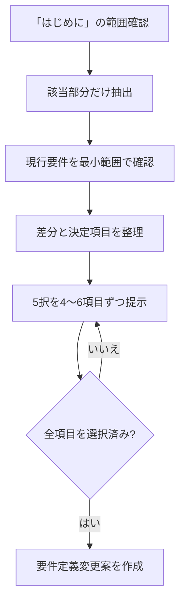

# 要件定義更新ワークフロー

- 対象プロダクト: `paper-repro`
- 位置づけ: 要件定義を確定する前の検討・意思決定プロセス
- 正本との関係: 確定済み要件の正本は [`requirements.md`](requirements.md)。本書は正本を直接置き換えない
- 対象資料: 『原論文から解き明かす生成AI』PDFの「はじめに」
- 版: v0.1（初版・ドラフト）

---

## 1. 目的

『原論文から解き明かす生成AI』の「はじめに」を、今回の要件検討における一次資料として読み、
得られた示唆と現在の要件定義を比較する。そのうえで、変更が必要な要求項目について利用者が
選択肢から方針を決定し、すべての選択後に `requirements.md` へ反映する変更案を作成する。

この作業では、実行時間と再分析を減らすため、次の原則を守る。

1. 最初からPDF全文を解析しない。
2. 最初からリポジトリ全体を精読しない。
3. 根拠抽出、現行要件との比較、選択、変更案作成を分離する。
4. 利用者の選択が完了するまで、確定要件の正本を変更しない。
5. 各判断について、根拠、選択結果、影響範囲を追跡可能にする。

## 2. 作業範囲

### 2.1 対象

- 『原論文から解き明かす生成AI』PDFの「はじめに」
- 現行の [`requirements.md`](requirements.md)
- 比較に必要な範囲の [`product-design.md`](product-design.md) と [`roadmap.md`](roadmap.md)
- 要件の実装状況を確認するときに限り、関連するソースコードとIssue

### 2.2 対象外

- PDFの目次、著者紹介、第1章以降の本文
- PDF全体の一括OCR
- 要件比較に不要なソースコードの精読
- 選択完了前の `requirements.md` の書き換え
- 要件変更案が承認される前の実装変更

## 3. 全体の進め方

作業を次の4段階に分ける。

1. 「はじめに」の範囲確認と根拠抽出
2. 現行要件の最小範囲での確認と差分分析
3. 要求項目ごとの5択による意思決定
4. 全選択後の要件定義変更案作成

各段階の成果物を確定してから次へ進み、同じ資料の再読や同じ要求項目の再分析を避ける。

## 4. 第1段階：「はじめに」だけを抽出する

### 4.1 抽出手順

1. 目次と見出しから「はじめに」の開始ページと終了ページを特定する。
2. 開始ページと終了ページを画像で確認し、隣接する章を含めていないことを検証する。
3. 対象ページのテキスト層を抽出する。
4. テキスト層が欠損・文字化けしているページだけOCRする。
5. 抽出結果とページ画像を照合し、見出し、段落、箇条書きの対応を確認する。

数式や図表が存在する場合も、要件の根拠に必要なものだけを確認する。PDF全体のOCRや、対象外ページの
画像解析は行わない。

### 4.2 根拠メモ

抽出結果を次の形式で整理する。

| 項目 | 記録内容 |
|---|---|
| 書籍が想定する課題 | 「はじめに」に記載された課題 |
| 想定する読者・利用者 | 明記されている対象者 |
| 論文を読む目的 | 理論理解、実装、検証など |
| 再現実装に必要な活動 | 環境構築、データ準備、評価など |
| `paper-repro` への示唆 | 要件候補となる内容 |
| 根拠ページ | PDFページ番号と該当箇所 |
| 情報区分 | `明記` / `解釈` / `設計上の提案` |

この段階では、示唆を記録するだけで要件を確定しない。

## 5. 第2段階：現行要件を最小範囲で確認する

### 5.1 読み順

1. [`requirements.md`](requirements.md)
2. [`product-design.md`](product-design.md)
3. [`roadmap.md`](roadmap.md)
4. 必要な場合だけ、関連するソースコードとIssue

リポジトリ全体を先に読み込まず、根拠メモと関係する箇所だけを確認する。

### 5.2 差分分類

現行要件と根拠メモを比較し、各項目を次のいずれかに分類する。

| 分類 | 意味 |
|---|---|
| 維持 | 現行要件を変更する必要がない |
| 変更 | 現行要件の内容または表現を修正する必要がある |
| 追加 | 根拠メモに示唆があり、現行要件に存在しない |
| 統合・削除候補 | 重複、矛盾、または不要となる可能性がある |
| 保留 | 「はじめに」と現行要件だけでは判断できない |

この段階でも文書は変更せず、差分候補と判断根拠だけを記録する。

## 6. 第3段階：選択対象となる要求項目を確定する

選択肢を作る前に、意思決定が必要な要求項目の一覧と順序を固定する。途中で項目を増減するときは、
既存の選択へ影響するかを先に確認する。

候補となる要求項目は次のとおり。

1. `paper-repro` の目的
2. 対象利用者
3. 対象とする論文・資料
4. 論文構造の解析範囲
5. 数式・図表・アルゴリズムの扱い
6. 再現実装までの支援範囲
7. コード生成の自動化レベル
8. 実行環境の構築方法
9. データセットの取得・管理
10. 実験条件とハイパーパラメータの管理
11. 再現性の判定基準
12. 原論文・書籍・実装間のトレーサビリティ
13. 成果物の保存形式
14. LLMと利用者の役割分担
15. セキュリティ、ライセンス、著作権
16. 性能、処理時間、利用コスト
17. エラー時の復旧と再実行
18. GitHubとの連携範囲

根拠メモ、現行要件、設計制約のいずれからも判断材料を得られない項目は、無理に選択対象へ含めず
保留とする。

## 7. 第4段階：要求項目ごとに5つの選択肢を提示する

### 7.1 選択肢の共通規則

各要求項目について、必ず5つの選択肢を提示する。

- 選択肢1〜4: 内容が明確に異なる具体的な要求案
- 選択肢5: LLMによる自動作成

選択肢5の意味は、すべての要求項目で次のように固定する。

> **5. LLMが、「はじめに」、現行要件、すでに確定した選択、プロジェクト制約を基に、整合性の高い要求を自動作成する。**

選択肢5が選ばれた場合、LLMは次の内容を自動生成して決定台帳へ登録する。

- 具体的な要求文
- 採用理由
- 根拠と情報区分
- 既存要件・設計・実装への影響
- 検証可能な受入基準

原則として追加の選択は要求しない。ただし、確定済みの要件や絶対原則と矛盾する場合は自動確定せず、
矛盾内容を提示して利用者へ戻す。

### 7.2 選択肢の表示形式

各案の違いを短時間で比較できるよう、次の形式で提示する。

| 番号 | 選択肢 | 長所 | 注意点 | 根拠区分 |
|---:|---|---|---|---|
| 1 | 具体案A | 主な利点 | 主な制約 | 明記 / 解釈 / 設計提案 |
| 2 | 具体案B | 主な利点 | 主な制約 | 明記 / 解釈 / 設計提案 |
| 3 | 具体案C | 主な利点 | 主な制約 | 明記 / 解釈 / 設計提案 |
| 4 | 具体案D | 主な利点 | 主な制約 | 明記 / 解釈 / 設計提案 |
| 5 | LLMによる自動作成 | 全体との整合性を取りやすい | 生成理由と根拠の記録が必要 | 自動生成 |

選択肢1〜4は、単に「弱・中・強」とするのではなく、採用後のシステム動作が区別できる内容にする。

## 8. 選択作業の進め方

### 8.1 バッチ単位

一度に全項目を提示せず、関連する4〜6項目を1バッチとして提示する。各バッチを回答した後、
決定台帳へ追記し、次のバッチへ進む。

### 8.2 回答形式

要求項目には一意なIDを付け、利用者は番号だけで回答できるようにする。

```text
REQ-01: 2
REQ-02: 5
REQ-03: 1
REQ-04: 4
```

### 8.3 決定台帳

| 要求ID | 要求項目 | 選択番号 | 確定内容 | 根拠 | 影響範囲 | 状態 |
|---|---|---:|---|---|---|---|
| REQ-01 | 例: 対象利用者 | 2 | 選択した要求文 | PDF頁・現行要件 | 文書・画面・API | 確定 |

回答済み項目は原則として再分析しない。後続の選択と矛盾した場合だけ、影響する要求IDと矛盾理由を
提示し、変更が必要な項目に限って利用者へ戻す。

## 9. 全選択後に作成する要件定義変更案

すべての対象項目が選択済みになった時点で、次の構成の変更案を作成する。

1. 変更概要
2. 変更理由
3. 追加する要求
4. 修正する要求
5. 統合または削除する要求
6. 維持する要求
7. 保留事項
8. 選択結果一覧
9. 根拠ページとのトレーサビリティ
10. 影響を受ける既存ファイル
11. 新しい要求文
12. 各要求の受入基準
13. 設計・実装・テストへの影響
14. 推奨する変更順序

変更案では、少なくとも次のトレーサビリティを記録する。

```text
PDFの根拠ページ
  -> 根拠メモ
  -> 要求ID
  -> 選択番号またはLLM自動作成結果
  -> 変更対象ファイル
  -> 受入基準
```

変更案の確認と承認を受けた後、別の作業単位で `requirements.md`、関連設計文書、ロードマップを更新する。
要件変更の承認前には、製品コードを変更しない。

## 10. 実行フロー



## 11. 完了条件

この検討工程は、次の条件をすべて満たしたときに完了する。

- 「はじめに」の対象範囲が検証されている。
- 根拠メモの各項目にページ番号と情報区分がある。
- 現行要件との差分が分類されている。
- すべての選択対象に5つの選択肢があり、そのうち自動作成は選択肢5だけである。
- すべての要求項目について、利用者の選択または保留が記録されている。
- LLMが自動作成した要求に、理由、影響範囲、受入基準がある。
- 要件定義変更案に、追加・変更・統合・削除・維持・保留が整理されている。
- `requirements.md` の更新は、変更案の承認後にのみ行われる。
