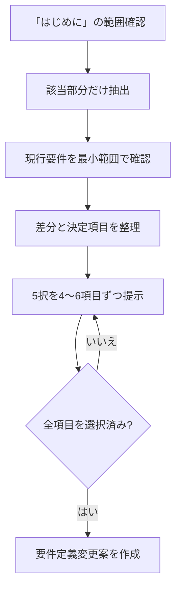

# 要件定義更新ワークフロー

- 対象プロダクト: `paper-repro`
- 位置づけ: 要件定義を確定する前の検討・意思決定プロセス
- 正本との関係: 確定済み要件の正本は [`requirements.md`](requirements.md)。本書は正本を直接置き換えない
- 対象資料: 『原論文から解き明かす生成AI』PDFの「はじめに」
- 現在の進捗: 第3段階の第2バッチ（REQ-C06〜REQ-C09）を提示済み。利用者の選択待ち
- 版: v0.6（第2バッチの5択を追加）

---

## 1. 目的

『原論文から解き明かす生成AI』の「はじめに」を、今回の要件検討における一次資料として読み、
得られた示唆と現在の要件定義を比較する。そのうえで、変更が必要な要求項目について利用者が
選択肢から方針を決定し、すべての選択後に `requirements.md` へ反映する変更案を作成する。

この作業では、実行時間と再分析を減らすため、次の原則を守る。

1. 最初からPDF全文を解析しない。
2. 最初からリポジトリ全体を精読しない。
3. 根拠抽出、現行要件との比較、選択、変更案作成を分離する。
4. 利用者の選択が完了するまで、確定要件の正本を変更しない。
5. 各判断について、根拠、選択結果、影響範囲を追跡可能にする。

## 2. 作業範囲

### 2.1 対象

- 『原論文から解き明かす生成AI』PDFの「はじめに」
- 現行の [`requirements.md`](requirements.md)
- 比較に必要な範囲の [`product-design.md`](product-design.md) と [`roadmap.md`](roadmap.md)
- 要件の実装状況を確認するときに限り、関連するソースコードとIssue

### 2.2 対象外

- PDFの目次、著者紹介、第1章以降の本文
- PDF全体の一括OCR
- 要件比較に不要なソースコードの精読
- 選択完了前の `requirements.md` の書き換え
- 要件変更案が承認される前の実装変更

## 3. 全体の進め方

作業を次の4段階に分ける。

1. 「はじめに」の範囲確認と根拠抽出
2. 現行要件の最小範囲での確認と差分分析
3. 要求項目ごとの5択による意思決定
4. 全選択後の要件定義変更案作成

各段階の成果物を確定してから次へ進み、同じ資料の再読や同じ要求項目の再分析を避ける。

### 3.1 進捗

| 段階 | 内容 | 状態 |
|---|---|---|
| 第1段階 | 「はじめに」の範囲確認と根拠抽出 | 完了 |
| 第2段階 | 現行要件の確認と差分分析 | 完了 |
| 第3段階 | 要求項目ごとの5択 | 進行中（第1バッチ完了・5/9件選択済み、第2バッチ選択待ち） |
| 第4段階 | 要件定義変更案の作成 | 未着手 |

## 4. 第1段階：「はじめに」だけを抽出する

### 4.1 抽出手順

1. 目次と見出しから「はじめに」の開始ページと終了ページを特定する。
2. 開始ページと終了ページを画像で確認し、隣接する章を含めていないことを検証する。
3. 対象ページのテキスト層を抽出する。
4. テキスト層が欠損・文字化けしているページだけOCRする。
5. 抽出結果とページ画像を照合し、見出し、段落、箇条書きの対応を確認する。

数式や図表が存在する場合も、要件の根拠に必要なものだけを確認する。PDF全体のOCRや、対象外ページの
画像解析は行わない。

### 4.2 根拠メモ

抽出結果を次の形式で整理する。

| 項目 | 記録内容 |
|---|---|
| 書籍が想定する課題 | 「はじめに」に記載された課題 |
| 想定する読者・利用者 | 明記されている対象者 |
| 論文を読む目的 | 理論理解、実装、検証など |
| 再現実装に必要な活動 | 環境構築、データ準備、評価など |
| `paper-repro` への示唆 | 要件候補となる内容 |
| 根拠ページ | PDFページ番号と該当箇所 |
| 情報区分 | `明記` / `解釈` / `設計上の提案` |

この段階では、示唆を記録するだけで要件を確定しない。

### 4.3 範囲確認結果

2026年8月21日に、PDFのテキスト層とページ画像の両方で境界を確認した。

| 項目 | 確認結果 |
|---|---|
| 開始 | PDFページ1の見出し「はじめに」 |
| 終了 | PDFページ3の脚注末尾 |
| 次の内容 | PDFページ4の先頭から「1.2 論文を読み解く技術」 |
| 確定した対象ページ | PDFページ1〜3 |
| 抽出方法 | PDFのテキスト層から抽出 |
| OCR | 不要。文字欠損や判読不能箇所は確認されなかった |
| 目視検証 | PDFページ1〜4を画像化し、開始・終了境界と抽出文字を照合済み |

### 4.4 「はじめに」から抽出された内容

以下は「はじめに」に明記された内容の要約である。現行要件との比較や、`paper-repro`へ反映するかの
判断はまだ行っていない。

| 分類 | 抽出内容 | 根拠ページ | 情報区分 |
|---|---|---:|---|
| 中心的な考え方 | 原論文を読み解き、生成AIを成立させている重要な理論的基礎を理解する | 1 | 明記（要約） |
| 原論文の定義 | 新しい科学的発見を最初に報告した学術論文 | 1 | 明記（要約） |
| 対象領域 | テキスト生成、画像生成、両者を融合する手法 | 1 | 明記（要約） |
| 理論的基礎 | 前提知識やモデル構造を数式から理解すること | 1 | 明記（要約） |
| 数学の範囲 | 高度な数理解析は基本的に対象外 | 1 | 明記（要約） |
| 得られるもの1 | Transformer、拡散モデル、スケーリング則などの理論的理解 | 1 | 明記（要約） |
| 得られるもの2 | 他の情報源では扱われにくい重要トピックの理解 | 1 | 明記（要約） |
| 得られるもの3 | 論文を独力で読み解く力と、そのための技術 | 1 | 明記（要約） |
| 得られないもの1 | 公開されている生成AIモデルの網羅的把握 | 1 | 明記（要約） |
| 得られないもの2 | プログラムによる生成AIモデルの実装 | 1 | 明記（要約） |
| 得られないもの3 | ウェブAPIを利用したアプリケーション開発 | 1 | 明記（要約） |
| 原論文を読む価値 | 表面的な最新情報ではなく、長期間参照される本質的な概念を理解できる | 1〜2 | 明記（要約） |
| 継続学習 | 新しい重要論文を読み解くことで、知識を持続的に更新できる | 2 | 明記（要約） |
| 読解支援 | 演習問題と論文読解技術によって理解を補助する | 2 | 明記（要約） |
| 原論文の限界 | 後に整理された定式化や解説の方が効率的な場合もある | 2 | 明記（要約） |
| 原典重視の理由 | 他人の解釈やバイアスを介さず、自分で原典を理解する | 2 | 明記（要約） |
| 実装との関係 | 実装方法は主題ではないが、理論理解のために実装を読むことは不可欠 | 2 | 明記（要約） |
| 対象コード | 一部でPython、C、C++のコードを読む | 2 | 明記（要約） |
| 想定読者 | 学部レベルの機械学習を理解し、生成AIの基礎を学びたい人 | 2〜3 | 明記（要約） |
| 具体的な読者 | 大学院生、研究者、生成AIの理論的理解を必要とする社会人 | 2〜3 | 明記（要約） |
| 想定知識水準 | PRMLや『はじめてのパターン認識 ディープラーニング編』を読み進められる程度 | 3 | 明記（要約） |

### 4.5 次段階へ引き継ぐ重要な対比

「はじめに」には、次の両方が明記されている。

- プログラムによるモデル実装や、ウェブAPIを利用したアプリケーション開発は、本書から得られるものには含まれない。
- 一方で、論文だけでは分からない内容を実装から理解することは、理論的側面の理解が目的であっても不可欠である。

この対比は抽出結果として記録するが、`paper-repro`の目的、支援範囲、実装自動化レベルへどう反映するかは、
第2段階以降で現行要件と比較して判断する。

## 5. 第2段階：現行要件を最小範囲で確認する

### 5.1 読み順

1. [`requirements.md`](requirements.md)
2. [`product-design.md`](product-design.md)
3. [`roadmap.md`](roadmap.md)
4. 必要な場合だけ、関連するソースコードとIssue

リポジトリ全体を先に読み込まず、根拠メモと関係する箇所だけを確認する。

### 5.2 差分分類

現行要件と根拠メモを比較し、各項目を次のいずれかに分類する。

| 分類 | 意味 |
|---|---|
| 維持 | 現行要件を変更する必要がない |
| 変更 | 現行要件の内容または表現を修正する必要がある |
| 追加 | 根拠メモに示唆があり、現行要件に存在しない |
| 統合・削除候補 | 重複、矛盾、または不要となる可能性がある |
| 保留 | 「はじめに」と現行要件だけでは判断できない |

この段階でも文書は変更せず、差分候補と判断根拠だけを記録する。

### 5.3 確認した現行文書

2026年8月21日に、次の順で必要な範囲を確認した。

| 順序 | 文書 | 確認した役割 |
|---:|---|---|
| 1 | [`requirements.md`](requirements.md) | 現行要件の正本。目的、対象機能、非機能要件、初期リリース範囲を確認 |
| 2 | [`product-design.md`](product-design.md) | human-in-the-loop、状態遷移、画面、API、初期リリース設計を補足確認 |
| 3 | [`roadmap.md`](roadmap.md) | タイプBから始める段階的な実装順序と、後続リリースへの拡張方針を確認 |

ソースコードとIssueは確認していない。「はじめに」と現行要件の差分を判断するために、実装状況の確認は
不要だったためである。

### 5.4 差分分析結果

以下は変更の確定結果ではなく、第3段階で利用者が判断するための差分候補である。
`requirements.md`、`product-design.md`、`roadmap.md`は、この分析では変更していない。

| 差分ID | 論点 | 「はじめに」の根拠 | 現行要件 | 分類 | 判断理由 |
|---|---|---|---|---|---|
| DIF-01 | 製品の中心目的 | 原論文から理論的基礎を理解し、独力で読み解く力を得る（1〜2頁） | 目的は「着手可能な再現実装」への到達を中心に記載 | 変更 | 理論理解と再現実装の二層を明記し、どちらを上位目的とするか決める必要がある |
| DIF-02 | human-in-the-loop | 他人の解釈に依存せず、自分で原典を理解する（2頁） | AIが草案を作り、各Phase末で人間が確認・承認 | 維持 | 利用者自身が判断するという一次資料の考え方と整合する |
| DIF-03 | 対象利用者 | 大学院生、研究者、理論的理解を必要とする社会人（2〜3頁） | 利用者像と知識水準が明記されていない | 追加 | UIの説明深度、用語解説、数式支援、既定値を決める前提になる |
| DIF-04 | 前提知識 | 学部レベルの機械学習を理解し、PRML等を読み進められる程度（3頁） | 前提知識と利用開始時の確認項目がない | 追加 | 初心者向け補助をどこまで用意するか判断できない |
| DIF-05 | 対象論文と入手元 | 新しい科学的発見を最初に報告した原論文（1頁） | 製品全体はarXivのAI/ML論文、初期リリースはarXiv URLに限定 | 変更 | 原論文という対象定義と、arXivという入手経路を分けて定義する必要がある |
| DIF-06 | 対象領域 | テキスト生成、画像生成、両者を融合する手法（1頁） | AI/ML論文全般。初期リリースはタイプB・公式実装あり | 保留 | 生成AIに限定するかAI/ML全般を維持するかは、一次資料だけでは確定できない |
| DIF-07 | 理論・数式の読解支援 | 前提知識とモデル構造を数式から理解する（1頁） | 数式表示、数式からコードへの下訳、shape検算はあるが、理論理解の到達点は未定義 | 変更 | 数式を表示・変換するだけでなく、概念・前提・モデル構造との関係を説明する要件が必要になり得る |
| DIF-08 | 数学的説明の深さ | 高度な数理解析は基本的に対象外（1頁） | 数学的な前提レベルと説明上限が未定義 | 追加 | 説明の過不足とLLM処理量を制御する基準になる |
| DIF-09 | 論文読解技術と演習 | 演習問題と論文読解技術で理解を補助する（2頁） | スリーパス法、Abstract要約、spec、仮定台帳はあるが、演習・理解確認はない | 追加 | 再現作業だけでなく、利用者の読解力を高める機能を含めるか判断が必要 |
| DIF-10 | モデル情報の網羅性 | 公開済み生成AIモデルの網羅的把握は対象外（1頁） | 網羅的なモデルカタログを要件としていない | 維持 | 現行要件に過剰な網羅性の約束はない |
| DIF-11 | 再現実装支援の境界 | モデル実装やWeb APIアプリ開発は本書から得られるものに含まれない（1頁） | 再現実装コード、Colab、サンドボックス実行、スコア照合を製品の中心に置く | 変更 | 書籍の対象外を製品独自価値として補完するのか、読解支援を優先するのかを明示する必要がある |
| DIF-12 | 実装を読む支援 | 理論理解のためにも実装を読むことは不可欠（2頁） | 公式実装探索、リポジトリ読解、コードから仮定台帳を更新 | 維持 | 一次資料の考え方をすでに具体的な機能へ落とし込んでいる |
| DIF-13 | 対応するコード言語 | 一部でPython、C、C++のコードを読む（2頁） | 実行・生成はPython/Colab中心。リポジトリ読解の対応言語は未定義 | 保留 | 初期リリースをPythonに絞るか、C/C++の静的読解まで含めるかは設計判断が必要 |
| DIF-14 | 一次資料と二次資料の使い分け | 後に整理された定式化や解説の方が効率的な場合もある（2頁） | 原論文、公式実装、Papers with Code、OpenReviewを扱うが、情報源の役割分担は未定義 | 追加 | 原典を正本としつつ補助資料を使う規則と、食い違い時の扱いが必要 |
| DIF-15 | 根拠と解釈の追跡 | 他人の解釈やバイアスを介さず、原典を自分で理解する（2頁） | 仮定台帳に論文記述・選択・根拠を残すが、ページ・節・図表・数式への追跡単位は未定義 | 追加 | 原文、LLM要約、設計上の推論を区別するトレーサビリティが必要 |
| DIF-16 | 継続学習 | 新しい重要論文を読むことで知識を持続的に更新できる（2頁） | 論文単位のプロジェクト保存と論文v1/v2差分はあるが、継続学習支援は未定義 | 追加 | 論文更新の追跡、学習履歴、関連論文への展開を製品範囲に含めるか判断が必要 |
| DIF-17 | 学術的な正しさの判定 | 原論文から本質的概念を理解することを重視（1〜2頁） | 論文の主張自体の学術的検証はスコープ外 | 維持 | 理解・再現と、主張の真偽判定を分離する現行境界に矛盾はない |
| DIF-18 | 再現性・安全性・コスト | 「はじめに」には具体的な実行要件の記載なし | サンドボックス、再現性、再開性、監査、コスト上限を定義 | 維持 | 一次資料に反対根拠がなく、再現実装支援に必要な製品固有要件である |

### 5.5 分類別集計

| 分類 | 件数 | 差分ID |
|---|---:|---|
| 維持 | 5 | DIF-02、DIF-10、DIF-12、DIF-17、DIF-18 |
| 変更 | 4 | DIF-01、DIF-05、DIF-07、DIF-11 |
| 追加 | 7 | DIF-03、DIF-04、DIF-08、DIF-09、DIF-14、DIF-15、DIF-16 |
| 統合・削除候補 | 0 | 該当なし |
| 保留 | 2 | DIF-06、DIF-13 |

「はじめに」だけを根拠として削除できる現行要件は確認されなかった。特にサンドボックス、再現性、
コスト上限などは書籍に記載がなくても、再現実装支援を安全に提供するため維持する。

### 5.6 第3段階へ渡す判断候補

18件の差分をそのまま18回の選択にせず、関連する差分を次の9項目へ束ねる。
この段階では項目だけを整理し、5つの選択肢はまだ作成しない。

| 要求候補ID | 判断項目 | 関連する差分ID | 第3段階で決めること |
|---|---|---|---|
| REQ-C01 | 製品の目的と価値の優先順位 | DIF-01、DIF-11、DIF-17 | 理論理解、読解力育成、再現実装の関係と優先順位 |
| REQ-C02 | 対象利用者と前提知識 | DIF-03、DIF-04、DIF-08 | 利用者像、必要知識、説明レベル |
| REQ-C03 | 対象論文・入手元・対象領域 | DIF-05、DIF-06、DIF-10 | 原論文の定義、arXiv以外の扱い、生成AIへの限定有無 |
| REQ-C04 | 論文読解と理解確認の支援範囲 | DIF-07、DIF-09 | 概念・数式・構造の説明、読解手順、演習・理解確認の有無 |
| REQ-C05 | 再現実装までの支援境界 | DIF-11、DIF-12、DIF-18 | 実装読解、コード生成、実行、照合のどこまでを製品責任とするか |
| REQ-C06 | コード言語と自動化レベル | DIF-07、DIF-13 | Python中心か、C/C++読解を含めるか、人間の確認点をどこに置くか |
| REQ-C07 | 情報源の優先順位 | DIF-14、DIF-15 | 原論文、公式実装、査読、二次解説の役割と不一致時の扱い |
| REQ-C08 | 根拠トレーサビリティ | DIF-02、DIF-15 | 原文、要約、解釈、設計提案をどの単位で追跡・表示するか |
| REQ-C09 | 継続学習と更新追跡 | DIF-05、DIF-16 | 論文版更新、関連論文、学習履歴を製品範囲に含めるか |

### 5.7 第2段階の結論

- 現行要件の強みは、human-in-the-loop、公式実装の読解、サニティチェック、再現性、安全性、コスト管理である。
- 主な不足は、理論理解を製品目的へどう位置付けるか、対象利用者と前提知識、数式を概念理解へ結び付ける支援、
  一次資料とLLM解釈のトレーサビリティである。
- 書籍の「実装は主題ではないが、理論理解には実装読解が不可欠」という対比と、現行の再現実装中心の目的の間には、
  利用者による明示的な方針決定が必要である。
- 現行要件を削除する根拠はなく、5択を始める前に判断すべき項目は `REQ-C01`〜`REQ-C09` の9項目に整理できる。
- 第3段階では、まず関連性の高い4〜6項目を1バッチとして5択を提示する。

## 6. 第3段階：選択対象となる要求項目を確定する

第2段階の差分分析により、選択対象候補は5.6節の `REQ-C01`〜`REQ-C09` に集約した。
第3段階の開始時に、一覧と提示順序だけを確認してから選択肢を作る。途中で項目を増減するときは、
既存の選択へ影響するかを先に確認する。

実行環境、データセット、実験条件、セキュリティ、性能、エラー復旧、GitHub連携などの現行要件は、
「はじめに」に変更根拠がなく、第2段階では維持とした。これらを5択の対象へ追加するのは、別の一次資料、
設計制約、または利用者から新しい判断条件が提示された場合に限る。

## 7. 第3段階：要求項目ごとに5つの選択肢を提示する

第1バッチの選択肢、選択結果、理由、影響範囲、受入基準は、
[`requirements-decisions/batch-01-options.md`](requirements-decisions/batch-01-options.md) に記録する。
第1バッチは5件すべて選択済みである。

第2バッチの `REQ-C06`〜`REQ-C09` の選択肢と回答欄は、
[`requirements-decisions/batch-02-options.md`](requirements-decisions/batch-02-options.md) に記録する。
第2バッチは提示済みで、利用者の選択待ちである。

### 7.1 選択肢の共通規則

各要求項目について、必ず5つの選択肢を提示する。

- 選択肢1〜4: 内容が明確に異なる具体的な要求案
- 選択肢5: LLMによる自動作成

選択肢5の意味は、すべての要求項目で次のように固定する。

> **5. LLMが、「はじめに」、現行要件、すでに確定した選択、プロジェクト制約を基に、整合性の高い要求を自動作成する。**

選択肢5が選ばれた場合、LLMは次の内容を自動生成して決定台帳へ登録する。

- 具体的な要求文
- 採用理由
- 根拠と情報区分
- 既存要件・設計・実装への影響
- 検証可能な受入基準

原則として追加の選択は要求しない。ただし、確定済みの要件や絶対原則と矛盾する場合は自動確定せず、
矛盾内容を提示して利用者へ戻す。

### 7.2 選択肢の表示形式

各案の違いを短時間で比較できるよう、次の形式で提示する。

| 番号 | 選択肢 | 長所 | 注意点 | 根拠区分 |
|---:|---|---|---|---|
| 1 | 具体案A | 主な利点 | 主な制約 | 明記 / 解釈 / 設計提案 |
| 2 | 具体案B | 主な利点 | 主な制約 | 明記 / 解釈 / 設計提案 |
| 3 | 具体案C | 主な利点 | 主な制約 | 明記 / 解釈 / 設計提案 |
| 4 | 具体案D | 主な利点 | 主な制約 | 明記 / 解釈 / 設計提案 |
| 5 | LLMによる自動作成 | 全体との整合性を取りやすい | 生成理由と根拠の記録が必要 | 自動生成 |

選択肢1〜4は、単に「弱・中・強」とするのではなく、採用後のシステム動作が区別できる内容にする。

## 8. 選択作業の進め方

### 8.1 バッチ単位

一度に全項目を提示せず、関連する4〜6項目を1バッチとして提示する。各バッチを回答した後、
決定台帳へ追記し、次のバッチへ進む。

### 8.2 回答形式

要求項目には一意なIDを付け、利用者は番号だけで回答できるようにする。

```text
REQ-01: 2
REQ-02: 5
REQ-03: 1
REQ-04: 4
```

### 8.3 決定台帳

第1バッチの決定台帳は
[`requirements-decisions/batch-01-options.md`](requirements-decisions/batch-01-options.md) の7〜9節を正本とする。
第2バッチの選択肢は
[`requirements-decisions/batch-02-options.md`](requirements-decisions/batch-02-options.md) を正本とする。
第2バッチの選択完了後、同ファイルに決定台帳を追記し、全9件を要件定義変更案へ統合する。

| 要求ID | 要求項目 | 選択番号 | 確定内容 | 根拠 | 影響範囲 | 状態 |
|---|---|---:|---|---|---|---|
| REQ-01 | 例: 対象利用者 | 2 | 選択した要求文 | PDF頁・現行要件 | 文書・画面・API | 確定 |

回答済み項目は原則として再分析しない。後続の選択と矛盾した場合だけ、影響する要求IDと矛盾理由を
提示し、変更が必要な項目に限って利用者へ戻す。

## 9. 第4段階：全選択後に作成する要件定義変更案

すべての対象項目が選択済みになった時点で、次の構成の変更案を作成する。

1. 変更概要
2. 変更理由
3. 追加する要求
4. 修正する要求
5. 統合または削除する要求
6. 維持する要求
7. 保留事項
8. 選択結果一覧
9. 根拠ページとのトレーサビリティ
10. 影響を受ける既存ファイル
11. 新しい要求文
12. 各要求の受入基準
13. 設計・実装・テストへの影響
14. 推奨する変更順序

変更案では、少なくとも次のトレーサビリティを記録する。

```text
PDFの根拠ページ
  -> 根拠メモ
  -> 要求ID
  -> 選択番号またはLLM自動作成結果
  -> 変更対象ファイル
  -> 受入基準
```

変更案の確認と承認を受けた後、別の作業単位で `requirements.md`、関連設計文書、ロードマップを更新する。
要件変更の承認前には、製品コードを変更しない。

## 10. 実行フロー



## 11. 完了条件

この検討工程は、次の条件をすべて満たしたときに完了する。

- 「はじめに」の対象範囲が検証されている。
- 根拠メモの各項目にページ番号と情報区分がある。
- 現行要件との差分が分類されている。
- すべての選択対象に5つの選択肢があり、そのうち自動作成は選択肢5だけである。
- すべての要求項目について、利用者の選択または保留が記録されている。
- LLMが自動作成した要求に、理由、影響範囲、受入基準がある。
- 要件定義変更案に、追加・変更・統合・削除・維持・保留が整理されている。
- `requirements.md` の更新は、変更案の承認後にのみ行われる。
