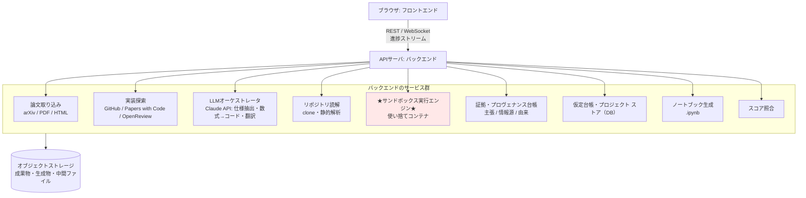

# 要件定義書：英語論文の読解〜再現実装 支援ツール

- 対象ワークフロー: `arxiv-paper-repro` スキル v2.0.0（Phase 0〜6、スリーパス法、論文タイプA/B分岐）
- 版: **v0.2**（選択済み要求の統合完了）
- 前版: v0.2-draft（骨組み更新）／ v0.1（初版・ドラフト）
- 統合元: [`requirements-change-proposal.md`](requirements-change-proposal.md) v0.12 第11章（要求文）・第12章（受入基準）
- 骨組み更新の決定記録: [`worknotes/id-unification-and-phase-provisional.md`](worknotes/id-unification-and-phase-provisional.md)
- 承認前の矛盾スクリーニング: [`worknotes/pre-approval-screening.md`](worknotes/pre-approval-screening.md)
- 用いた一次資料の書誌: [`references.md`](references.md)

> **本版で確定したもの。** 選択済みの `REQ-C01`〜`REQ-C11` と、具体化済みサブ要求12件を、
> 要求文・受入基準つきで第3章へ統合した。第4〜5章の実装単位は、この要求へ対応づけて更新した。
>
> **本版で確定していないもの。** 新しい一次資料3件（`simclr-handson-deck.md`、
> `academic-research-skills.md`、`academic-research-skills-frameworks.md`）から抽出した
> 要求候補32件は、5択を経ていないため本書に含めない。次サイクルで扱う。

## ID体系

**要求の識別子は `REQ-Cxx`（メイン）と `REQ-Cxx-Sxx`（サブ）に一本化する。**
本書・決定台帳・分析文書・変更案のすべてで、この番号だけが要求を指す。

`F-xx`（フロントエンド）・`B-xx`（バックエンド）・`N-xx`（非機能）は**要求IDではなく、
実装単位の番号**である。画面・API・非機能条件の粒度を示すために維持するが、
要求そのものは常に `REQ-Cxx` で参照する。対応は第9章に置く。

| 種別 | 記法 | 件数 | 役割 |
|---|---|---|---|
| メイン要求 | `REQ-C01`〜`REQ-C11` | 11 | 要求の一次識別子 |
| サブ要求 | `REQ-C03-S01` ほか | 12 | メイン要求を具体化する一次識別子 |
| 実装単位（FE） | `F-01`〜`F-20` | 20 | 画面・機能の粒度 |
| 実装単位（BE） | `B-01`〜`B-15` | 15 | サービス・API の粒度 |
| 実装単位（非機能） | `N-01`〜`N-10` | 10 | 非機能条件の粒度 |

---

## 0. 用語定義：「再現」の水準

本書および関連文書で「再現」「再現実装」という語を使うときは、
[ACM Artifact Review and Badging, Version 1.1](references.md)（REF-10）が区別する
次の3水準のうち、**どれを指すかを常に明示する。** 3水準は互いに独立した達成であり、
どれか1つを満たせば他も満たすという関係にはない。

| 水準 | 定義 | 著者の成果物を使うか |
|---|---|---|
| **Repeatability（再実行可能性）** | 同じチーム・同じ実験設定で、自分の計算を自分で再実行できる | — |
| **Reproducibility（再現可能性）** | 異なるチーム・同じ実験設定で、著者が提供した成果物を使って同じ結果を得る | **使う** |
| **Replicability（再現性）** | 異なるチーム・異なる実験設定で、著者の成果物を使わずに独立に開発した成果物で同じ結果を得る | **使わない** |

> **注意。** ACM は NISO の勧告を受け、Reproducibility と Replicability の定義を
> 過去に入れ替えた経緯を明記している。他の文献を参照する際は、その文献が
> どちらの定義を採っているかを個別に確認すること。

初期リリース（第8章）が対象とするタイプB（学習なし・公式実装あり）論文では、
公式実装を利用することを前提とするため、**主に Reproducibility を目指す。**
利用者が公式実装を使わずに再現することを選ぶ場合は、Replicability として区別し、
成果物にどちらを目指したかを明記する（`REQ-C05`・`REQ-C08`・`REQ-C10-S02` に関連）。

数値の一致判定は、厳密な一致を要求しない。同種の実験で許容される誤差の範囲で
一致すればよく、ただし差が論文の主要な主張を変えないことを条件とする
（`F-10` スコア照合ビューの `±5` 判定はこの考え方の初期実装）。

---

## 1. ツールの目的とスコープ

### 1.1 目的

arXiv の AI/ML 論文を入力すると、**Phase 0〜6 のワークフローに沿って**、
仕様抽出・差分特定・仮定台帳作成・サニティチェック・論文値との照合までを支援し、
**「着手可能な再現実装（コード／Colabノートブック）」まで到達させる**こと。

**あわせて、原論文の理論理解と読解力の育成を、再現実装と同等の目的とする**（`REQ-C01`）。
どちらか一方を主、他方を従とはしない。利用者は開始時に経路を選び、
進捗と成果物を失わずに切り替えられる。

> **Phase 0〜6 は暫定の工程モデルである。** 別の一次資料（SCONUL Seven Pillars。
> [`worknotes/id-unification-and-phase-provisional.md`](worknotes/id-unification-and-phase-provisional.md)
> を参照）が読解工程の別モデルを示しているが、そちらはまだ5択を経ておらず、
> 根拠なく採用も棄却もしない。実装は Phase 0〜6 で進めてよいが、**工程モデル自体を
> 確定要件として設計の前提に固定しない。** 工程モデルの確定は次サイクルの決定事項とする。

### 1.2 設計上の根本方針（最重要）

**このツールは「全自動で論文を再現する箱」にはしない。**
ワークフローの本質は、各 Phase 末に人間が方針を決めるゲート（human-in-the-loop）にある。

- Phase 0 末：方針の5択（フル再現／縮小版／読解+改造／部分採用／見送り）を**人間が選ぶ**
- Phase 1：論文タイプ（A:学習あり／B:学習なし）判定を**人間が確認する**
- Phase 4：オラクル満点／1バッチ過学習を**人間が確認してから**スケールに進む

**human-in-the-loop は実行承認だけに適用しない**（`REQ-C01`・`REQ-C07`）。
次の3つにも人間の確認を必須とする。

- **重要な解釈** — 論文の主張をどう読んだか
- **重大な証拠矛盾** — 情報源どうしが食い違ったとき
- **学習到達点** — 理解できたと判定してよいか

→ 製品像は「伴走型パイプライン」。AI は各 Phase の草案を作り、**人間が承認して次に進む。**

### 1.3 スコープ外（やらないこと）

- 論文の主張が正しいかの学術的検証（再現できたかは見るが、論文の是非は判定しない）
- モデルの網羅的カタログ化
- 有償データセット・クローズドモデルの代理取得
- 論文の全自動フル再現（上記方針のとおり、ゲートを外さない）

**学習支援との境界**（`REQ-C03`）。本ツールは論文を読み解く力を育てるが、
機械学習そのものの体系的な教育課程は提供しない。説明は対象論文の理解に必要な範囲に限る。

---

## 2. 全体アーキテクチャ



<details>
<summary>Mermaid のソースを見る</summary>

````markdown

````

</details>

**★印がこのツールの心臓部かつ最大のリスク**（第7章）。

---

## 3. 確定要求

本章が要求の正本である。要求文と受入基準は
[`requirements-change-proposal.md`](requirements-change-proposal.md) v0.12 第11・12章から統合した。
根拠となる一次資料は [`requirements-analysis/`](requirements-analysis/) の各分析文書、
選択の経緯は [`requirements-decisions/`](requirements-decisions/) の決定台帳を参照する。

### 3.1 メイン要求

#### REQ-C01 読解と再現実装の二経路

システムは原論文の読解・学習と再現実装を同等の主要経路として提供し、
利用者が開始時に選択し、進捗を失わず切り替えられるものとする。

- **受入基準**: 2コースを選択・保存でき、既存の進捗と成果物を失わずに切り替えられる。
- **実装単位**: `F-02`（暫定）、`F-15`

#### REQ-C02 前提知識の段階的説明

システムは前提知識を利用条件とせず、必要な用語、数式、機械学習の基礎を段階的に説明し、
一次資料へ戻れるようにする。

- **受入基準**: 前提用語と基礎説明を表示し、追加説明を要求でき、説明から一次資料の根拠へ戻れる。
- **実装単位**: `F-16`、`B-04`

#### REQ-C03 対象論文の範囲と拡張

システムは初期に生成AIのarXiv原論文を中核とし、AI/ML他領域とPDF、DOI、出版社ページ等を
取り込みアダプタで追加できるものとする。

- **受入基準**: 初期対象と拡張対象を識別し、新しい分野・入手元を中核フロー変更なしに追加できる。
- **実装単位**: `F-01`、`B-01`

#### REQ-C04 理解の確認とフィードバック

システムは主要概念ごとに理論解説、演習、確認問題、自己説明と根拠付きフィードバックを
提供するものとする。

- **受入基準**: 主要概念ごとに理解確認を提示し、利用者の回答へ根拠付きフィードバックを返せる。
- **実装単位**: `F-16`、`B-04`

#### REQ-C05 再現実装の支援範囲

システムは公式実装読解、コード・Notebook生成、隔離実行、サニティチェック、
論文値照合を支援範囲とする。

- **受入基準**: ホスト直接実行を禁止し、隔離・制限・シークレット分離・サニティ通過後に照合できる。
- **実装単位**: `B-05`、`B-06`、`B-07`、`B-08`、`F-08`〜`F-10`
- **備考**: 本要求が指す「再現」の水準は第0章の定義による。

#### REQ-C06 実行言語の段階拡張と承認ゲート

システムはPythonを初期実行対象とし、言語アダプタと専用サンドボックスでC/C++等を
段階追加し、高リスク操作とPhase末に人間の承認を要求するものとする。

- **受入基準**: 言語追加用インターフェース、言語別検証、専用隔離条件、迂回不可能な承認ゲートがある。
- **実装単位**: `B-03`、`B-05`、`F-12`

#### REQ-C07 証拠の記録と矛盾の保持

システムは主張単位で情報源の属性、一致状況、確信度を記録し、重大な矛盾を隠さず、
人間が採用根拠を承認できるものとする。

- **受入基準**: 複数情報源を区別して併記し、矛盾を未解決表示し、人間の採用根拠を保存できる。
- **実装単位**: `F-05`／`F-06`、`F-17`、`B-02`、`B-12`

#### REQ-C08 由来の版管理と双方向追跡

システムは最終的に、原文から成果物までの由来を生成条件・変換・レビュー・支持反証関係と
ともに版管理し、双方向に追跡できるものとする。

- **受入基準**: 1→4の各段階を検証でき、前段階のデータを移行し、根拠と成果物を双方向追跡できる。
- **実装単位**: `F-17`、`B-13`、`N-06`、`N-09`
- **備考**: 段階1→4で拡張する。初期リリースは段階1に相当する範囲のみを実装する。

#### REQ-C09 論文ポートフォリオ

システムは最終的に、論文更新、学習履歴、関連論文、獲得スキル、復習、通知、
知識再利用を統合した論文ポートフォリオを提供するものとする。

- **受入基準**: 1→4の各段階を検証でき、更新差分、学習履歴、関連知識を管理し、
  同意・出力・削除に対応できる。
- **実装単位**: `F-13`、`F-18`、`B-09`、`B-14`、`N-08`

#### REQ-C10 批判的検証ワークスペース

システムは重要な主張について、主張区分、前提条件、成立範囲、実験条件、支持・反証、矛盾、
不足情報、手計算、反例、公式実装、再現結果を関連付け、人間が最終判断を承認できる
批判的検証ワークスペースを提供するものとする。

- **受入基準**: 主張区分と原文根拠を表示し、成立条件、支持・反証、矛盾、手計算、反例、
  公式実装、再現結果を関連付け、LLMではなく人間が最終判断を承認できる。
- **実装単位**: `F-19`、`B-12`、`B-13`

#### REQ-C11 質問台帳と外部対話

システムは未解決の疑問を質問台帳で管理し、生成AI、招待利用者、専門家、著者、
ウェブ上の議論から得た回答を主体・情報源・日時・原文・要約・公開範囲とともに記録し、
外部送信・公開を人間の最終操作に限定するものとする。

- **受入基準**: 1→4の各段階を検証でき、回答主体と公開範囲を区別し、AI回答を非確定情報として
  保持し、利用者の明示操作なしに外部送信・公開しない。
- **実装単位**: `F-20`、`B-15`、`N-10`

### 3.2 サブ要求

| 要求ID | 要求文 | 最小受入基準 | 実装単位 |
|---|---|---|---|
| **REQ-C03-S01** | システムは論文の入手元、識別子、版、カテゴリー、取得日時、公開状態、採択先とその履歴を保存し、不明な情報を推測で補わないものとする | 入手元、版、カテゴリー、取得日時、公開状態を履歴付きで保存し、カテゴリーや査読状態だけで真偽を判定せず、不明を`unknown`として扱える | `F-01`、`B-01` |
| **REQ-C04-S01** | システムは評価指標、理論的主張およびモデル挙動について、一次資料へ関連付けた具体例、反例、境界条件、手計算問題を提示し、利用者が入力データ、パラメータ、仮定または評価条件を変更して結果を再計算・比較できるようにする。フィードバックは定義、計算、観察、解釈、適用範囲を区別し、複数の妥当な例または解法を許容するものとする | 課題を対象概念・数式・主張・前提へ関連付け、問題、入力条件、確認点、期待する観察、解答例、根拠を区別し、条件変更後の結果を比較できる。回答・訂正履歴を保存し、複数解法を文字列一致だけで誤答にせず、少数の外部モデル観察だけで一般的性質を確定しない | `F-16`、`B-04` |
| **REQ-C04-S02** | システムは利用者が理解した内容を自分の言葉で説明し、理解できている点、説明できない点、未解決の疑問および次に深掘りする項目を記録できるようにするものとする | 自己説明を根拠箇所へ関連付け、理解済み・部分理解・未理解・要再確認を区別し、フィードバックと訂正履歴を保存し、流暢さだけで理解済みにしない | `F-16`、`B-04` |
| **REQ-C05-S01** | システムは論文の節、主張、数式、図表または擬似コードを、公式実装のリポジトリ、版、コミット、タグ、ファイル、シンボル、行範囲、Notebookセル、設定および配布物へ双方向に対応付ける。対応関係は、一致、実装詳細、論文での省略、版差、意図的変更、バグ候補、原因不明、入手不能または検査不能として記録し、論文と実装の双方を保持する。どちらを採用するかは対象実験との版整合、証拠および利用者の承認理由とともに保存し、一方を自動的に常時優先しないものとする | 論文箇所と版付きコード・Notebook・設定・配布物を双方向移動でき、コミット等を保存し、一致・省略・版差・実装詳細・原因不明を区別できる。公開状態をソース検査可能、モデル・APIのみ、非公開、取得不能、版不明等へ分け、確認不能を推測で埋めず、常に一方を優先せず利用者の採用・訂正・承認理由を保存できる | `B-02`、`B-03`、`N-06` |
| **REQ-C07-S01** | システムは査読・採択、引用、著者実績、専門家意見、ウェブ上の議論を信頼性の参考情報として種類別に表示し、一つの指標で真偽を自動確定しないものとする | 参考情報の種類、主体、情報源、取得日時、対象版を表示し、矛盾を併記し、利用者の判断理由を保存できる | `B-02`、`F-17` |
| **REQ-C09-S01** | システムは論文ファイル、注釈、計算、メモ、読書位置、対象版を論文プロジェクトとして保存し、検索、再表示、バックアップ、復元、移行可能なエクスポート、確認付き削除を可能にするものとする。版変更時は注釈の再関連付け結果と再確認対象を区別し、特定端末・サービスを必須にしない | 同一プロジェクトへ論文、版、注釈、計算、メモ、読書位置を保存・復元でき、検索、バックアップ状態の確認、復元、移行可能なエクスポート、確認付き削除、版変更時の未対応注釈の保持に対応できる | `F-05`／`F-06`、`F-13`、`B-09` |
| **REQ-C09-S02** | システムは、参考文献、関連論文、データセットおよび関連実装を、対象論文との関係、引用による影響、影響の時間変化、実装・データの利用、信頼できる主体からの推薦、利用者の目的・関心ならびに公開・取得・検査可能性から候補化し、利用者が優先順位を承認・変更できる深掘りキューとして管理するものとする。重要対象を詳細に理解する工程と、要約・索引により探索範囲を広げる工程を別の状態として保持し、引用数、推薦、人気または利用実績の一つだけで重要性や正しさを自動確定しないものとする | 対象論文との関係、引用・推薦・利用信号と取得時点、利用者の関心を分離表示し、利用者が順位と理由を変更できる。候補、優先、深掘り中、詳細読解済み、要約・索引済み、再確認予定、保留を区別できる。データセットの代表例、形式、分割、難易度、タスク、評価、ライセンス、関連実装を記録し、発展案を検証済み結論と区別できる。一つの指標で自動採用せず、有償・非公開資料を代理取得しない | `F-18`、`B-02`、`B-14` |
| **REQ-C09-S03** | システムは自己説明、計算、注釈、読解メモおよび学習成果の公開範囲を非公開、限定共有、公開から選択できるようにし、外部送信または公開前に機密情報、個人情報、シークレット、著作権、引用元、ライセンスおよび対象範囲を確認するものとする | 新規成果物を非公開にし、公開前プレビューと機密・権利確認を行い、利用者の最終操作なしに外部送信せず、共有・取消履歴と外部制約を表示できる | `F-18`、`B-14`、`N-08`、`N-10` |
| **REQ-C10-S01** | システムは重要な主張ごとに、前提条件、帰結、成立範囲、省略された推論および読解深度を分離して記録し、利用者が必要性と理解度に応じて読解深度を変更できるものとする | 主張を原文へ関連付け、前提・帰結・成立範囲・読解深度を分離し、未解決を保持し、LLMだけで導出確認済みまたは理解完了にできない | `F-19`、`B-12` |
| **REQ-C10-S02** | システムは実験結果ごとに、データ、前処理、モデル、ハイパーパラメータ、乱数、試行回数、評価指標、エラーバー、計算資源および比較条件を構造化し、記載済み、未報告、推定、外部確認済みを区別するものとする | 複数手法の実験条件を比較し、未報告を未確認として保持し、注意事項だけで結果を無効と断定せず、利用者の判断と根拠を保存できる | `F-19`、`B-12` |
| **REQ-C10-S03** | システムは重要な主張または前提に対し、支持例、最小具体例、仮定が成立しない反例、境界条件、手計算および小規模な検証コードを作成・保存し、対象主張、変更・維持した条件、予想、入力、手順、観察結果、適用範囲および未確認範囲を記録する。検証結果から派生した仮説または設計案を確定済み結論と区別するものとする | 検証成果物を主張・前提・数式へ関連付け、支持例と反例の条件、予想と観察、適用範囲外と反証、仮説と検証済み結論を区別する。一例だけで一般的真偽を確定せず、サンドボックスと承認を迂回しない | `F-19`、`B-13` |
| **REQ-C10-S04** | システムは重要な記述を事実、実験結果、解釈・推論、仮説、予測、宣伝的・価値判断的表現へ区分し、根拠が直接支持する範囲と追加の推論を要する範囲を分けるものとする。誤り、誇張、バイアス等は根拠付きの検討状態として表示し、人間が訂正・承認でき、LLMだけで真偽や不正を確定しないものとする | 原文位置、主張区分、直接支持範囲、根拠種別、検討状態、分類主体を表示し、利用者の訂正履歴を保持できる。査読・人物属性だけで真偽やバイアスを確定せず、LLM単独で真偽、不正または検討完了へ変更できない | `F-17`、`F-19`、`B-12`、`B-13`、`N-06` |

### 3.3 未具体化のサブ要求

次の2件は、対応する一次資料の小節がまだ分析されておらず、要求文を具体化していない。

| 要求ID | 状態 |
|---|---|
| `REQ-C02-S01` | 後続小節の詳細分析で具体化する |
| `REQ-C08-S01` | 後続小節の詳細分析で具体化する |

また `REQ-C09-S04` は判断を保留している
（[`worknotes/pending-req-c09-s04.md`](worknotes/pending-req-c09-s04.md)）。

---

## 4. フロントエンド要件

### 4.1 機能要件

| 実装単位 | 機能 | 内容 | 対応要求 |
|---|---|---|---|
| F-01 | 論文入力 | arXiv URL / PDF アップロード / タイトル検索。第1パス（Abstract要約と「読む価値」の一次判断）を表示。**初期は生成AI・arXiv中心とし、PDF・DOI・出版社ページ・AI/ML他領域をアダプタで追加可能にする。入手元、版、カテゴリー、公開状態を表示する** | `REQ-C03`、`REQ-C03-S01` |
| F-02 | パイプライン・ウィザード（**暫定**） | Phase 0〜6 を横断するステッパー。現在地・完了・保留を可視化。各 Phase を行き来できる。**読解・学習と再現実装の2経路、途中切替、段階的な成果物を表示する。工程モデル自体は確定要件ではない（第0章・第1.1節参照）** | `REQ-C01` |
| F-03 | 論文タイプ表示 | A / B の判定結果と根拠を提示。**人間が上書き修正できる** | — |
| F-04 | 方針選択ゲート | Phase 0 末に5択（フル再現／縮小版／読解+改造／部分採用／見送り）を提示し、選択を記録 | — |
| F-05 | 仕様エディタ | `spec.md` をプレビュー付きで編集。図表キャプチャの貼り付けに対応。**原文、要約、解釈、設計提案、前提、帰結、成立範囲、実験条件、直接支持範囲、証拠の一致状況、不確実性と検討状態を区別し、論文表示に注釈・計算・メモ・読書位置を関連付ける** | `REQ-C07`、`REQ-C08`、`REQ-C09-S01`、`REQ-C10-S01`〜`S04` |
| F-06 | 仮定台帳テーブル | 曖昧箇所・論文の記述・選択・根拠・**疑わしさ(高/中/低)**・検証状況を表で編集。ソート・フィルタ可。**F-05 と同じ区分体系を用いる** | `REQ-C07`、`REQ-C08`、`REQ-C09-S01`、`REQ-C10-S01`〜`S04` |
| F-07 | Δリスト | 差分を1〜3個で管理。「5行を超えたら警告」（＝まだ理解不足のサイン） | — |
| F-08 | サニティ階段ビュー | タイプA/B別の各段を pass/fail バッジで表示。**オラクル満点・1バッチ過学習の段を強調** | `REQ-C05` |
| F-09 | 実行コンソール | サンドボックス実行のログ・stdout・生成画像を表示。中間ファイルを目視できる | `REQ-C05` |
| F-10 | スコア照合ビュー | 再現値 vs 論文値を並べ、差分と ±5 判定を色分け。サチュレーション側/崩壊側タスクを明示 | `REQ-C05` |
| F-11 | 成果物ビュー | 生成した `.ipynb`・コード・`spec.md`・台帳を一覧。**規約名 zip（files_reify_YYYYMMDD_hhmm.zip, JST）でダウンロード** | — |
| F-12 | 承認ゲート | 各 Phase 末に「この方針で次へ」ボタン。承認履歴を残す。**コード実行、外部通信、重要な解釈、重大な証拠矛盾、Phase末を必須承認対象にする** | `REQ-C06`、`REQ-C07` |
| F-13 | プロジェクト管理 | 論文ごとにプロジェクトを保存・再開。セッション断からの復帰。**論文単位の読書位置と書き込みを復元し、更新履歴とプロジェクト間の学習情報を段階的に管理する** | `REQ-C09`、`REQ-C09-S01` |
| F-14 | コスト表示 | 現在の Phase で発生した／発生見込みの API コストを常時表示（第5章 `N-03` と対） | — |
| F-15 | 利用経路選択 | 読解コースと再現実装コースを選択・切替し、進捗と成果物を保持する | `REQ-C01` |
| F-16 | 段階的学習支援 | 用語、数式、機械学習の前提説明、操作可能な具体例・反例・手計算、確認問題、自己説明、根拠付きフィードバックを提供する | `REQ-C02`、`REQ-C04`、`REQ-C04-S01`〜`S02` |
| F-17 | 証拠・プロヴェナンス表示 | 主張ごとの区分、直接支持範囲、根拠、不一致、不確実性、実装の入手・検査状態、分類・訂正履歴、影響成果物を閲覧する | `REQ-C07`、`REQ-C07-S01`、`REQ-C08`、`REQ-C10-S04` |
| F-18 | 学習ポートフォリオ | 論文更新、学習履歴、重要文献の深掘りキュー、関連論文、引用・推薦・利用信号、探索状態、要約・索引、自己説明、公開範囲、再学習対象を表示・管理する | `REQ-C09`、`REQ-C09-S02`〜`S03` |
| F-19 | 批判的検証ワークスペース | 主張区分、直接支持範囲、前提、帰結、成立範囲、読解深度、実験条件、支持例・反例・境界条件、予想と観察、仮説、矛盾、誤り・誇張・バイアス等の検討状態、公式実装、再現結果を関連付け、人間が最終判断する | `REQ-C10`、`REQ-C10-S01`〜`S04` |
| F-20 | 質問・対話・共同読解 | 個人質問台帳から生成AI対話、限定共有、専門家・著者問い合わせへ段階拡張し、回答主体と公開範囲を管理する | `REQ-C11` |

### 4.2 主要画面

1. **ダッシュボード** — プロジェクト一覧、進捗、直近のコスト
2. **論文インテーク** — 入力〜第1パス要約〜方針選択
3. **リーディング作業台** — 論文ビューア＋spec エディタ＋台帳の3ペイン
4. **実装・検証台** — ノートブック／コード＋実行コンソール＋サニティ階段
5. **照合・レポート** — スコア照合＋成果物ダウンロード

### 4.3 非機能要件（FE）

- 長時間ジョブ（推論・実行）の進捗を **WebSocket でストリーム表示**。ブラウザを閉じても継続
- ブラウザストレージに機密（APIキー等）を置かない
- 数式は KaTeX/MathJax でレンダリング。コードは syntax highlight
- レスポンシブは PC 優先（作業台は広い画面前提）

---

## 5. バックエンド要件

### 5.1 機能要件

| 実装単位 | 機能 | 内容 | 対応要求 |
|---|---|---|---|
| B-01 | 論文取り込み | arXiv API でメタデータ、HTML版(ar5iv/arXiv HTML)本文、PDF抽出。**v1/v2差分の取得。原論文の定義と入手元を分離し、版、ハッシュ、カテゴリー、取得日時、プレプリント・査読・採択状態を履歴付きで保持する** | `REQ-C03`、`REQ-C03-S01`、`REQ-C08` |
| B-02 | 実装探索 | GitHub 検索・Papers with Code・OpenReview を横断し、公式実装／査読コメントを収集。**公式実装、査読、採択、引用、著者実績、専門家意見、重要文献、データセット、二次解説を区別し、実装の版・取得可否・検査可否を真偽判定なしで証拠・深掘り台帳へ登録する** | `REQ-C05-S01`、`REQ-C07`、`REQ-C07-S01`、`REQ-C09-S02` |
| B-03 | リポジトリ読解 | 公式リポジトリを clone し、README のスキーマ・CLI、スコア計算・パーサ・プロンプト抽出関数を静的に抽出（**推測でなくコードで仮定台帳を埋めるため**）。**Python中心から、C/C++等を追加可能な言語アダプタ方式へ拡張し、論文箇所と版付きコード・Notebook・設定・配布物を双方向対応させ、一致・省略・版差・実装詳細・確認不能を表示する** | `REQ-C05-S01`、`REQ-C06` |
| B-04 | LLMオーケストレータ | Claude API で：第1〜3パスの要約、spec 草案、数式→コード下訳、shape 導出検算、台帳の穴の洗い出し、翻訳。**出力は必ずサニティに通す前提。理論解説、具体例・反例・手計算課題、自己説明へのフィードバック、生成条件の記録を追加する** | `REQ-C02`、`REQ-C04`、`REQ-C04-S01`〜`S02`、`REQ-C08` |
| B-05 | サンドボックス実行 | 使い捨てコンテナで、公式コード／生成コード／サニティチェックを実行。★第7章★ **Pythonを初期対象とし、言語ごとの専用プロファイルを審査後に追加する** | `REQ-C05`、`REQ-C06` |
| B-06 | サニティ実行 | タイプA：shape→勾配→1バッチ過学習→ベースライン。タイプB：データ実測→抽出→**オラクル満点→異常系0点**→E2E→照合 | `REQ-C05` |
| B-07 | ノートブック生成 | Colab 用 `.ipynb` を生成（環境ピン留め・サニティ段・推論・照合を含む構成） | `REQ-C05` |
| B-08 | スコア照合 | 再現値と論文値（表から抽出）を突き合わせ、±5 判定。平均の取り方（単純／重み付き）を検算 | `REQ-C05` |
| B-09 | 台帳・PJ 永続化 | 仮定台帳・spec・Δ・承認履歴・成果物を DB／ストレージに保存。**論文ファイル、注釈、計算、メモ、読書位置、バックアップ、証拠、プロヴェナンス、学習履歴、同意情報を段階的に追加する** | `REQ-C07`〜`REQ-C09`、`REQ-C09-S01` |
| B-10 | 成果物パッケージ | 規約名 zip（JST）を生成。個別ファイルも提示可能に | — |
| B-11 | コスト計上 | LLM／実行の消費を Phase 単位で記録し、**予算上限で自動停止** | — |
| B-12 | 証拠台帳管理 | 情報源の種別・版・著者性・直接性・一致状況に加え、前提、帰結、成立範囲、実験条件、主張区分、検討状態と人間の採用根拠を保存する | `REQ-C07`、`REQ-C10`、`REQ-C10-S01`〜`S04` |
| B-13 | プロヴェナンス管理 | 原文から要約、解釈、分類、問題、条件変更、予想、計算、観察、反例、仮説、利用者訂正、要求、実装、テスト、承認までを、生成条件とともに双方向追跡する | `REQ-C08`、`REQ-C10-S03`〜`S04` |
| B-14 | 論文更新・学習履歴 | 論文・公式実装の更新差分、理解確認、重要文献、深掘りキュー、関連グラフ、時点付き参考信号、要約・索引、自己説明、公開範囲、知識再利用を管理する | `REQ-C09`、`REQ-C09-S02`〜`S03` |
| B-15 | 質問・回答管理 | 質問、回答、注釈、主体、情報源、媒体、原文、要約、対象箇所、変更履歴、公開範囲を保存する | `REQ-C11` |

### 5.2 非機能要件（BE）

| 実装単位 | 項目 | 要件 | 対応要求 |
|---|---|---|---|
| N-01 | セキュリティ（実行分離） | 信頼できない第三者コードを実行する前提。**ネットワーク原則遮断・ファイルシステム隔離・リソース上限・使い捨て。**（第7章） | — |
| N-02 | シークレット管理 | ユーザーの API キー・GitHub トークンは暗号化保管。ログに残さない | — |
| N-03 | コスト上限 | プロジェクト単位・実行単位で上限設定。**ドライラン見積もり**（例数×モデル数）を実行前に提示 | — |
| N-04 | 再現性 | seed 固定・ライブラリ版固定・`temperature=0` をデフォルト。実行環境を記録 | — |
| N-05 | 冪等・再開性 | 生成・実行結果を逐次永続化。セッション断・コンテナ再起動から再開可能 | — |
| N-06 | 監査ログ | どの Phase で何を実行し、何を承認したかを追跡可能に。**最終到達点として、モデル、プロンプト、ツール、変換、論文・実装対応、前提・実験条件、検証成果物、主張分類、利用者訂正、レビュー、採用理由、支持・反証関係を追加する** | `REQ-C05-S01`、`REQ-C08`、`REQ-C10-S01`〜`S04` |
| N-07 | スケール | 推論・実行はジョブキューで非同期。ワーカーを水平スケール | — |
| N-08 | 学習データのプライバシー | 学習履歴の同意、目的、保存期間、エクスポート、削除、通知設定を管理する | `REQ-C09`、`REQ-C09-S03` |
| N-09 | 根拠履歴の完全性 | 根拠識別子、版、ハッシュ、承認履歴を保持し、段階拡張時に後方互換な移行を行う | `REQ-C08` |
| N-10 | 外部対話の安全性 | 外部送信・公開前に機密、個人情報、シークレット、著作権対象を確認し、利用者の明示的な最終操作を必須にする | `REQ-C11`、`REQ-C09-S03` |

---

## 6. データモデル（主要エンティティ）

```
Project            論文1件の再現作業
 ├─ id, arxiv_id, title, paper_type(A/B/null)
 ├─ course(reading/reproduction)          ← REQ-C01
 ├─ policy(full/reduced/adapt/partial/skip/null)
 ├─ created_at, updated_at
Paper              取り込んだ論文
 ├─ abstract, html_body, pdf_ref, versions[], official_repo_url
 ├─ source, identifier, category, fetched_at, publication_status[]  ← REQ-C03-S01
Spec               spec.md 本文（版管理）
Assumption[]       仮定台帳の1行
 ├─ topic, paper_says, chosen, rationale, suspicion(high/mid/low), status
Claim[]            重要な主張                              ← REQ-C10, REQ-C10-S01
 ├─ kind(fact/result/interpretation/hypothesis/prediction/promotional)
 ├─ premises, consequences, scope, reading_depth, direct_support_range
Evidence[]         主張に対する証拠                        ← REQ-C07, B-12
 ├─ source_type, version, authorship, directness, agreement, confidence
 ├─ approved_by_human, approval_rationale
ExperimentCond[]   実験条件の構造化                        ← REQ-C10-S02
 ├─ data, preprocessing, model, hyperparams, seed, runs, metric
 ├─ error_bar, compute, comparison, state(reported/unreported/estimated/verified)
Provenance[]       原文→成果物の由来                       ← REQ-C08, B-13
Delta[]            差分（最大3推奨、5超で警告）
SanityRun[]        サニティ階段の1実行
 ├─ paper_type, rung, status(pass/fail), log_ref
ScoreCompare[]     照合結果
 ├─ task, mine, paper, diff, verdict(ok/investigate)
SelfExplanation[]  自己説明と理解状態                      ← REQ-C04-S02
 ├─ text, anchor, state(understood/partial/not/recheck), visibility
DeepDiveQueue[]    重要文献の深掘りキュー                  ← REQ-C09-S02
Question[]         質問台帳                                ← REQ-C11, B-15
 ├─ body, answers[], respondent, source, medium, visibility, history
Artifact[]         生成物（notebook/code/zip）
Approval[]         承認ゲートの履歴
CostRecord[]       Phase単位のコスト計上
```

---

## 7. 最大の技術的リスク：サンドボックス実行

**このツールの成否を分ける中核。** 論文の公式コードも、LLM が生成したコードも、
**信頼できない第三者コード**として扱わねばならない。

### 要件

- **使い捨てコンテナ**（1実行1コンテナ、実行後破棄）
- **ネットワークは原則遮断**。パッケージ取得等は許可リスト方式のプロキシ経由のみ
- **リソース上限**（CPU・メモリ・実行時間・書き込み容量）
- **ファイルシステム隔離**（ホスト・他プロジェクトへ到達不可）
- GPU が要る場合（タイプA のローカル推論）は、**専用の隔離 GPU ワーカー**に限定
- **中間生成物（画像・ファイル）を保存し、人間が目視できる**こと
  （タイプBの教訓：真っ白な画像でもパイプラインは構文点1を返しうる。目視が必須）

### コスト面のリスク（`N-03` と対）

- タイプB は「例数 × モデル数」で LLM 呼び出しが発生する
- **実行前にドライラン見積もりを必須化**し、上限超過は自動停止

---

## 8. 初期リリース範囲（正式版の第一段階）

paper-repro は正式版として継続開発する。この節は製品全体の機能上限ではなく、
最初に利用可能な価値を届ける範囲を定める。全 Phase・全機能を一度に作らない。
**タイプB（学習なし・公式実装あり）に絞ると、GPU もサンドボックスの GPU 対応も不要**になり、
リスクが激減する（StructEval-T の実作業が実証済み）。

**最終製品要求と初期実装範囲は別物である。** 第3章の11件は最終到達点であり、
本章はその一部を縦切りで先に実装する範囲を指す。`REQ-C08`・`REQ-C09`・`REQ-C11` は
段階1→4で拡張する要求であり、初期リリースは段階1に相当する範囲のみを含む。

### 初期リリースに含める

- `F-01` 論文入力（arXiv URL のみ）
- `F-02`〜`F-06` パイプライン・タイプ判定・方針選択・spec・台帳
- `F-15` 利用経路選択（`REQ-C01` の最小実装）
- `B-01`〜`B-04` 取り込み・実装探索・リポジトリ読解・LLMオーケストレータ
- `B-05`/`B-06` サンドボックス（**CPU のみ・ネットワーク遮断**）＋ タイプB のサニティ階段
  （オラクル満点・異常系0点まで）
- `F-10` スコア照合、`F-11` 成果物ダウンロード（規約名 zip）

### 初期リリースで先送りする

- タイプA（学習あり）の GPU 実行 → 第2フェーズ
- レンダリング必須の評価（ブラウザ・TeX 実行環境）→ 第2フェーズ
- LLM-as-a-Judge／VLM 採点（API コストと審査モデル版の管理）→ 第2フェーズ
- `F-17`〜`F-20`、`B-12`〜`B-15`、`N-08`〜`N-10`（`REQ-C08`〜`REQ-C11` の段階2以降）→ 第2フェーズ以降

### 初期リリースの受け入れ基準

「公式実装のある タイプB 論文 1本を入力し、方針合意 → spec → 台帳 → **オラクル満点確認** →
識別力の高い2タスクで論文値と ±5 に収まる Colab ノートブックを生成・ダウンロードできる」。

---

## 9. 要求と実装単位の対応表

要求（`REQ-Cxx`）から実装単位（`F-xx`／`B-xx`／`N-xx`）を引くための索引。
逆向きの対応は第4〜5章の「対応要求」列を見る。

| 要求ID | フロントエンド | バックエンド | 非機能 |
|---|---|---|---|
| REQ-C01 | F-02、F-15 | — | — |
| REQ-C02 | F-16 | B-04 | — |
| REQ-C03 | F-01 | B-01 | — |
| REQ-C04 | F-16 | B-04 | — |
| REQ-C05 | F-08、F-09、F-10 | B-05〜B-08 | — |
| REQ-C06 | F-12 | B-03、B-05 | — |
| REQ-C07 | F-05／F-06、F-12、F-17 | B-02、B-09、B-12 | — |
| REQ-C08 | F-05／F-06、F-17 | B-01、B-04、B-09、B-13 | N-06、N-09 |
| REQ-C09 | F-13、F-18 | B-09、B-14 | N-08 |
| REQ-C10 | F-05／F-06、F-19 | B-12、B-13 | N-06 |
| REQ-C11 | F-20 | B-15 | N-10 |
| REQ-C03-S01 | F-01 | B-01 | — |
| REQ-C04-S01 | F-16 | B-04 | — |
| REQ-C04-S02 | F-16 | B-04 | — |
| REQ-C05-S01 | — | B-02、B-03 | N-06 |
| REQ-C07-S01 | F-17 | B-02 | — |
| REQ-C09-S01 | F-05／F-06、F-13 | B-09 | — |
| REQ-C09-S02 | F-18 | B-02、B-14 | — |
| REQ-C09-S03 | F-18 | B-14 | N-08、N-10 |
| REQ-C10-S01 | F-19 | B-12 | — |
| REQ-C10-S02 | F-19 | B-12 | — |
| REQ-C10-S03 | F-19 | B-13 | — |
| REQ-C10-S04 | F-17、F-19 | B-12、B-13 | N-06 |

### 対応する要求を持たない実装単位

一次資料と矛盾せず、内容も変更しない維持項目。

`F-03`・`F-04`・`F-07`・`F-11`・`F-14`、`B-10`・`B-11`、
`N-01`〜`N-05`、`N-07`

---

## 10. 未決事項（次に詰める）

### 10.1 v0.1 から持ち越し

- 認証・マルチユーザー（個人ツールか、チーム共有か）
- LLM プロバイダの固定/切替（Claude 固定か、複数対応か）
- 実行基盤（マネージド・コンテナ vs 自前 k8s vs サーバレス）
- 論文の figure キャプチャ（自動抽出 vs 手動貼り付け）
- オフライン/セルフホスト要件の有無

### 10.2 本版で新たに生じたもの

- **工程モデルの確定**（第1.1節）。Phase 0〜6 を維持要求として確定させるか、
  `academic-research-skills-frameworks.md` の `ARF-M-01` を5択にかけるか。
- **新しい一次資料3件の要求候補32件**の扱い。
  [`worknotes/pre-approval-screening.md`](worknotes/pre-approval-screening.md) の判定では、
  26件が既存要求の具体化にとどまり、5択へ進めるべきは5〜7件程度と見込まれる。
- `REQ-C02-S01`・`REQ-C08-S01` の具体化、`REQ-C09-S04` の保留解除。
- 第9章の対応表と `product-design.md`・`roadmap.md` の突き合わせ。
